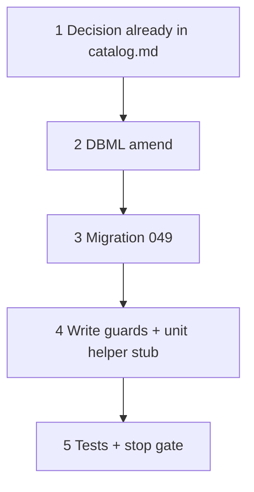

# 37p — Spec value types DDL (units, number, range, drop text)

> **Status:** Complete (2026-07-08). Next: [37q](./37q-spec-units-defs-ui.md).
>
> **Decision:** [spec value types, units table, and locks](../decisions/catalog.md#decision-spec-value-types-units-table-and-locks-2026-07-08) (T1–T14 locked 2026-07-08). **Builds on:** [37o](./37o-spec-participation-flatten.md), [37j](./37j-catalog-part-authoring.md), [value types 2026-07-02](../decisions/catalog.md#decision-spec_def-value-types-and-part-matching-rules-2026-07-02). **Touches:** `current.dbml`, migration `049`, write guards in `item-spec-definitions-write` / `spec-detail-write`.

## Problem

Catalog specs are still `enum` \| `boolean` \| `text`. HVAC/electrical need **number** and **range** with units; `text` does not filter; retyping a def with stored values is unsafe; enum option delete ignores estimate buckets.

## Locked deliverables (this task)

| # | Deliverable |
|---|-------------|
| P1 | Table **`spec_unit`** + seed starter units |
| P2 | `spec_def`: `unit_id`, `decimal_places`; CHECK `value_type ∈ (enum, boolean, number, range)` |
| P3 | Drop `text` — migration **fails** if any `text` rows exist |
| P4 | `value_number` / `value_number_max` on `manufacturer_part_spec` + estimate/job bucket spec tables |
| P5 | DAL guards: type/unit lock on value rows; option delete checks parts **and** buckets |
| P6 | `current.dbml` synced |

**Not in this task:** units table UI, defs popover UI, part/estimate number inputs, resolver match (→ 37q / 37r).

## Execution order



---

## Step 1 — Decision

Confirm [2026-07-08 decision](../decisions/catalog.md#decision-spec-value-types-units-table-and-locks-2026-07-08) is present; J8 amended.

### Verify

- [x] T1–T14 in `catalog.md`; decisions README index row
- [x] 2026-07-02 block marked amended

---

## Step 2 — DBML (`current.dbml`)

### New `spec_unit`

```text
Table spec_unit {
  id text [pk]
  symbol text [not null]
  name text [not null]
  dimension text [not null]
  canonical_unit_id text [note: 'null = this row is canonical for dimension']
  to_canonical_factor numeric [not null, default: 1]
  sort_order int [not null, default: 0]
}
```

### Amend `spec_def`

- `value_type` note: `enum | boolean | number | range`
- `unit_id` text nullable FK → `spec_unit` (required in DAL when number/range)
- `decimal_places` int nullable (display-only)

### Amend value tables

Add nullable `value_number numeric`, `value_number_max numeric` to:

- `manufacturer_part_spec`
- `estimate_scope_spec` / `estimate_zone_spec` / `estimate_line_spec`
- job snapshot spec tables that mirror estimate (`job_system_spec` / etc. if still present — align names to current schema)

Keep `value_text` column for now (legacy empty) **or** drop if unused after text-type removal — prefer **drop `value_text`** only if no rows; otherwise leave nullable unused until a cleanup migration.

### Verify

- [x] `TableGroup` / `Ref:` include `spec_unit` → `spec_def.unit_id`
- [x] Notes cite 37p / 2026-07-08 decision

---

## Step 3 — Migration `049_spec_value_types_units.sql`

> Prerequisite: **048** applied.

### Planned SQL (draft)

```sql
-- 0. Fail fast if text defs exist
DO $$
BEGIN
  IF EXISTS (SELECT 1 FROM spec_def WHERE value_type = 'text') THEN
    RAISE EXCEPTION '049: drop or retype all spec_def rows with value_type=text before applying';
  END IF;
END $$;

-- 1. spec_unit + seed (A/mA, V/mV, ton, psi, mm, phase/count, …)
CREATE TABLE spec_unit (
  id text PRIMARY KEY,
  symbol text NOT NULL,
  name text NOT NULL,
  dimension text NOT NULL,
  canonical_unit_id text REFERENCES spec_unit (id),
  to_canonical_factor numeric NOT NULL DEFAULT 1,
  sort_order int NOT NULL DEFAULT 0
);
-- INSERT seed rows (canonical first, then aliases with factors)

-- 2. spec_def columns + CHECK
ALTER TABLE spec_def
  ADD COLUMN unit_id text REFERENCES spec_unit (id) ON DELETE RESTRICT,
  ADD COLUMN decimal_places int;

ALTER TABLE spec_def DROP CONSTRAINT IF EXISTS spec_def_value_type_check;
ALTER TABLE spec_def ADD CONSTRAINT spec_def_value_type_check
  CHECK (value_type IN ('enum', 'boolean', 'number', 'range'));

-- 3. value_number columns on part + bucket tables
ALTER TABLE manufacturer_part_spec
  ADD COLUMN value_number numeric,
  ADD COLUMN value_number_max numeric;
-- same for estimate_scope_spec, estimate_zone_spec, estimate_line_spec (+ job mirrors)
```

### Verify

- [x] Migration applied on dev
- [x] Seed units visible; no `text` defs remain allowed by CHECK

---

## Step 4 — Write guards + helper stub

| File | Action |
|------|--------|
| `lib/catalog/spec-units.ts` | **Create** — `toCanonical` / `fromCanonical` / format helpers (used by 37q/37r) |
| `item-spec-definitions-write.ts` | Reject `text`; require `unit_id` for number/range; **lock** type/unit when value rows exist; pass `decimal_places` |
| `spec-detail-write.ts` / option delete | Extend `assertSpecOptionDeletable` to estimate/job bucket tables |
| Descriptors / Zod | Allow `number` \| `range`; drop `text` from unions |

### Verify

- [x] Unit tests: lock on part value row; allow retype when only participation; option delete blocked by estimate bucket
- [x] Shape: enum requires options; number/range forbid options; number/range require `unit_id`

---

## Step 5 — Stop gate

- [x] Decision + DBML + `049` applied
- [x] Write guards + `spec-units` helper + tests green
- [x] `codegen:check` if YAML touched (may be none in 37p)
- [x] STATUS → point at **37q**

**Next:** [37q — units table Surface + spec definitions UI](./37q-spec-units-defs-ui.md).
