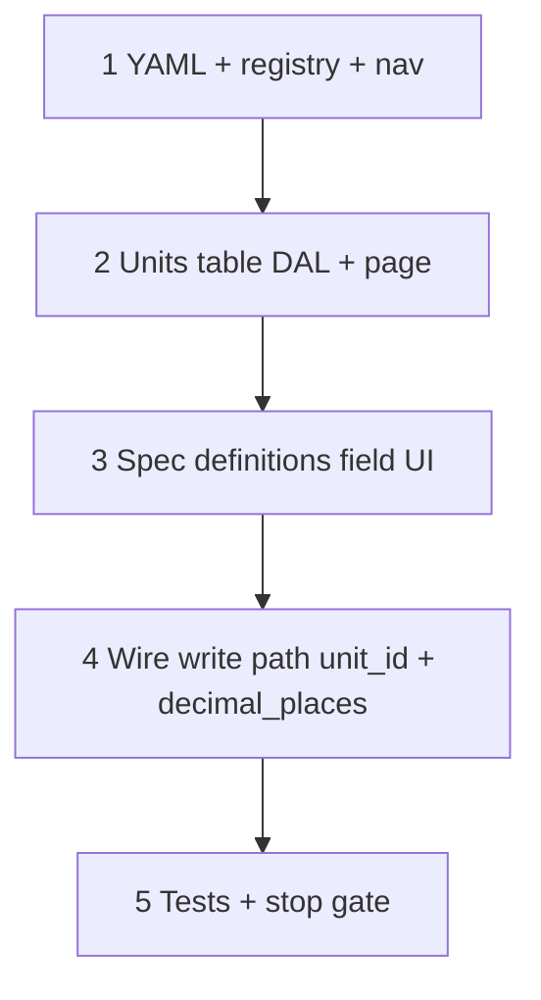

# 37q — Spec units table Surface + definitions UI

> **Status:** Complete (2026-07-08). Next: [37r](./37r-spec-number-range-consumers.md).
>
> **Decision:** [spec value types, units table, and locks](../decisions/catalog.md#decision-spec-value-types-units-table-and-locks-2026-07-08) (T7, T8, T13). **Pattern:** [`CommercialCatalogTable`](../../components/catalog/CommercialCatalogTable.tsx) / `CatalogTableSurface` (rate tables). **Touches:** `item_detail` Specs tab, nav, YAML for `spec_unit_table`.

## Problem

After 37p, units exist in DDL but have no admin UI; spec definitions still use tags (cannot rename options) and offer `text` without unit/number/range controls.

## Locked deliverables (this task)

| # | Deliverable |
|---|-------------|
| Q1 | Surface **`spec_unit_table`** — flat editable table at `/spec-units` (Catalog nav) |
| Q2 | Spec definitions UI: types `enum` \| `boolean` \| `number` \| `range`; unit picker; `decimal_places` |
| Q3 | Enum options: cell shows names; **popover** editable list (rename keeps `id`) |
| Q4 | Disable type/unit when def has value-bearing in-use counts |
| Q5 | YAML + codegen + policy registry + nav |

**Not in this task:** part form number/range inputs, estimate bucket number field, resolver (→ 37r).

## Execution order

---

## Step 1 — Surface YAML + chrome

| File | Action |
|------|--------|
| `modules/catalog/spec_unit_table.surface.yaml` | **Create** — list Field replace-array over `spec_unit` (mirror `labor_rate_type_table`) |
| Policy / loader / nav | Register Surface; Catalog nav **Spec units** → `/spec-units` |
| `docs/surface-specs/` | Short note or amend `item.md` Specs section for unit picker + options popover |

### Columns (table)

| Column | Editable |
|--------|----------|
| `symbol` | yes |
| `name` | yes |
| `dimension` | yes (select or text) |
| `canonical_unit_id` | yes (picker same dimension; empty = canonical) |
| `to_canonical_factor` | yes (default 1) |
| `sort_order` | via row order |

**Delete:** block when `spec_def.unit_id` references the unit (`in_use`).

### Verify

- [x] `codegen` / `codegen:check` green
- [x] Nav link visible with grant

---

## Step 2 — Units table UI + DAL

Reuse `CommercialCatalogTable` or thin clone:

- Route `app/(private)/spec-units/page.tsx`
- List GET + replace-array PATCH via existing catalog table pattern (`commercial-catalogs.ts` or sibling `spec-units.ts`)
- Seed already from 049 — UI must load/edit/add/remove (with delete guard)

### Verify

- [x] CRUD smoke: add alias unit, set factor, delete unused; delete blocked when referenced
- [x] Repository tests for replace + in-use

---

## Step 3 — `ItemSpecDefinitionsField` UI

| Control | Behavior |
|---------|----------|
| Type select | `enum` \| `boolean` \| `number` \| `range` — **no text**; disabled when `in_use_*` value counts &gt; 0 (from DTO) |
| Unit | Select from `spec_unit` list when type is number/range; required; disabled when locked |
| Decimal places | Optional int input when number/range |
| Options cell | Typography summary of option `display_name`s; click → **Popover** with editable list (Input per option, add, remove, reorder if cheap) |
| Options popover | Preserve `id` on rename; new rows omit `id` |

Load unit picker options once (list API or embed on item detail payload).

### Verify

- [x] Rename option keeps id through save (diff-upsert)
- [x] Type locked UI when part has values; unlocked when only participation
- [x] Number/range hide options column content; show unit + decimal places

---

## Step 4 — Write path wiring

Ensure `replaceScopeSpecDefinitionsTx` persists `unit_id`, `decimal_places`; validates unit exists; clears `unit_id` on enum/boolean; 37p locks enforced end-to-end from UI save.

DTO read: return `unit_id`, unit symbol, `decimal_places`, in-use counts split if useful (`in_use_value_count` vs participation).

### Verify

- [x] Integration/unit tests for patch with unit_id
- [x] item detail GET shape includes new fields

---

## Step 5 — Stop gate

- [x] `/spec-units` table Surface works
- [x] Scope Specs tab: four types, unit, decimal places, options popover
- [x] Tests + `codegen:check` + build green
- [x] STATUS → **37r**

**Next:** [37r — part / estimate / resolver consumers](./37r-spec-number-range-consumers.md).
