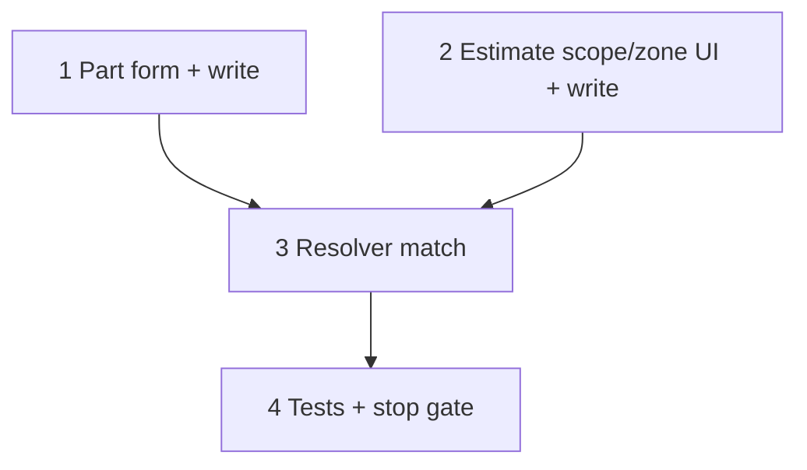

# 37r — Spec number/range consumers (part, estimate, resolver)

> **Status:** Complete (2026-07-08). Next: [37s](./37s-spec-defs-ui-drop-range.md) (drop def `range`; Specs Details popover).
>
> **Decision:** [spec value types, units table, and locks](../decisions/catalog.md#decision-spec-value-types-units-table-and-locks-2026-07-08) (T2, T8, T12). **Builds on:** [37f](./37f-estimate-line-costing.md) resolver, [37j](./37j-catalog-part-authoring.md) `part_specs`. **Touches:** part detail, estimate scope/zone spec panel, `estimate-part-resolver`.

## Problem

Defs can be `number` / `range` after 37p/37q, but parts and estimates still only author enum/boolean/text, and the resolver does not match numeric columns.

## Locked deliverables (this task)

| # | Deliverable |
|---|-------------|
| R1 | Part `part_specs`: number = one input; range = min–max; suffix from def unit; write via `toCanonical` |
| R2 | Estimate scope/zone spec panel: number/range = single point input (blank = no filter); display via `fromCanonical` + `decimal_places` |
| R3 | Resolver: exact number; range contains point; ignore blank bucket |
| R4 | Drop remaining `text` handling in forms/resolver unions |
| R5 | Tests for match matrix + form expand/collapse |

**Not in this task:** line-level `estimate_line_spec` editor (still deferred v1); wildcard option; def domain min/max.

## Execution order

---

## Step 1 — Part authoring

| File | Action |
|------|--------|
| Part specs UI | Branch on `value_type`: enum (multi), boolean, number (`InputNumber` + unit suffix), range (two `InputNumber`s + unit) |
| Write / expand helpers | Persist canonical `value_number` / `value_number_max`; validate `min ≤ max` for range |
| Read | Convert canonical → def `unit_id` for display |

### Verify

- [x] Save part with tonnage `3` and trip band `10`–`20` in def units
- [x] Reload shows authored units (not raw canonical if def unit is non-canonical)

---

## Step 2 — Estimate scope / zone panel

| File | Action |
|------|--------|
| `EstimateScopeSpecFields` (or successor) | Number/range: one nullable number + unit suffix; clear = blank filter |
| Scope/zone write | Store canonical `value_number`; no `value_number_max` on bucket |
| DTO merge | Include `unit` symbol + `decimal_places` from def for labels |

### Verify

- [x] Scope bucket `16` A filters; blank does not
- [x] Zone override point works same as enum override pattern

---

## Step 3 — Resolver

Amend part-matching for participation ∩ bucket:

| Bucket | Part | Result |
|--------|------|--------|
| null number/range | any | Pass |
| `N` number | `value_number = N` | Pass |
| `N` range | `min ≤ N ≤ max` | Pass |
| else | | Fail |

Use canonical numbers only (already stored). Enum/boolean paths unchanged.

### Verify

- [x] Unit tests covering HVAC-style matrix (exact tonnage + range band)
- [x] 0 / 1 / many outcomes unchanged

---

## Step 4 — Stop gate

- [x] Part + estimate UI author number/range
- [x] Resolver tests green; no `text` in active unions
- [x] `codegen:check` + build green
- [ ] Manual smoke: def → participate → part values → estimate bucket → filtered PN
- [x] STATUS: epic complete; point at next slice work

**Done when:** number/range specs filter parts end-to-end with units table + defs UI from 37q.
