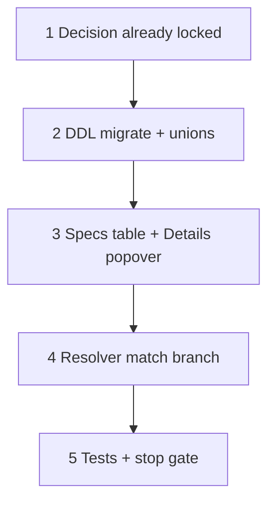

# 37s — Spec defs UI: drop `range` type; Details popover

> **Status:** Complete (2026-07-08). Next: [37u](./37u-part-leaf-links-specs-ui.md) (part leaf links + Specs value UX); [37t](./37t-spec-def-type-roundtrip.md) (type round-trip Details).
>
> **Decision:** [numeric specs — drop `range` type; band is part-authored](../decisions/catalog.md#decision-numeric-specs--drop-range-type-band-is-part-authored-2026-07-08) (N1–N10). **Amends:** [value types / units / locks](../decisions/catalog.md#decision-spec-value-types-units-table-and-locks-2026-07-08). **Touches:** `item_detail` Specs tab, `spec_def` CHECK, resolver match branch, type unions.

## Problem

After 37q/37r, Specs tab shows Unit / Decimals as always-on columns and offers `number` **and** `range` as def types. Product review: band vs exact belongs on the **part** (like enum multi-option), not on the def. Defs only need “is numeric?” + unit + decimal precision. Specs table should be Name · Type · Details with a type-aware popover.

## Locked deliverables (this task)

| # | Deliverable |
|---|-------------|
| S1 | Migrate `value_type = 'range'` → `'number'`; CHECK ∈ (`enum`, `boolean`, `number`); DBML + Zod/unions |
| S2 | Specs table: **Name · Type · Details** — remove Unit / Decimals columns |
| S3 | Details popover: enum = options list; boolean = blank cell; number = unit + decimals |
| S4 | Resolver: numeric match branches on part `value_number_max` (null → exact; set → contains) |
| S5 | Tests + stop gate |

**Not in this task:** manufacturer_part exact/band authoring UX polish (N9 — defer); def domain min/max (T6); estimate operators.

## Execution order

---

## Step 1 — DDL + type unions

| File | Action |
|------|--------|
| `migrations/052_drop_spec_range_type.sql` (or next id) | `UPDATE … SET value_type = 'number' WHERE value_type = 'range'`; replace CHECK |
| `docs/schema/current.dbml` | `value_type` note: `enum \| boolean \| number` |
| Descriptors / Zod / form unions | Drop `"range"` from active `value_type` unions (part/estimate/item) |
| Write validators | `assertSpecDefinitionShape`: number requires `unit_id`; no `range` branch |

### Verify

- [x] Migration applies cleanly on DB with any existing `range` defs
- [x] Create/update def rejects `value_type: "range"`

---

## Step 2 — Specs tab UI

| File | Action |
|------|--------|
| `ItemSpecDefinitionsField.tsx` | Columns: Name, Type (`enum` \| `boolean` \| `number`), **Details** |
| Details cell | Summary by type (see decision N7); open popover on click |
| Enum popover | Keep current option CRUD / reorder / delete-unused |
| Number popover | Unit `Select` + `decimal_places` `InputNumber`; respect type/unit locks |
| Boolean | Details cell **blank** (no `—`, no popover) |
| Type change | Clearing unit/decimals when leaving `number`; clear options when leaving `enum` |

### Verify

- [x] Scope root Specs: switch type → Details cell updates; Unit/Decimals columns gone
- [x] Number: set unit + decimals in popover; save; reload shows summary
- [x] Boolean: Details empty; Enum: options list still works

---

## Step 3 — Resolver

| File | Action |
|------|--------|
| `estimate-part-resolver.ts` | For `value_type === "number"`: if part row has `value_number_max` → contains; else exact. Remove `range` meta branch (or treat as number after migrate) |
| Tests | Exact tonnage; band contains point; blank bucket; wrong point fails |

### Verify

- [x] HVAC-style matrix green without a `range` def type
- [x] Existing part rows with max still match after def migrate to `number`

---

## Step 4 — Stop gate

- [x] No `"range"` in active value_type unions / type pickers
- [x] Specs UI matches N6/N7
- [x] `codegen:check` + build green
- [x] Manual smoke: scope Specs → number def (unit/dp in popover) → participate → estimate point filter (part UI polish deferred)
- [x] STATUS → next work; note deferred part exact/band UX

**Done when:** defs are `enum` \| `boolean` \| `number` only; Specs table is Name · Type · Details; numeric band matching is part-row-shaped, not def-typed.

**Next (follow-on, not this task):** part form — clear exact vs optional-max band UX (N9).
