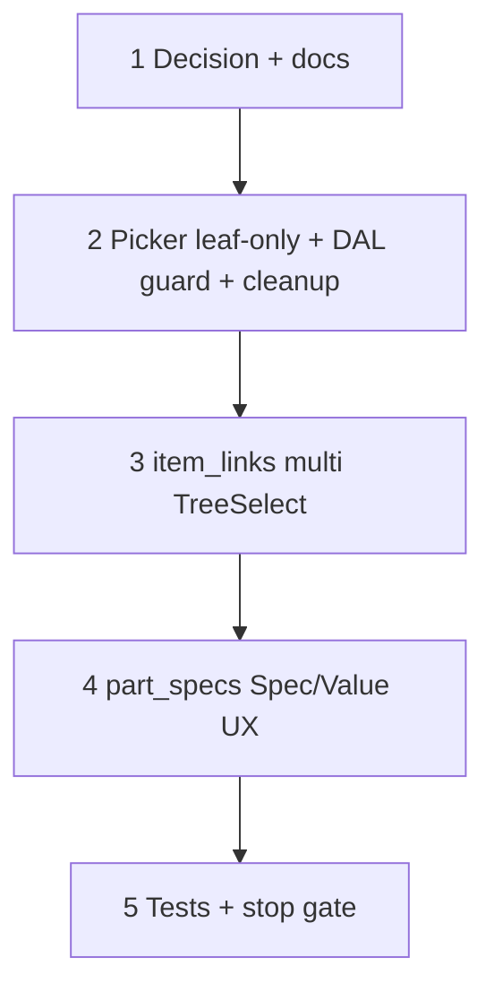

# 37u — Part leaf-only item links + Specs tab value UX

> **Status:** Complete (2026-07-08). Next: [37t](./37t-spec-def-type-roundtrip.md) (scope def type round-trip) or [37h](./37a-category-scope-decision-dbml-migration.md) (job `site_zone_id` FK renames).
>
> **Decision to lock:** [part item links leaf-only + Specs value UX](../decisions/catalog.md#decision-part-item-links-leaf-only--specs-value-ux-2026-07-08) (U1–U6 below). **Amends:** [catalog part authoring J3](../decisions/catalog.md#decision-catalog-part-authoring-ui-2026-07-06); closes N9 (part exact/band polish). **Touches:** `/parts/[id]?tab=specs` (`item_links`, `part_specs`); picker tree; `part_item` write guard; docs.

## Problem

1. **J3 allowed any tree node** on `part_item`, but estimate/job lines and `item_spec_participation` are **leaf-only** (`node_type = item`). Parent/scope links do not expand the part pool in today’s resolver (exact `item_id` match) and contribute **zero** defs to the part specs union — so they look assigned but do nothing useful.
2. **`item_links` UX** is a row-per-link `FieldArrayTable` with one TreeSelect each — noisy for multi-assign.
3. **`part_specs` value controls** need a clear Spec / Value table: boolean control, number exact-or-band (N9 polish), enum multi-select (already correct).

**Route note:** This is the **Parts** Specs tab (`part_detail`), not `/items` scope definitions / leaf participation.

## Locked deliverables

| # | Topic | Choice |
|---|--------|--------|
| **U1** | Linkable nodes | **`item.node_type = 'item'` only** — same selectable set as estimate/job item pickers |
| **U2** | `item_links` UI | **One** `TreeSelect` — `multiple` / `treeCheckable` (or equivalent multi); tree shows full org hierarchy; **only leaves selectable**; replace-array still maps to `part_item` rows (`sort_order` = selection order) |
| **U3** | DAL guard | Reject non-leaf `item_id` on `item_links` write (`item_not_selectable` / `not_leaf_item`); optional one-shot cleanup of existing non-leaf `part_item` rows |
| **U4** | Specs table | Columns **Spec · Value** (def label read-only; value type-aware). Rows = contextual union of linked leaves’ participation (unchanged merge) |
| **U5** | Boolean value | **Checkbox** (checked = true, unchecked = false). No indeterminate v1 — blank/unset = omit row on save (same as today: no claim → never matches when bucket filters that def) |
| **U6** | Number value | **Exact *or* band** via min + optional max — **not** a discrete number array (see [Advice](#advice--number-minmax-vs-discrete-or)) |
| **U7** | Enum value | **Multi-select `Select`** — as-is (use for closed discrete sets like 12 V / 24 V) |
| **U8** | Docs | Amend J3 + `part.md` / `surfaces.md`; drop “parent link → subtree pool” claims; note resolver remains exact leaf `part_item` (no subtree walk) |

**Not in this task:** subtree part pool restoration; bulk “assign under category” UI (S10); estimate bucket UI; 37t type round-trip; assemblies (`item_part_link`); multi-point number rows.

---

## Advice — number min/max vs discrete OR

**Ship: min + optional max (band). Do not ship a number array.**

Discrete OR cases (e.g. part runs on **12 V or 24 V**) are a **closed labeled set** → author as **`enum`** with options, then multi-select on the part (U7). Do **not** encode them as `min=12, max=24` (would falsely match 18 V) and do **not** add multi-point number storage in v1.

| Need | Type | Part value UX |
|------|------|---------------|
| Continuous capability (`3–5 ton`) | `number` | min + optional max |
| Exact rating (`24 V` only) | `number` | value, max empty |
| Discrete alternatives (`12 V` **or** `24 V`) | **`enum`** | multi-select options |

**UI shape (U6):** Value cell summary (`12 A` or `3 – 5 ton`); click → popover with `InputNumber` min + optional max (unit from def). Validate `max >= min` when both set. Maps 1:1 to existing PATCH body — no schema change.

---

## Execution order

---

## Step 1 — Decision + surface docs

| File | Action |
|------|--------|
| `docs/decisions/catalog.md` | Add decision block (U1–U8); amend **J3** → leaf-only; note N9 closed by this task |
| `docs/surface-specs/part.md` | Locked answer #10 + `item_links` / §I / edge cases: leaf-only; multi TreeSelect; Spec/Value controls; remove parent→subtree wording |
| `docs/surfaces.md` | `item_links` row: leaf-only multi TreeSelect |

### Verify

- [x] Decision dated; J3 text no longer says “any tree node”
- [x] `part.md` matches U1–U7

---

## Step 2 — Picker + write guard (+ cleanup)

| File | Action |
|------|--------|
| `lib/catalog/repository/item-picker-tree.ts` | `loadOrgItemTree`: `selectable: item.node_type === "item"` (today categories are selectable — wrong for parts) |
| `lib/parts/repository/part-item-links.ts` | After exist check: require `node_type = 'item'`; reject otherwise |
| `lib/parts/repository/part-item-links.test.ts` | Reject category/scope ids; accept leaf |
| `migrations/053_part_item_leaf_only.sql` *(if any non-leaf rows exist in seed/dev)* | `DELETE FROM part_item WHERE item_id IN (SELECT id FROM item WHERE node_type <> 'item')` — or fail migration with count if prefer manual review |

Confirm estimate item picker already uses leaf-only (`loadItemTreeForRoot` / estimate path) — do **not** loosen that.

### Verify

- [x] Org part picker API: scopes/categories `selectable: false`; leaves `true`
- [x] PATCH `item_links` with a category id → 400 validation
- [x] Existing leaf links unchanged

---

## Step 3 — `item_links` multi TreeSelect

| File | Action |
|------|--------|
| `components/parts/PartItemLinksField.tsx` | Replace per-row table with **one** multi `TreeSelect` (show checked strategy / tags for selected leaves). Form value remains `item_links: { item_id, name?, breadcrumb?, sort_order? }[]` for PATCH compatibility |
| `components/parts/PartDetailForm.tsx` | Keep `normalizeItemLinksBody` / duplicate validation; wire multi-select ↔ array |
| Empty state | Keep copy: not assigned → not in estimate resolution |

### Verify

- [x] Select two leaves under different categories → two `part_item` rows on save
- [x] Cannot check a category/scope node
- [x] Remove one tag → omitted from next PATCH; prune still runs on link shrink

---

## Step 4 — `part_specs` Spec · Value UX

| File | Action |
|------|--------|
| `components/parts/PartSpecsField.tsx` | Table columns **Spec** (display_name + type hint) · **Value** |
| Boolean | `Checkbox` bound to `value_boolean` (see U5) |
| Number | Summary cell + **popover** (or inline dual `InputNumber`): Value + optional Max. Empty max = exact |
| Enum | Multi `Select` unchanged |
| `lib/parts/part-specs-form.ts` | Ensure expand/collapse + canonical unit conversion still correct for min/max (one number row per def) |

### Verify

- [x] Boolean: check/uncheck → save → reload
- [x] Number exact: max empty → matcher equality
- [x] Number band: min/max → point-in-band on estimate (smoke or unit test already in 37s)
- [x] Enum multi unchanged (e.g. dual-voltage options)
- [x] Unlinked / empty union → empty specs helper unchanged

---

## Step 5 — Tests + stop gate

| Area | Action |
|------|--------|
| Unit | `part-item-links` leaf guard; optional form helper for number popover ↔ patch rows |
| Manual smoke | `/parts/[id]?tab=specs` — multi leaf assign; boolean / number band / enum; shrink links prunes orphan specs |

### Verify (stop gate)

- [x] Decision + `part.md` / `surfaces.md` updated
- [x] Picker + DAL leaf-only
- [x] Multi TreeSelect ships; no FieldArrayTable for links
- [x] Specs Spec · Value: checkbox / number min-max / enum multi
- [x] Build + targeted tests green
- [x] No non-leaf `part_item` rows remain (cleanup or none existed)

**Done when:** parts only link to quotable leaves; Specs tab matches U2–U7; docs no longer promise parent/subtree assignment.

## Related

- [37j](./37j-catalog-part-authoring.md) — original `item_links` / `part_specs`
- [37k](./37k-part-spec-lifecycle.md) — prune on link save (unchanged)
- [37s](./37s-spec-defs-ui-drop-range.md) — band via optional max (N9 polish lands here)
- [37t](./37t-spec-def-type-roundtrip.md) — scope def Details round-trip (independent)
