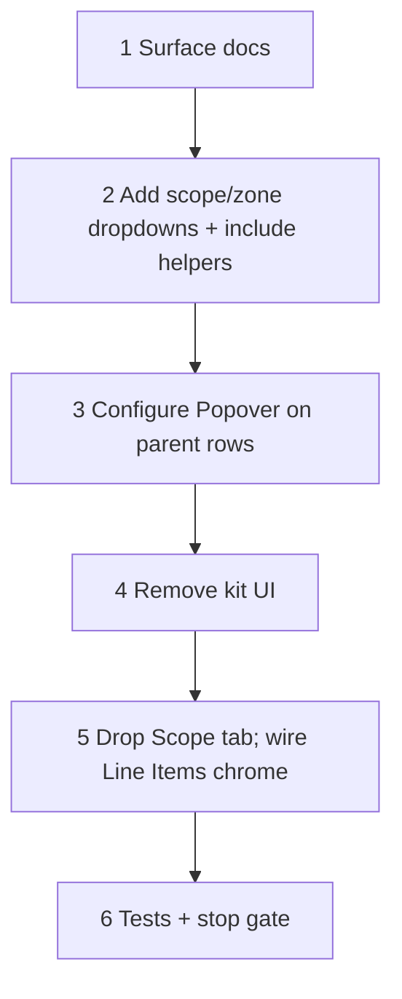

# 37v — Estimate Line Items tab (merge Scope config)

> **Status:** Complete (2026-07-08). **UI superseded by:** [37w](./37w-estimate-line-items-panels.md) three-panel layout (decision W1 locked). Next: lock 37w W2–W9; parallel **37h** job `site_zone_id` FK renames.
>
> **Decision:** [estimate Line Items tab — merge Scope config into line tree](../decisions/estimate.md#decision-estimate-line-items-tab--merge-scope-config-into-line-tree-2026-07-08) (V1–V8). **Supersedes UI of:** [37e](./37e-estimate-scope-tab.md) Scope tab. **Builds on:** [37f](./37f-estimate-line-costing.md) line tree, [37n](./37n-labor-phase-inclusion.md) phase inclusion. **No schema change.** **Touches:** `estimate_detail` UI only.

## Problem

Scope config and line editing span two tabs over one scope→zone hierarchy. Spec filters / complexity / labor phases that drive part resolution and labor cost are invisible while editing lines.

## Locked deliverables

| # | Topic | Choice |
|---|--------|--------|
| **V1** | Tabs **General \| Line Items**; retire Scope tab; one `Table` + `treeData` on Line Items |
| **V2** | Scope / zone parents (`colSpan`); line leaves; unzoned lines under scope; scope required per line |
| **V3** | Toolbar **Add scope ▾**; scope header **Add zone ▾**; tree = included only; empty site → CTA to site; no site writes on estimate |
| **V4** | Configure **Popover** (⚙) on scope + zone headers; reuse spec/phase/complexity fields; no Drawer |
| **V5** | Summary chips **deferred** |
| **V6** | Kits **UI removed**; schema/DAL validation unchanged |
| **V7** | Persistence unchanged — dirty until Save; `replaceEstimateCollectionsTx` |
| **V8** | Line-level spec (O5) **deferred** |

**Not in this task:** summary chips (V5); `estimate_line_spec` UI (O5); Drawer; assembly expand-on-add; drag reorder; part-match `Alert`; full kit schema retirement; shared line editor refactor (4d′) — but **do not** fork the leaf grid in a way that blocks it.

---

## Execution order

---

## Step 1 — Surface docs

| File | Action |
|------|--------|
| `docs/surface-specs/estimate.md` | Refresh stale `systems`/General/kit vocabulary; document Line Items tab: Add scope/zone, parent Configure popover, scope-required lines |
| `docs/surfaces.md` | `estimate_detail` tabs: General · Line Items (Scope tab retired) |
| `docs/decisions/estimate.md` | Note 37e Scope tab UI superseded (decision already locked) |

### Verify

- [x] `estimate.md` surface-spec matches V1–V8
- [x] `surfaces.md` tab list updated

---

## Step 2 — Add scope / Add zone dropdowns

| File | Action |
|------|--------|
| `components/estimates/EstimateLineTreeTable.tsx` | Toolbar **Add scope ▾** — options = `site_tree.scopes` not yet on quote; append `scopes[]` + seed `spec_templates` (move logic from `EstimateScopeTab`) |
| `EstimateLineTreeTable.tsx` | Scope header **Add zone ▾** — zones for that `site_scope` not yet in `scopes[i].zones`; auto-include parent scope |
| `components/estimates/estimate-scope-tree.ts` | Reuse `makeScopeRow`, `makeZoneMembership`, reference guards; extract toggle helpers from `EstimateScopeTab` |
| Empty state | No `site_tree.scopes` → disabled Add scope + link to `/sites/[id]` Scopes & zones |
| Remove scope/zone | Action on header when no referencing lines (or dropdown “Remove from quote”) |

### Verify

- [x] Add scope includes quote scope from site; Save persists `estimate_scope`
- [x] Add zone includes zone; parent scope auto-included
- [x] Cannot remove scope/zone referenced by lines
- [x] Empty site scopes → CTA, no lines

---

## Step 3 — Configure Popover

| File | Action |
|------|--------|
| `components/estimates/EstimateBucketConfigurePanel.tsx` *(new)* | `LinkedSelectInput` + `EstimateScopeSpecFields` + `EstimateScopeLaborPhaseFields`; `scopeIndex` / optional `zoneIndex` |
| `EstimateLineTreeTable.tsx` | Scope + zone parent `colSpan` → label + **⚙** `Popover` + **Add zone ▾** (scope only) + **+ Line** |
| Permissions | Popover editable only when Field `scopes` has `write` |

### Verify

- [x] Popover edits dirty form; Save persists scope + zone bucket fields
- [x] Zone popover writes zone override rows

---

## Step 4 — Remove kit UI

| File | Action |
|------|--------|
| `EstimateLineTreeTable.tsx` | Drop Add Kit, kit `Tag`s, component indent, kit-header actions |
| `estimate-line-tree.ts` | `makeLine` standalone only; tree builders ignore kit nesting |
| `EstimateDetailForm.tsx` | Map lines as `standalone` only |

Leave `estimate-lines-write.ts` kit validation intact.

### Verify

- [x] No kit affordances on Line Items tab
- [x] PATCH emits only `standalone` lines

---

## Step 5 — Drop Scope tab

| File | Action |
|------|--------|
| `EstimateDetailForm.tsx` | Remove Scope tab; Line Items tab hosts extended `EstimateLineTreeTable` |
| `EstimateScopeTab.tsx` | Retire after helpers moved |

### Verify

- [x] Tabs: General · Line Items only
- [x] `site_id` gating unchanged; create-time site change clears collections

---

## Step 6 — Tests + stop gate

| Area | Action |
|------|--------|
| Unit | Add-scope/zone helpers; kit-free `makeLine`; reference guards |
| Manual smoke | Add scope → Configure popover → add lines → Save → reload |

### Verify (stop gate)

- [x] Surface docs updated
- [x] Add scope / Add zone dropdowns work
- [x] Configure popover (scope + zone)
- [x] Kits removed from UI
- [x] Scope tab retired
- [x] Build + targeted tests green

**Done when:** estimators include scopes/zones, configure buckets, and edit lines on **Line Items** only; no kit UI; no schema change.

## Related

- [37e](./37e-estimate-scope-tab.md) — Scope tab (UI superseded)
- [37f](./37f-estimate-line-costing.md) — line tree + costing
- [37n](./37n-labor-phase-inclusion.md) — phase inclusion fields (reused)
- [37c](./37c-site-scopes-zones.md) — site Add scope/zone (estimate only includes, does not create)
