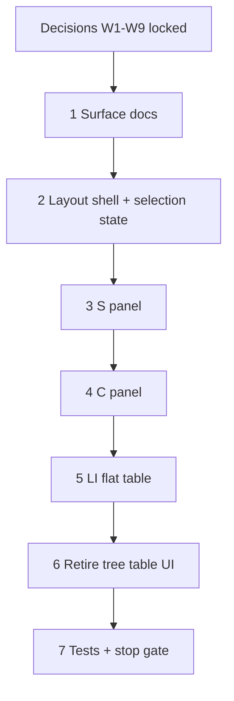

# 37w — Estimate Line Items three-panel layout

> **Status:** Complete (2026-07-08). Next: [37x](./37x-estimate-conditions-allocations.md) — conditions + allocations (G1–G5e).
>
> **Decision:** [three-panel layout](../decisions/estimate.md#decision-estimate-line-items-tab--three-panel-layout-2026-07-08) (W1–W9). **Supersedes UI of:** [37v](./37v-estimate-structure-tab.md) tree table + Configure popover. **Builds on:** [37f](./37f-estimate-line-costing.md) line columns, [37n](./37n-labor-phase-inclusion.md) phase fields, `EstimateBucketConfigurePanel`. **No schema change.** **Touches:** `estimate_detail` Line Items tab UI only.

## Problem

The 37v single tree `Table` merges quote structure, bucket config, and line editing. Scope/zone parent rows (`colSpan`) scroll with costing columns; fixed-column and sticky-header workarounds fail or split the header. Config in a popover is easy to miss while editing lines.

## Decision log

Work **one decision at a time** — lock in [estimate.md](../decisions/estimate.md#decision-estimate-line-items-tab--three-panel-layout-2026-07-08), then implement.

| # | Topic | Status | Doc anchor |
|---|--------|--------|------------|
| **W1** | Shell topology (S + C left, LI right) | **Locked** | [decision W1](../decisions/estimate.md#w1--shell-topology-locked) |
| **W2** | S panel — site-shaped tree, select only | **Locked** | [decision W2](../decisions/estimate.md#w2--s-panel-tree-locked) |
| **W3** | Selection → LI filter (unzoned on scope) | **Locked** | [decision W3](../decisions/estimate.md#w3--selection--li-filter-locked) |
| **W4** | C panel — bucket config (complexity, phases, specs) | **Locked** | [decision W4](../decisions/estimate.md#w4--c-panel-config-locked) |
| **W5** | S panel — no add/remove; selection drives LI/C | **Locked** | [decision W5](../decisions/estimate.md#w5--s-panel-actions-locked) |
| **W6** | LI panel — flat grid + Add line footer | **Locked** | [decision W6](../decisions/estimate.md#w6--li-flat-grid-locked) |
| **W7** | Responsive — desktop-only v1 | **Locked** | [decision W7](../decisions/estimate.md#w7--responsive-layout-locked) |
| **W8** | Persistence (unchanged 37v V7) | **Locked** | [decision W8](../decisions/estimate.md#w8--persistence-locked) |
| **W9** | Deferred carry-forward | **Locked** | [decision W9](../decisions/estimate.md#w9--deferred-carry-forward-locked) |

---

## Decision W1 — Shell topology ✅

**Locked 2026-07-08.** See [decision](../decisions/estimate.md#w1--shell-topology-locked).

- Left rail: **S** (top) + **C** (bottom), stacked.
- Right pane: **LI** flat line table (no `treeData`, no parent rows).
- Tabs: **General \| Line Items** unchanged.

### Verify (W1)

- [x] Decision recorded in `docs/decisions/estimate.md`
- [x] Task 37w created with decision log
- [x] W4–W9 locked before implementation starts

---

## Decision W2 — S panel tree content ✅

**Locked 2026-07-08.** See [decision W2](../decisions/estimate.md#w2--s-panel-tree-locked).

- Same hierarchy as site **Scopes & zones**; **full `site_tree`**; **selection only** (no site CRUD, no add/remove quote UI — [W5](#decision-w5--s-panel-actions-)).
- Panel title **Scopes & zones**; no “Unzoned” pseudo-node.

### Verify (W2)

- [x] Option locked in decision doc
- [x] Unzoned handling → scope selection (W3)
- [x] Amended: full site tree (W5)
- [x] Line-count badges / default selection (open)
- [x] `estimate.md` surface-spec § Line Items updated (after W6–W9)

---

## Decision W3 — Selection → LI filter ✅

**Locked 2026-07-08.** See [decision W3](../decisions/estimate.md#w3--selection--li-filter-locked).

- Scope → unzoned lines only (`site_zone_id` null).
- Zone → lines in that zone.

### Verify (W3)

- [x] Scope vs zone filter rules locked
- [x] Empty LI copy drafted

---

## Decision W2 (archived prompt) — S panel tree content

Original W2 discussion prompt (superseded)

**Question:** What does **S** show, and how is it labeled?

| Option | Description |
|--------|-------------|
| **A** | Quote structure tree — included scopes/zones only |
| **B** | Full site tree with checkmarks |
| **C** | Hybrid grayed site tree |

**Locked:** Site-shaped tree, select-only; full site tree + implicit include (W5, user 2026-07-08).

---

## Decision W5 — S panel actions ✅

**Locked 2026-07-08.** See [decision W5](../decisions/estimate.md#w5--s-panel-actions-locked).

- **No** Add scope / Add zone / Remove from quote on Line Items tab.
- **S** selection → active bucket for **LI** + **C**.
- **Implicit include** on first line add or **C** edit for bucket not yet on `scopes[]`.

### Verify (W5)

- [x] No explicit include/remove UI
- [x] Implicit include rule locked
- [x] Empty site scopes → CTA to site (retained)

---

## Decision W5 (archived prompt) — include/remove actions

Original W5 discussion prompt (superseded)

User 2026-07-08: no add scope/zone — S tree is selection; selected node is where lines are added/edited/deleted.

---

## Decision W4 — C panel config binding ✅

**Locked 2026-07-08.** See [decision W4](../decisions/estimate.md#w4--c-panel-config-locked).

- **C** = selected scope/zone bucket config (formerly popover).
- **Fields:** Complexity factor · Labor phases (multi-select) · Specs.
- Popover **retired**; empty state when nothing selected in **S**.

### Verify (W4)

- [x] Binding rules locked
- [x] Field list locked
- [x] Empty / read-only states defined
- [x] Labor phases UI: checkbox → multi-select `Select` (implementation)

---

## Decision W4 (archived prompt) — C panel config binding

Original W4 discussion prompt (superseded)

Locked per user 2026-07-08: permanent C panel with complexity, labor phases multi-select, specs.

---

## Decision W6 — LI panel flat grid ✅

**Locked 2026-07-08.** See [decision W6](../decisions/estimate.md#w6--li-flat-grid-locked).

- Flat **37f** columns; filtered by **S** selection ([W3](#decision-w3--selection--li-filter-)).
- **Add line** — `FieldArrayTable` footer: dashed block button + `PlusOutlined`, label **Add line**.
- Requires **S** selection; implicit include ([W5](#decision-w5--s-panel-actions-)).
- Drag retarget deferred.

### Verify (W6)

- [x] Column set confirmed (37f)
- [x] Add line UX locked (`FieldArrayTable` footer pattern)
- [x] Remove line — per-row delete (37f)

---

## Decision W6 (archived prompt) — LI panel flat grid

Original W6 discussion prompt (superseded)

User 2026-07-08: Add line button like the other tables (`FieldArrayTable` dashed footer).

---

## Decision W7 — Responsive layout ✅

**Locked 2026-07-08.** See [decision W7](../decisions/estimate.md#w7--responsive-layout-locked).

- **Desktop-only v1** — defer mobile stack/drawer.

### Verify (W7)

- [x] Breakpoint strategy locked (defer)

---

## Decision W8 — Persistence ✅

**Locked 2026-07-08.** See [decision W8](../decisions/estimate.md#w8--persistence-locked).

- Unchanged 37v **V7**; **S** selection client-only.

### Verify (W8)

- [x] Confirmed in decision doc

---

## Decision W9 — Deferred carry-forward ✅

**Locked 2026-07-08.** See [decision W9](../decisions/estimate.md#w9--deferred-carry-forward-locked).

### Verify (W9)

- [x] Deferred list confirmed

---

## Implementation (decisions complete — start here)

**Do not start implementation until Step 1 surface docs are updated.**

---

## Step 1 — Surface docs (start here)

| File | Action |
|------|--------|
| `docs/surface-specs/estimate.md` | Replace 37v tree vocabulary with three-panel S / C / LI; W1–W9 summary |
| `docs/surfaces.md` | Line Items tab: three-panel layout |
| `docs/decisions/estimate.md` | ✅ W1–W9 locked |

### Verify (Step 1)

- [x] `estimate.md` surface-spec matches W1–W9
- [x] `surfaces.md` updated

---

## Step 2 — Layout shell + selection state

| File | Action |
|------|--------|
| `EstimateLineItemsPanels.tsx` *(new)* | Three-panel shell: left rail S + C, right LI; client selection state |
| `EstimateDetailForm.tsx` | Line Items tab hosts panel layout; retire `EstimateLineTreeTable` |

### Verify (Step 2)

- [x] Desktop three-panel renders; selection state wired

---

## Step 3 — S panel

| File | Action |
|------|--------|
| `EstimateQuoteStructureTree.tsx` *(new)* | Full `site_tree` shape; select-only; reuse `buildEstimateScopeTree` / site tree patterns |

### Verify (Step 3)

- [x] Select scope/zone updates shared selection

---

## Step 4 — C panel

| File | Action |
|------|--------|
| `EstimateBucketConfigurePanel.tsx` | Promote to permanent **C** panel; labor phases → multi-select `Select` |

### Verify (Step 4)

- [x] Config edits dirty form; implicit include on edit when bucket missing

---

## Step 5 — LI flat table

| File | Action |
|------|--------|
| `EstimateLineFlatTable.tsx` *(new)* | Filtered flat grid; `FieldArrayTable` footer **Add line**; 37f columns |

### Verify (Step 5)

- [x] Add line targets **S** selection; implicit include

---

## Step 6 — Retire tree table UI

| File | Action |
|------|--------|
| `EstimateLineTreeTable.tsx` | Remove or reduce to leaf-cell exports if needed |

### Verify (Step 6)

- [x] No tree parent rows; 37v popover/toolbar removed

---

## Step 7 — Tests + stop gate

### Verify (stop gate)

- [x] Surface docs updated
- [x] Three-panel layout ships
- [x] Build + targeted tests green

**Done when:** estimators select scope/zone in **S**, configure in **C**, edit lines in **LI**; no 37v tree UI.

---

## Related

- [37v](./37v-estimate-structure-tab.md) — tree table (UI superseded)
- [37e](./37e-estimate-scope-tab.md) — Scope tab (UI superseded by 37v, then 37w)
- [37f](./37f-estimate-line-costing.md) — line columns + costing
