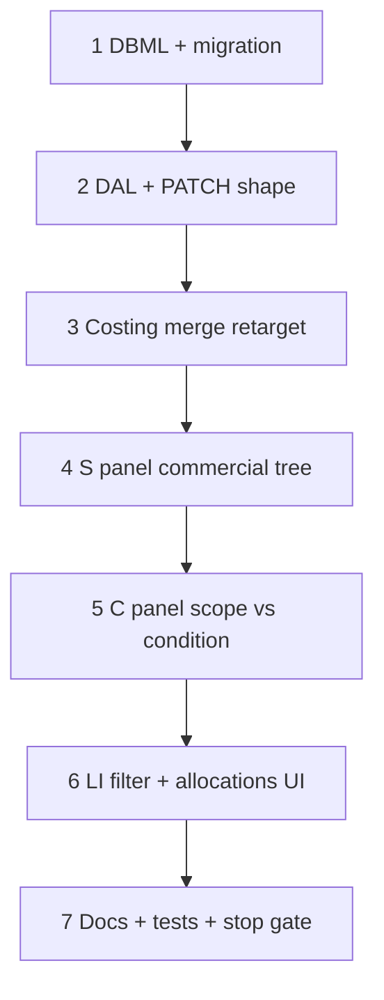

# 37x — Estimate conditions + line allocations

> **Status:** Complete (2026-07-09). Next: [37y](./37y-condition-only-commercial-tree.md) — condition-only commercial tree (Y1–Y5).
>
> **Decision:** [scope / condition / zone / qty](../decisions/estimate.md#decision-estimate-scope-condition-zone-and-line-qty-2026-07-09) (**G1–G5e**, **X1–X4**). **Amended by:** [37y](./37y-condition-only-commercial-tree.md) (drop `estimate_scope` roots). **Amends UI of:** [37w](./37w-estimate-line-items-panels.md) S/C binding (site tree → commercial tree). **Schema change.** **Touches:** estimate DAL, DBML, Line Items panels, costing merge. **Out of scope:** win→job copy; job unresolved queue (G4).

## Problem

Site zones were overloaded as place **and** commercial override. Estimators need a per-quote **condition** tree (spec values, phases, complexity) and optional **zone allocations** for qty/place — without inventing fake site geography.

## Locked summary (do not re-litigate)

| # | Choice |
|---|--------|
| **G1** | Site scope/zone = place only |
| **G2** | Estimate **condition** tree under scope instance; children override |
| **G3** | Line qty + `estimate_line_allocation`; unset qty follows allocate; then `qty ≥ allocated` |
| **G4** | Win → all lines; job unresolved = unplaced / part-open queue |
| **G5a** | New `estimate_condition*` tables; retire commercial `estimate_zone*` |
| **G5b** | `estimate_condition_id` + allocations; drop line `site_zone_id` after migrate |
| **G5c** | **S** = manually built scope→condition tree (editable names, deletable) |
| **G5d** | **C** = form for S selection; **complexity only on condition** |
| **G5e** | D5/D3/D6g/DBML wording as in decision |

## Implementation forks (lock before / during coding)

| # | Topic | Status |
|---|--------|--------|
| **X1** | Delete scope/condition when lines reference | **Locked — Block** |
| **X2** | Estimate-owned tree; site-like UI; names in C | **Locked** |
| **X3** | `qty_manual` flag (allocate drives until typed) | **Locked** |
| **X4** | Estimate path only (defer win/job G4 UI) | **Locked** ([decision](../decisions/estimate.md#x4--37x-delivery-scope-locked-2026-07-09)) |

## Implementation steps

### Step 1 — DBML + migration

| Action |
|--------|
| Add `estimate_condition`, `estimate_condition_spec`, `estimate_condition_labor_phase` |
| Add `estimate_line_allocation` |
| Add `estimate_line.estimate_condition_id` + `estimate_line.qty_manual` |
| Add `estimate_scope.name` |
| Drop commercial `estimate_zone` / `_spec` / `_labor_phase` (dev DB) |
| Drop `estimate_scope.complexity_factor_id` |
| Migrate any `site_zone_id` on lines → one allocation row; then drop `estimate_line.site_zone_id` |

### Verify (Step 1)

- [x] `current.dbml` + migration authored; codegen green

### Step 2 — DAL + PATCH

| Action |
|--------|
| Replace-array for conditions (+ nested specs/phases) with scopes |
| Line PATCH includes `estimate_condition_id` + `allocations[]` |
| Validate condition ∈ line’s scope; `sum(alloc) ≤ quantity` when qty set |

### Verify (Step 2)

- [x] Round-trip create/patch/read for conditions + allocations

### Step 3 — Costing merge

| Action |
|--------|
| Spec merge: line → condition → scope |
| Complexity: condition only (nested child > parent); else 100% |
| Labor phases: condition override → scope → item group |

### Verify (Step 3)

- [x] Unit tests for merge + complexity-on-condition-only

### Step 4 — S panel

| Action |
|--------|
| Replace site-tree S with editable scope→condition tree |
| Add / rename / delete nodes; selection filters LI |

### Verify (Step 4)

- [x] Manual tree CRUD dirty until Save; LI filters by selection

### Step 5 — C panel

| Action |
|--------|
| Bind to scope or condition; complexity control **only** for condition |

### Verify (Step 5)

- [x] Scope selection: no complexity picker; condition: complexity + phases + specs

### Step 6 — LI + Places

| Action |
|--------|
| Add line targets S selection (scope or condition) |
| Places… UI: allocations (default qty 1); qty sync rules per G3 |

### Verify (Step 6)

- [x] Allocations + qty rules; over-allocate blocked

### Step 7 — Stop gate

### Verify (stop gate)

- [x] Decision G1–G5e reflected in surface-spec / surfaces.md
- [x] Build + targeted tests green
- [x] 37w site-tree S/C path retired
**Done when:** Estimators build a commercial condition tree, configure knobs on C (complexity on conditions only), edit lines under a node, and optionally allocate places with qty rules.

## Related

- [37w](./37w-estimate-line-items-panels.md) — three-panel shell (topology retained)
- [Decision G1–G5e](../decisions/estimate.md#decision-estimate-scope-condition-zone-and-line-qty-2026-07-09)
