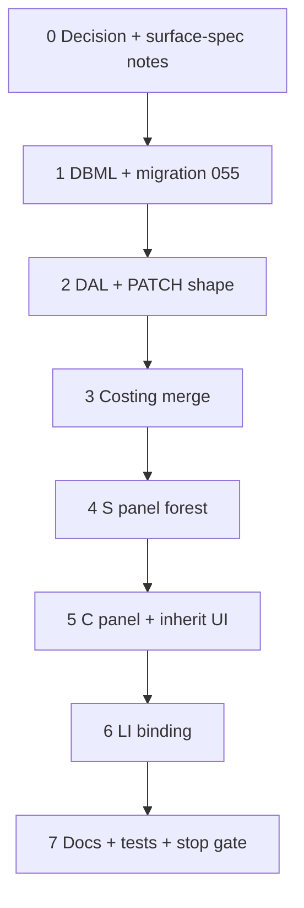

# 37y — Condition-only commercial tree

> **Status:** Complete (2026-07-09). Next: [37h](./37a-category-scope-decision-dbml-migration.md) job FK renames (parallel OK) / G4 win-copy (deferred).
>
> **Decision:** [condition-only commercial tree](../decisions/estimate.md#decision-condition-only-commercial-tree-2026-07-09) (**Y1–Y5**). **Amends:** [37x](./37x-estimate-conditions-allocations.md) G2/G5a–G5e (scope instance roots). **Keeps:** G1, G3, G4, X1, X3, X4. **Schema change.** **Touches:** DBML, migration, estimate DAL/PATCH, costing merge, S/C/LI panels. **Out of scope:** win→job copy; job unresolved queue (G4).

## Problem

37x kept `estimate_scope` as commercial roots and `estimate_condition` as children. Complexity only on conditions; phases/specs on both. Product intent: **one nestable condition tree** — every node has complexity + phases + specs; children optionally override parents with explicit inherit UI.

## Locked summary (do not re-litigate)

| # | Choice |
|---|--------|
| **Y1** | Drop `estimate_scope*`; condition forest on `estimate_id`; roots carry `root_item_id` |
| **Y2** | `estimate_line.estimate_condition_id` **NOT NULL**; drop `estimate_line.estimate_scope_id` |
| **Y3** | Complexity + phases + specs on **every** condition; cascade leaf → root → catalog |
| **Y4** | Child C: inherit checkbox — unchecked = ancestry (read-only); checked = own |
| **Y5** | S = condition forest; Add root (catalog item) / Add condition / delete (X1) |

## Implementation steps

### Step 0 — Docs pointer (before code)

| Action |
|--------|
| Confirm Y1–Y5 in [estimate.md](../decisions/estimate.md#decision-condition-only-commercial-tree-2026-07-09) |
| Note D3/D5/D6f amend in [catalog.md](../decisions/catalog.md) (complexity/specs/line FK) |
| Sketch surface-spec Line Items: S = conditions; C inherit checkbox; lines require condition |

### Verify (Step 0)

- [x] Decision Y1–Y5 present; catalog D3/D5/D6f note amended
- [x] This task file linked from STATUS + task index

### Step 1 — DBML + migration

| Action |
|--------|
| Author migration **055** (dev-friendly): |
| — Add `estimate_condition.estimate_id`, `estimate_condition.root_item_id` (nullable; NOT NULL when `parent_condition_id` IS NULL) |
| — Migrate each `estimate_scope` → root `estimate_condition` (copy name, `root_item_id`, specs → `estimate_condition_spec`, phases → `estimate_condition_labor_phase`) |
| — Re-point existing conditions: `estimate_scope_id` → new root condition as parent (or keep nesting under migrated root) |
| — Lines: null `estimate_condition_id` → migrated root for that scope; then set `estimate_condition_id` NOT NULL |
| — Drop `estimate_line.estimate_scope_id` |
| — Drop `estimate_condition.estimate_scope_id` |
| — Drop `estimate_scope_spec`, `estimate_scope_labor_phase`, `estimate_scope` |
| Update `current.dbml` to match |
| Codegen / types green |

**Child `root_item_id`:** store null on non-roots; resolve from tree root in app/DAL.

### Verify (Step 1)

- [x] `current.dbml` + `055_*.sql` authored
- [x] Migrate path: old scope+condition data → condition forest; lines all have condition
- [x] Codegen / typecheck green for schema touchpoints

### Step 2 — DAL + PATCH

| Action |
|--------|
| Replace estimate PATCH shape: `scopes[]` → `conditions[]` (nested tree) **or** flat list with `parent_condition_id` — pick one; prefer **nested** to match current RHF tree |
| Root create requires `root_item_id`; children forbid changing catalog root |
| Line write: require `estimate_condition_id`; validate condition ∈ estimate; drop scope FK checks |
| Delete: block if lines on node or descendants (X1) |
| Read DTO: condition forest + lines with condition only |

### Verify (Step 2)

- [x] Round-trip create/patch/read for nested conditions + lines
- [x] Reject line without condition; reject orphan condition id

### Step 3 — Costing merge

| Action |
|--------|
| Specs: `line → condition leaf → … → root → catalog` (no scope tier) |
| Complexity: walk leaf → root for first non-null `complexity_factor_id`; else 100% |
| Phases: first condition in leaf→root walk with **explicit** phase set (junction present, incl. empty); else item/catalog default |
| Update unit tests; retire scope-merge helpers |

### Verify (Step 3)

- [x] Unit tests: inherit / override / empty-phase-set / complexity 100% at root with null factor
- [x] No remaining `estimate_scope` references in merge path

### Step 4 — S panel

| Action |
|--------|
| Tree = condition forest only (no `scope:` keys) |
| **Add root ▾** — catalog root picker (rename from Add scope) |
| **Add condition** — under selection |
| Delete with X1 messaging |
| Selection filters LI to lines for selected `estimate_condition_id` (**selected node only** unless product asks for subtree) |
| Default selection: first root condition if any |

### Verify (Step 4)

- [x] Multi-root same `root_item_id` works
- [x] LI empty until a condition selected; add-line gated

### Step 5 — C panel + inherit UI

| Action |
|--------|
| Always show: name, complexity, phases, specs for selected condition |
| **Root:** no inherit checkboxes; all controls editable |
| **Child:** checkbox per control group (complexity, each spec, phases) |
| — unchecked → read-only, show resolved ancestry value |
| — checked → editable own value; clearing checkbox drops own override |
| Phases: checked + empty = explicit no phases (persist empty junction / sentinel — document in code) |
| Wire RHF paths off `conditions` tree (retire `scopes` form shape) |

### Verify (Step 5)

- [x] Root: complexity visible and writable
- [x] Child unchecked: read-only ancestry; checked: own persists after save
- [x] Spec / complexity / phase inherit behaviors match Y3–Y4

### Step 6 — LI panel

| Action |
|--------|
| Add line requires selected condition → set `estimate_condition_id` |
| Filter by selection (Step 4 rule) |
| Places / allocations / `qty_manual` unchanged (G3) |
| Item picker root from condition’s tree `root_item_id` |

### Verify (Step 6)

- [x] Cannot add line with no selection
- [x] Allocations still enforce `qty ≥ allocated`

### Step 7 — Stop gate

| Action |
|--------|
| Update [surface-spec estimate](../surface-specs/estimate.md) + [surfaces.md](../surfaces.md) |
| Amend catalog D3/D5/D6f rows to point at Y1–Y3 |
| Grep: no live `estimate_scope` in estimate Line Items path (site `site_scope` untouched) |
| Build + targeted tests green |
| Mark this task complete; STATUS → next |

### Verify (stop gate)

- [x] Y1–Y5 reflected in surface-spec / surfaces.md / catalog decision rows
- [x] Build + targeted tests green
- [x] 37x scope-root S/C path retired
- [x] STATUS + task index updated

**Done when:** Estimators build a condition-only forest (multi-root OK), configure complexity/phases/specs on every node, children inherit via checkbox (read-only until override), and every line hangs on a condition.

## Related

- [Decision Y1–Y5](../decisions/estimate.md#decision-condition-only-commercial-tree-2026-07-09)
- [37x](./37x-estimate-conditions-allocations.md) — prior scope+condition split (superseded for commercial roots)
- [37w](./37w-estimate-line-items-panels.md) — three-panel shell (topology retained)
