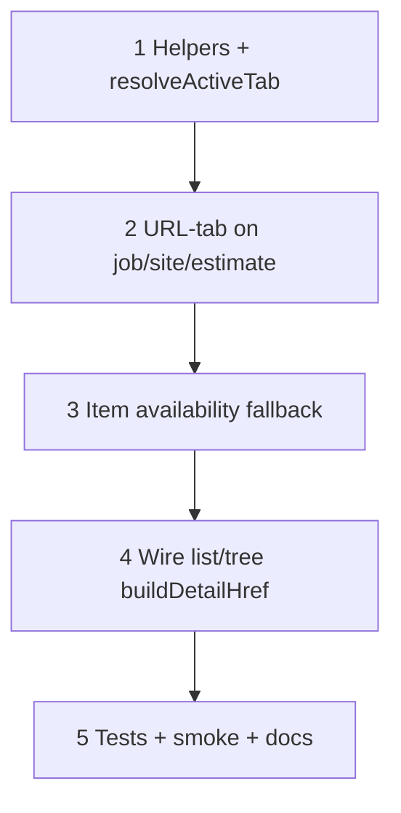

# 40 — Detail tab persistence (URL `?tab=` + availability fallback)

> **Status:** Complete (2026-07-13). Next: resume [37h](./37a-category-scope-decision-dbml-migration.md) or walkthrough **W2b**.
>
> **Decision:** [detail tab persistence](../decisions/general.md#decision-detail-tab-persistence--url-tab--availability-fallback-2026-07-13).

## Problem

Tabbed detail Surfaces remount (or rebuild) when the user selects another record in the master list/tree. Today:

1. **Parts / items** already store tab in `?tab=` and control `activeKey`, but list/tree navigations use bare `routes.*.detail(id)` — the query is dropped, so Specs resets to Purchase/General.
2. **Jobs / sites / estimates** use `DetailHeader` **without** `activeKey` / `onChange` — Ant Design Tabs are uncontrolled and always reopen on the first tab after an id change.
3. **Availability** — Specs (items: scope-only; parts: Field grants), Scopes & zones (sites: edit only), Line Items (estimates: gated) may be absent on the next record. A carried `?tab=` must fall back cleanly.

## Goal

Same-surface record switches keep the current tab when it is still available; otherwise fall back to the surface default and correct the URL. Shared helper so callers do not hand-roll query preservation.

**Exit:** All tabbed business details use URL `?tab=`; list/tree (and any same-surface id change) go through `buildDetailHref`; invalid/unavailable tabs fall back + `replace`; unit tests + smoke; STATUS/index updated.

**Not in this task:** Nested path tabs (`/items/[id]/specs`); sessionStorage last-tab; cross-surface tab inheritance; IAM / contacts / manufacturers (no detail tabs today).

---

## Locked summary (do not re-litigate)

| # | Choice |
|---|--------|
| **T1** | Active tab = URL `?tab=<key>`; default tab = omit `tab` |
| **T2** | Same-surface record nav **preserves** `tab` via `buildDetailHref` |
| **T3** | If requested tab ∉ available keys → default tab + `router.replace` to fix URL |
| **T4** | `/new` and cross-surface links do **not** carry origin `tab` |
| **T5** | Canonical keys per [decision](../decisions/general.md#decision-detail-tab-persistence--url-tab--availability-fallback-2026-07-13) |

---

## Implementation steps

---

## Step 1 — Shared helpers

| File | Action |
|------|--------|
| `lib/surface-navigation.ts` (or `lib/detail-tab.ts` if cleaner) | **Add** `buildDetailHref({ detailPath, currentSearch, preserve?: string[] })` — default `preserve = ["tab"]`; copies only listed keys that are set; returns `detailPath` or `detailPath?…` |
| Same | **Add** `resolveActiveTab(requested, availableKeys, defaultKey)` — returns `requested` if in `availableKeys`, else `defaultKey` |
| Optional | **Add** `useDetailTab({ availableKeys, defaultKey })` — reads `searchParams`, returns `{ activeKey, setTab }` where `setTab` does `router.replace` with omit-on-default (mirror parts/items today) |
| `lib/surface-navigation.test.ts` (or sibling) | Unit cases: preserve/omit; empty search; unknown keys ignored; resolve fallback |

### Verify

- [x] `buildDetailHref("/parts/b", "?tab=specs&returnTo=/x")` → `/parts/b?tab=specs` (does **not** copy `returnTo` unless listed)
- [x] `buildDetailHref("/parts/b", "")` → `/parts/b`
- [x] `resolveActiveTab("specs", ["purchase"], "purchase")` → `"purchase"`
- [x] `npm run test` covers new helpers

---

## Step 2 — URL-control tabs on job / site / estimate

Wire each form like parts today: controlled `activeKey` + `onChange` → `?tab=`.

| File | Default | Other keys | Availability notes |
|------|---------|------------|--------------------|
| `components/jobs/JobDetailForm.tsx` | `overview` | `scope`, `field`, `billing` | All keys present in v1 shell (stubs OK) |
| `components/sites/SiteDetailForm.tsx` | `general` | `scopes-zones` | Omit `scopes-zones` on create / no scopes read — fallback if `?tab=scopes-zones` |
| `components/estimates/EstimateDetailForm.tsx` | `general` | `line-items` | Only when Line Items tab is shown; else fallback |
| `components/parts/PartDetailForm.tsx` | _(already)_ | | Refactor to shared helper / `useDetailTab` if low-cost |
| `components/catalog/ItemDetailForm.tsx` | _(already)_ | | Same; availability in Step 3 |

Prefer `DetailHeader` `activeKey` / `onChange` (jobs/sites/estimates already use it). Items may keep raw `Tabs` or switch to `DetailHeader` — cosmetic, not required.

### Verify

- [x] `/jobs/[id]?tab=billing` opens Billing; switch to Overview clears `tab` from URL
- [x] `/sites/[id]?tab=scopes-zones` opens Scopes & zones when available
- [x] `/estimates/[id]?tab=line-items` opens Line Items when available
- [x] Invalid `?tab=nope` → default tab + URL cleaned on load

---

## Step 3 — Item Specs availability fallback

| File | Action |
|------|--------|
| `components/catalog/ItemDetailForm.tsx` | `activeTab = resolveActiveTab(searchParams.get("tab"), available, "general")` where `available` includes `specs` only when `showSpecsTab` |
| Same | When URL has `tab=specs` but Specs unavailable (category/item leaf), `replace` to strip `tab` (same as parts already does for display; make URL match) |

Parts already gate: `tab === "specs" && showSpecsTab`. Align items to that pattern via `resolveActiveTab`.

### Verify

- [x] Scope node on Specs → select category sibling → General shown; URL no longer `tab=specs`
- [x] Scope → another scope keeps Specs

---

## Step 4 — Same-surface navigations use `buildDetailHref`

Replace bare detail hrefs / pushes that switch record **within** a tabbed surface.

| Caller | Today | Change |
|--------|--------|--------|
| `components/catalog/ItemTreeList.tsx` | `router.push(routes.items.detail(id))` | `buildDetailHref({ detailPath: routes.items.detail(id), currentSearch: searchParams })` |
| `components/parts/PartList.tsx` | `Link href={routes.parts.detail(row.id)}` | `href={buildDetailHref(...)}` — list needs `useSearchParams` (or pass tab from layout) |
| `components/jobs/JobList.tsx` | bare detail Link | same |
| `components/sites/SiteList.tsx` | bare detail Link | same |
| `components/estimates/EstimateList.tsx` | bare detail Link | same |
| Any next/prev / programmatic `router.push(routes.*.detail(id))` on these surfaces | audit | preserve `tab` |

**Do not** preserve `tab` when:

- Navigating to `/new`
- Cross-surface `linkHref` (e.g. estimate → site)
- Picker return / `returnTo` flows (preserve their own params only)

### Verify

- [x] Items: Specs on scope A → click scope B in tree → still Specs; click category → General
- [x] Parts: Specs → click another part in list → still Specs (when Specs tab shown)
- [x] Estimates: Line Items → select another estimate → still Line Items (when tab available)
- [x] Sites: Scopes & zones → select another site → still Scopes & zones
- [x] Jobs: Billing → select another job → still Billing
- [x] **New** still opens default tab (no inherited `tab`)

---

## Step 5 — Docs, tests, smoke

| File | Action |
|------|--------|
| `docs/surface-specs/part.md` | Already documents `?tab=specs` — confirm wording |
| `docs/surface-specs/item.md` | Note `?tab=specs` + scope-only + fallback |
| `docs/surface-specs/site.md` | Note `?tab=scopes-zones` |
| `docs/surface-specs/estimate.md` | Note `?tab=line-items` |
| `docs/surface-specs/job.md` | Note `?tab=` keys |
| Unit tests | Helpers (Step 1); optional small resolve cases for item availability |
| Manual smoke | Checklist below |

### Manual smoke

1. **Items:** Open a scope → Specs → select another scope in tree → Specs stays. Select a category → General; URL has no `tab`.
2. **Parts:** Specs → click another part → Specs stays. Open `/parts/new` → Purchase (no Specs chrome until Fields allow).
3. **Estimates:** Line Items → click another estimate in list → Line Items stays.
4. **Sites:** Scopes & zones → another site → tab stays.
5. **Jobs:** Billing stub → another job → Billing stays.
6. Deep link: paste `?tab=specs` on a non-scope item → General + URL cleaned.
7. Refresh on `?tab=line-items` → still Line Items.

### Verify

- [x] Automated tests green for helpers
- [x] Smoke 1–7 pass on local `:3003`
- [x] Surface specs mention `?tab=` where tabs exist
- [x] STATUS **Right now** + [01-task-index](./01-task-index.md) updated

---

## Stop gate

- [x] All step verifies `[x]`
- [x] T1–T5 observable in UI for parts, items, sites, estimates, jobs
- [x] No bare same-surface `routes.*.detail(id)` on tabbed list/tree navigations
- [x] [`STATUS.md`](../../STATUS.md) + [01-task-index](./01-task-index.md) updated

---

## Dependencies

| Upstream | Provides |
|----------|----------|
| **38** | `surface-navigation` / master-detail chrome |
| Parts/items | Existing `?tab=specs` pattern to generalize |

| Downstream | Needs |
|------------|--------|
| Future tabbed details | Reuse `buildDetailHref` + `resolveActiveTab` / `useDetailTab` |
| Walkthrough / 37h | Unblocked (this task is parallel chrome) |
