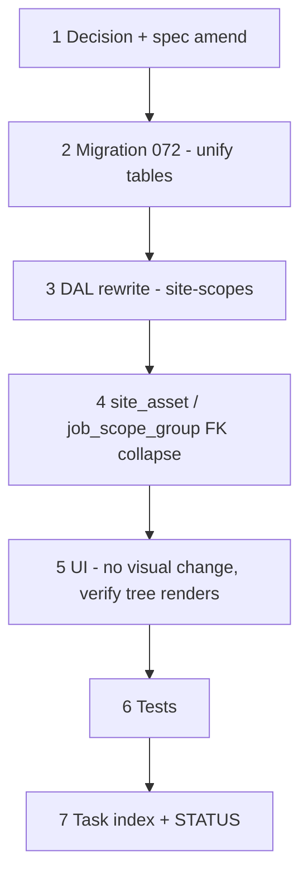

# 42a — Site zone tree unification (`site_scope` + `site_zone` → one tree)

> **Status:** Complete (2026-07-14). Next: [42b-estimate-condition-zone-link.md](./42b-estimate-condition-zone-link.md).
>
> **Prerequisite:** [37c-site-scopes-zones.md](./37c-site-scopes-zones.md) ✅ (current 2-table shape). **Next:** [42b-estimate-condition-zone-link.md](./42b-estimate-condition-zone-link.md) — estimate root condition → root zone link (depends on this task).
>
> **Spec:** [`site.md`](../surface-specs/site.md) · **Planning:** [14-site-estimate-zone-unification.md](../planning/14-site-estimate-zone-unification.md) § 1 · **Decision:** [site zone tree unification](../decisions/site.md#decision-site-zone-tree-unification-2026-07-14).

**Out of scope (deferred):** asset-level history / `site_asset` write access from estimates — tracked separately, not part of this task or 42b.

---

## Decisions (proposed — lock in Step 1 before continuing)

| # | Topic | Choice |
|---|-------|--------|
| D1 | **Table shape** | Collapse `site_scope` + `site_zone` into one self-referencing `site_zone` table. Root rows (`parent_zone_id IS NULL`) are the scope instance ("base zone"); `root_item_id` **required** on real scope roots, **null** on the General root and all children. |
| D2 | **Root delete semantics** | **Block** — a root row cannot be deleted while it has any children (existing or reparented). No cascade, no auto-reparent-to-General. Matches existing block-on-reference posture. |
| D3 | **FK collapse** | `site_asset.site_scope_id` + `site_asset.site_zone_id` → single `site_asset.site_zone_id` (points at any node). Same collapse on `job_scope_group`. |
| D4 | **Migration approach** | Big-bang, dev DB, no compat layer (matches `033`/`037` precedent) — insert one root `site_zone` row per existing `site_scope` row (preserving `id` if practical, else new id + FK remap), reparent existing `site_zone` rows' `site_scope_id` → `parent_zone_id` (root's new id) or leave `parent_zone_id NULL` for General, then drop `site_scope`. |
| D5 | **Duplicate names / duplicate root categories** | Unchanged from [D7/37c](./37c-site-scopes-zones.md) — not enforced v1. |
| D6 | **General bucket** | Remains **retired** (039 / 37f) — no synthetic General root; `scopes` Field only. |

---

## Goal

Replace the two-table site geography model with a single self-referencing `site_zone` tree so every consumer (site UI, `site_asset`, `job_scope_group`, and the upcoming estimate-condition link in 42b) uses one FK instead of a nullable pair. No Field/API vocabulary change — `scopes` / `general_zones` Field ids and their read/write DTO shapes stay as shipped in 37c; only the underlying tables and DAL queries change.

**Exit:** Site detail Scopes & zones tab round-trips unchanged from a user's perspective; `site_asset` and `job_scope_group` read/write against the unified table; root-delete blocked while children exist; `codegen:check` and DAL tests pass.

**Not in scope:** Estimate condition binding (42b); `site_asset` editor UI (still deferred to job phase per `site.md`); asset-level history/write access from estimates.

---

## Collapse matrix

| Layer | Before | After |
|-------|--------|-------|
| Tables | `site_scope`, `site_zone` | `site_zone` only |
| Root identity | `site_scope.id` | `site_zone.id` where `parent_zone_id IS NULL` |
| Root's catalog link | `site_scope.root_item_id` | `site_zone.root_item_id` (root rows only) |
| Child link to root | `site_zone.site_scope_id` (nullable = General) | `site_zone.parent_zone_id` (same nullable-root pattern, now within one table) |
| `site_asset` FKs | `site_scope_id` + `site_zone_id` | `site_zone_id` only |
| `job_scope_group` FKs | `site_scope_id` + `site_zone_id` | `site_zone_id` only |
| Blocker query | `estimate_line` / `job_line` / `site_asset` referencing `site_zone_id`, or `site_scope_id` on scope delete | Same three, now all keyed on `site_zone_id`; **root** delete additionally blocked by **any child row existing** (D2) |

---

## Execution order



---

## Step 1 — Decision + spec amend

| File | Action |
|------|--------|
| [`docs/decisions/site.md`](../decisions/site.md) | **Add** dated Decision block — "site zone tree unification" — D1–D6 above |
| [`docs/surface-specs/site.md`](../surface-specs/site.md) | **Amend** § A/D/E — `site_scope` references become `site_zone` (root rows); DAL read/write sections describe single-table tree walk |
| [`docs/schema/current.dbml`](../schema/current.dbml) | **Amend** — drop `site_scope` table; `site_zone` gains `root_item_id` (nullable, root-only); update all downstream `Ref:` lines (`site_asset`, `job_scope_group`) |

### Verify

- [x] Decision block dated and cross-linked from `site.md`
- [x] `current.dbml` has no remaining `site_scope` table

---

## Step 2 — Migration `072_site_zone_tree_unification.sql`

| Action |
|--------|
| Add `site_zone.root_item_id` (nullable), `FK → item, ON DELETE RESTRICT` |
| Data migrate: for each `site_scope` row, insert (or convert in place) a root `site_zone` row carrying its `id`, `site_id`, `root_item_id`, `name`, `status`, `sort_order`, `parent_zone_id = NULL` |
| Reparent: existing `site_zone.site_scope_id` → `site_zone.parent_zone_id` pointing at the new root's id (or leave `NULL` for General rows — unchanged) |
| Repoint `site_asset.site_scope_id` + `site_asset.site_zone_id` → single `site_asset.site_zone_id` (prefer the more specific of the two when both were set) |
| Repoint `job_scope_group.site_scope_id` + `job_scope_group.site_zone_id` → single `job_scope_group.site_zone_id` |
| Drop `site_scope` table, drop old dual columns |
| Add CHECK: `root_item_id IS NOT NULL OR parent_zone_id IS NOT NULL` is **not** required (General root is a valid `root_item_id IS NULL, parent_zone_id IS NULL` row) — no new CHECK needed beyond existing `status` CHECK |

### Verify

- [x] `node scripts/db-migrate.mjs --dir=apps/subhub --check` passes
- [x] Row counts: `site_zone` after migration = old `site_scope` count + old `site_zone` count
- [x] Every pre-migration `site_asset` / `job_scope_group` row resolves to the same effective place post-migration (spot-check on dev seed data)

---

## Step 3 — DAL rewrite

| File | Action |
|------|--------|
| `lib/sites/repository/site-scopes.ts` | **Rewrite** — single recursive query over `site_zone`; root rows (`parent_zone_id IS NULL AND root_item_id IS NOT NULL`) map to `scopes[]`; General root (`parent_zone_id IS NULL AND root_item_id IS NULL`) maps to `general_zones[]`; nest children under either by `parent_zone_id` |
| `lib/sites/repository/site-scopes-write.ts` | **Rewrite** replace-array write; add **root delete-block** — refuse to omit a root row from the PATCH payload while it still has child rows in the same payload state (D2); keep existing referenced-row 409 (now single `site_zone_id` blocker query against `estimate_line`, `job_line`, `site_asset`) |
| `lib/sites/repository/site-scopes-write.test.ts` | Update fixtures — single-table tree; add root-with-children delete-block case |
| `lib/sites/repository/sql-utils.ts` | Update any `site_scope` table-existence helpers |

### Verify

- [x] `npm test -- --run site-scopes-write`
- [x] Deleting a root with children → blocked (new case)
- [x] Deleting an empty root → allowed (existing case, still passes)

---

## Step 4 — `site_asset` / `job_scope_group` FK collapse

| File | Action |
|------|--------|
| Any `site_asset` repository/DTO code referencing `site_scope_id` | Update to single `site_zone_id` (site_asset editor UI itself remains deferred — this is DTO/DAL plumbing only) |
| `lib/estimates/repository/estimate-site-tree.ts` | Update query — reads `site_zone` unified table instead of joining `site_scope` + `site_zone` separately (keep DTO shape `scopes[] { zones[] }` identical for 42b to consume) |
| Any `job_scope_group` repository code | Update FK references to single `site_zone_id` |

### Verify

- [x] No remaining `site_scope_id` references in `lib/` or `components/`
- [x] `estimate-site-tree.ts` output DTO unchanged in shape (regression-checked by existing `EstimateLinePlacesButton` consumer, pending 42b's rework)

---

## Step 5 — UI smoke (no intended visual change)

Scopes & zones tab UI (`SiteScopesZonesTree.tsx`) should require **no changes** — same nested `scopes[]` / `general_zones[]` DTO shape. This step is verification only.

### Verify

- [x] Existing site with scopes/zones renders identically pre/post migration
- [x] Add scope / Add zone / DnD / delete still work
- [x] Root with children → trash disabled or 409 on attempted delete

---

## Step 6 — Tests

```bash
cd apps/subhub
npm run codegen:check
npm test -- --run site-scopes-write
npm test -- --run estimate-site-tree
npm run build
```

### Verify

- [x] All above pass

---

## Step 7 — Task index + STATUS

| File | Action |
|------|--------|
| [`docs/tasks/01-task-index.md`](./01-task-index.md) | Link **42a** under a new "Site / estimate zone unification" section |
| [`STATUS.md`](../../STATUS.md) | Note task authored; do not reorder **Right now** unless explicitly promoted ahead of **37h** |

---

## Manual smoke (stop gate)

1. Load an existing site with multiple scope instances (e.g. Fire Alarm — Bldg A / Bldg B) — both render as before.
2. Attempt to delete a root scope with zones underneath — blocked.
3. Delete all zones under a root, then delete the (now-empty) root — succeeds.
4. Add a new scope, add nested zones, save, reload — persists.
5. Existing `site_asset` rows (if any dev-seeded) still resolve to the correct place.

---

## Risk notes

| Risk | Mitigation |
|------|------------|
| Data migration id remap breaks existing FKs mid-transaction | Single transaction; prefer preserving `site_scope.id` as the new root `site_zone.id` where no collision exists, to avoid remapping `site_asset`/`job_scope_group` rows at all |
| Root-delete-block is a **behavior change** from today's `SET NULL`-to-General | Call out explicitly in manual smoke; no dev data currently depends on the old reparent-to-General-on-delete behavior (verify before merging) |
| `estimate-site-tree.ts` DTO drift breaks `EstimateLinePlacesButton` before 42b lands | Keep DTO shape byte-for-byte identical; 42b is the task that reworks the consumer |

---

## Related

- [planning/14-site-estimate-zone-unification.md](../planning/14-site-estimate-zone-unification.md) — full proposal + rationale
- [37c-site-scopes-zones.md](./37c-site-scopes-zones.md) — current 2-table implementation being replaced
- [42b-estimate-condition-zone-link.md](./42b-estimate-condition-zone-link.md) — depends on this task
