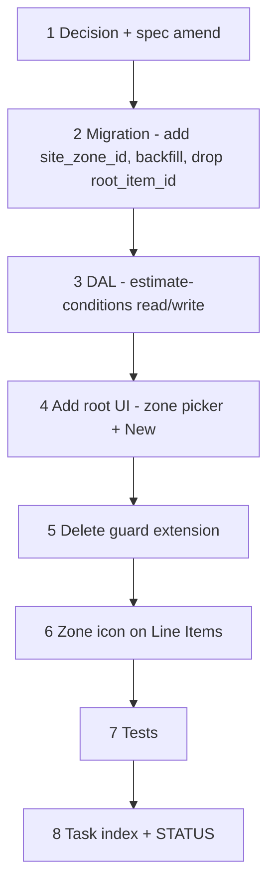

# 42b — Estimate root condition → site zone link + zone icon on Line Items

> **Status:** Complete (2026-07-14). Next: [42c — zone tree popover](./42c-estimate-line-zone-tree-popover.md) (optional; STATUS still points at [37h](./37a-category-scope-decision-dbml-migration.md) unless promoted).
>
> **Prerequisite:** [42a-site-zone-tree-unification.md](./42a-site-zone-tree-unification.md) — unified `site_zone` table must land first so the root FK targets one table, not the retired `site_scope`.
>
> **Spec:** [`estimate.md`](../surface-specs/estimate.md) · **Planning:** [14-site-estimate-zone-unification.md](../planning/14-site-estimate-zone-unification.md) § 2–3 · **Decision:** [estimate root condition ↔ site zone link](../decisions/estimate.md#decision-estimate-root-condition--site-zone-link-2026-07-14) — amends [X2](../decisions/estimate.md#x2--scope--condition-tree-ownership--ui-locked-2026-07-09) and [G1](../decisions/estimate.md#g1--site-geography-stays-place-only-locked).

**Out of scope (deferred):** asset-level history / loosening `site_asset` write access to estimates — separate future task, not authored here.

---

## Decisions (locked 2026-07-14)

| # | Topic | Choice |
|---|-------|--------|
| D1 | **Root FK** | `estimate_condition.site_zone_id` — **NOT NULL on root conditions** (`parent_condition_id IS NULL`); must reference a **root-level** `site_zone` (`parent_zone_id IS NULL`) belonging to the estimate's `site_id`; **NULL on children** (unchanged — children nest via `parent_condition_id`, never reference `site_zone` directly). |
| D2 | **Drop stored `root_item_id`** | Remove `estimate_condition.root_item_id` column. Derive it by joining the linked root's `site_zone.root_item_id` at read time. Never stored redundantly. |
| D3 | **Name handling (hybrid)** | `estimate_condition.name` stays independently editable, prefilled from the linked zone's `name` at creation only — same pattern as today's `site_scope` prefill-then-rename. Renaming the site zone later does **not** rewrite an already-created condition's name. |
| D4 | **Add root UI** | "Add root" lists the estimate's site's existing root `site_zone` rows (pickable) **and** a "New…" option that creates a `proposed` root `site_zone` inline (name + root-item picker, same UX as today's site "Add scope") before attaching the condition. |
| D5 | **Duplicate roots** | `UNIQUE (estimate_id, site_zone_id)` where `parent_condition_id IS NULL` — one root condition per base zone per estimate. |
| D6 | **Delete guard** | Extend the `site_zone` delete-block query (42a) to include: blocked while any `estimate_condition.site_zone_id` references it, **regardless of the estimate's status** (open, sent, lost, expired all block). |
| D7 | **Zone icon (Line Items)** | Remove the **Places** column/label; add an icon-only zone control immediately before the **Qty** column. Same underlying data model (`estimate_line_allocation`) — only the entry point and the picker's zone source change. |
| D8 | **Zone icon source** | Picker options = the line's `estimate_condition`'s **root**'s zone subtree only (walk up `parent_condition_id` to the root, then flatten that root `site_zone`'s descendants) — not the whole site tree. |

---

## Goal

Bind every estimate root condition to a real site base zone so the Line Items zone picker has an unambiguous source, replacing today's "all zones on the site" / "guess by catalog root" behavior. Ship the originally-requested UI change (remove Places column, add zone icon before Qty) as part of this task, now that it has a correct data source.

**Exit:** New root conditions require picking/creating a site base zone; existing root conditions are migrated to a linked zone; the Line Items zone icon shows only that root's own zone subtree; deleting a referenced root zone is blocked.

**Not in scope:** `site_asset` / device pinning from estimates; asset-level history; job-side zone assignment UI (separate future task).

---

## Migration plan (data backfill for existing `estimate_condition` rows)

Existing root conditions have `root_item_id` but no zone link — there is nothing today for them to point at other than a matching catalog root. Dev DB, big-bang, no compat layer:

1. For each existing root `estimate_condition` (`parent_condition_id IS NULL`), look at its `estimate.site_id` and `root_item_id`.
2. If exactly one root `site_zone` on that site shares the same `root_item_id` → link to it.
3. If zero match → create a new root `site_zone` on that site (`status = proposed`, `name` copied from the condition's `name`) and link to it.
4. If more than one match (multiple site instances of the same root) → **cannot auto-resolve** — flag for manual review (dev data only; expect a short list, fix by hand before dropping `root_item_id`).

---

## Execution order



---

## Step 1 — Decision + spec amend

| File | Action |
|------|--------|
| [`docs/decisions/estimate.md`](../decisions/estimate.md) | **Add** dated Decision block — D1–D8 above; explicitly note it **amends** X2 and G1 |
| [`docs/surface-specs/estimate.md`](../surface-specs/estimate.md) | **Amend** § covering the **S** panel ("Add root" flow), **LI** panel (drop Places column, add zone icon), condition read/write DTO shape |
| [`docs/schema/current.dbml`](../schema/current.dbml) | **Amend** — `estimate_condition.site_zone_id` FK (root rows), drop `root_item_id` column, add unique constraint (D5) |

### Verify

- [x] Decision block dated, cross-linked, explicitly marked as amending X2/G1
- [x] `estimate.md` § S panel reflects zone-based "Add root"

---

## Step 2 — Migration `073_estimate_condition_site_zone_link.sql`

| Action |
|--------|
| Add `estimate_condition.site_zone_id` (nullable initially), `FK → site_zone, ON DELETE RESTRICT` |
| Backfill per the migration plan above |
| Add `CHECK (parent_condition_id IS NOT NULL OR site_zone_id IS NOT NULL)` — root rows must have a zone link |
| Add `UNIQUE (estimate_id, site_zone_id)` scoped to root rows (partial unique index `WHERE parent_condition_id IS NULL`) |
| Drop `estimate_condition.root_item_id` column |

### Verify

- [x] `node scripts/db-migrate.mjs --dir=apps/subhub --check` passes
- [x] Every pre-migration root condition has a non-null `site_zone_id` post-migration (or is on the manual-review list)
- [x] No two root conditions in the same estimate share a `site_zone_id`

---

## Step 3 — DAL read/write

| File | Action |
|------|--------|
| `lib/estimates/repository/estimate-conditions.ts` | Derive `root_item_id` / root zone name via join on `site_zone_id` instead of reading a stored column; DTO gains `site_zone_id`, `site_zone_name` on root rows |
| `lib/estimates/repository/estimate-conditions-write.ts` | Validate: root rows require `site_zone_id`; must reference a **root-level** `site_zone` on the estimate's `site_id`; enforce D5 uniqueness (friendly `ValidationError`, not just DB constraint surfacing); children keep `site_zone_id = null` |
| `lib/estimates/repository/estimate-conditions-write.test.ts` | Update fixtures; add cases: missing zone on root → rejected; duplicate zone on two roots → rejected; child with `site_zone_id` set → rejected |
| `lib/sites/repository/site-scopes-write.ts` (post-42a) | Extend delete-block query to include `estimate_condition.site_zone_id` references (D6) |

### Verify

- [x] `npm test -- --run estimate-conditions-write`
- [x] Root condition create without `site_zone_id` → rejected
- [x] Deleting a referenced root zone from `site_detail` → 409, listing referencing estimate(s)

---

## Step 4 — Add root UI (zone picker + create-new)

| File | Action |
|------|--------|
| `components/estimates/EstimateQuoteStructureTree.tsx` | "Add root" control — replace catalog-root picker with: (a) list of the site's existing root `site_zone` rows, (b) "New…" sub-flow (name + root-item picker, mirrors site's "Add scope") that creates a `proposed` root `site_zone` then attaches the condition |
| New picker route, e.g. `app/api/estimates/pickers/site-zones/route.ts` | List root `site_zone` rows for the estimate's site — Field-grant-entailed read under `estimate_detail` context (same pattern as [37c D2](./37c-site-scopes-zones.md#picker-auth-d2--implementation-note)) |
| `lib/hooks/use-*-picker.ts` (new hook) | Fetch + cache the site-zone picker options |

### Verify

- [x] Add root shows existing site zones; picking one attaches the condition with the derived name/root item
- [x] "New…" creates a `proposed` site zone and attaches in one flow
- [x] Site with zero root zones → "Add root" shows only "New…" (or is disabled with a CTA to `/sites/[id]`, matching the D5-empty-roots pattern from 37c)

---

## Step 5 — Delete guard extension (site side)

Covered in Step 3's DAL change (`site-scopes-write.ts` blocker query) — this step is verification only, from the **site** surface's perspective.

### Verify

- [x] Deleting a root zone referenced by any estimate's root condition → blocked, regardless of that estimate's status (open/sent/lost/expired)

---

## Step 6 — Zone icon on Line Items (drop Places column)

| File | Action |
|------|--------|
| `components/estimates/EstimateLinePlacesButton.tsx` | **Rename/rework** → icon-only control (e.g. `EnvironmentOutlined`, no text label); `zoneOptions` computed from the **line's condition's root** zone subtree only, not the whole `site_tree` |
| `components/estimates/EstimateLineFlatTable.tsx` | Move the zone control out of the actions column to immediately before the **Qty** column; drop the old "Places" text/column header |
| `components/estimates/estimate-line-tree.ts` | Update any type/prop names referencing "Places" for clarity (optional, cosmetic) |

### Verify

- [x] Zone icon renders directly before Qty on every line
- [x] Opening it shows only zones under that line's condition's root — not sibling roots' zones
- [x] Allocation save/qty-sync behavior (existing `qty_manual` rules) unchanged

---

## Step 7 — Tests

```bash
cd apps/subhub
npm run codegen:check
npm test -- --run estimate-conditions-write
npm test -- --run site-scopes-write
npm run build
# Manual: open an estimate → Add root → pick/create zone → add condition child → add line → zone icon → confirm scoped options
```

### Verify

- [x] All above pass

---

## Step 8 — Task index + STATUS

| File | Action |
|------|--------|
| [`docs/tasks/01-task-index.md`](./01-task-index.md) | Link **42b** alongside 42a |
| [`STATUS.md`](../../STATUS.md) | Note task authored; do not reorder **Right now** unless explicitly promoted ahead of **37h** |

---

## Manual smoke (stop gate)

1. Existing estimate with a root condition — after migration, its root shows a linked zone name; deleting that site zone is blocked.
2. New estimate → blank **S** → Add root → pick existing site zone → condition created with prefilled name.
3. New estimate → Add root → "New…" → creates a `proposed` site zone + attaches.
4. Site with two instances of the same catalog root (Bldg A / Bldg B) → both selectable as distinct roots; no ambiguity.
5. Add a line under a condition → zone icon → only that root's zones appear, not the other building's.
6. Attempt to add a second root condition pointing at the same zone → rejected (D5).

---

## Risk notes

| Risk | Mitigation |
|------|------------|
| Migration Step 2's "multiple match" case for existing root conditions | Expect a short manual-review list on dev data; fix by hand before shipping — flag in migration output, don't silently guess |
| PDF/quote export showing a zone name that's since been renamed on the site | Out of scope here — export-time snapshot is a separate concern noted in [planning/14 § 2](../planning/14-site-estimate-zone-unification.md#2--estimate-root-condition--root-site-zone-hybrid-link) |
| UI regression on `qty_manual` sync when reworking `EstimateLinePlacesButton` | Keep allocation save logic untouched — only change is the trigger control and the zone option source |

---

## Related

- [planning/14-site-estimate-zone-unification.md](../planning/14-site-estimate-zone-unification.md) — full proposal + rationale
- [42a-site-zone-tree-unification.md](./42a-site-zone-tree-unification.md) — prerequisite
- [decisions/estimate.md — X2](../decisions/estimate.md#x2--scope--condition-tree-ownership--ui-locked-2026-07-09) and [G1](../decisions/estimate.md#g1--site-geography-stays-place-only-locked) — amended by this task
