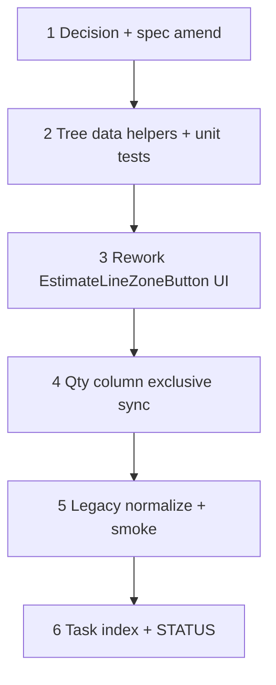

# 42c — Line Items zone popover: checkable tree + exclusive qty

> **Status:** Complete (2026-07-14). Next: [37h — Job FK renames](./37a-category-scope-decision-dbml-migration.md) (STATUS pointer unchanged).
>
> **Prerequisite:** [42b-estimate-condition-zone-link.md](./42b-estimate-condition-zone-link.md) ✅ — root condition ↔ root `site_zone` + zone icon before Qty (flat Select modal still in place).
>
> **Spec:** [`estimate.md`](../surface-specs/estimate.md) · **Planning:** [14-site-estimate-zone-unification.md](../planning/14-site-estimate-zone-unification.md) · **Amends:** [G3](../decisions/estimate.md#g3--line-quantity-and-zone-allocations-locked) / [X3](../decisions/estimate.md#x3--qty-unset-vs-db-locked-2026-07-09) (exclusive tree ↔ qty; no simultaneous unallocated remainder).

**Out of scope:** Schema change to `estimate_line_allocation` (keep table); job-side place UI; creating site zones from the popover; asset pinning.

---

## Decisions (lock in Step 1)

| # | Topic | Choice |
|---|-------|--------|
| **Z1** | **Picker chrome** | Zone icon opens a **Popover/Modal** with Ant `Tree` `checkable` showing the line’s condition-**root** site-zone subtree only (42b D8). Not the whole site; not the estimate condition tree. |
| **Z2** | **Cascade check** | Check/uncheck a **parent** → check/uncheck **all descendants**. Partial child selection → parent **indeterminate**. |
| **Z3** | **Persist leaf-only** | `estimate_line_allocation` rows exist **only for leaf zones** (nodes with no children in the site subtree). Parents are cascade / bulk-qty UI only — never stored as allocation rows. |
| **Z4** | **Qty on tree** | Every node shows an `InputNumber` when relevant: **leaves** = per-place qty (default **1** when checked); **parents** = bulk control — setting parent qty writes the same **N** onto every **checked** descendant leaf (overwrites mixed values). Unchecked leaves have no editable qty (or disabled). |
| **Z5** | **Exclusive SoT (amends G3/X3)** | **Tree mode** (`qty_manual = false`): any tree edit (check / uncheck / parent or leaf qty) sets `quantity = sum(leaf allocation qtys)`, or **1** when no allocations. **Qty mode** (`qty_manual = true`): user edits line **Qty** → **uncheck entire tree** and clear `allocations[]`. Places **or** bare commercial qty — **not both**. Drops G3’s “qty 50 + 40 placed + 10 unallocated.” |
| **Z6** | **Switch edges** | Tree → type Qty: wipe allocations, keep typed qty, `qty_manual = true`. Qty mode → check any zone: `qty_manual = false`, rebuild from tree, qty follows sum. Optional “Sync qty to places” is unnecessary (tree always syncs when used). |
| **Z7** | **Apply / form** | Draft edits stay local until **Apply**; then write `allocations[]` + `quantity` + `qty_manual` into RHF (`shouldDirty`). Estimate PATCH unchanged (replace allocations). |
| **Z8** | **Legacy data** | On open/Apply of the popover (or one-shot client normalize when loading line items): if `qty_manual = true` **and** allocations exist → **prefer qty** (clear allocations). If allocations reference a **non-leaf** `site_zone_id` → drop those rows (or expand to descendant leaves @ same qty — prefer **drop** for v1 simplicity; document in smoke). No DB migration required unless a seed/dev audit finds many non-leaf rows. |

---

## Goal

Replace the flat “Add zone…” Select + per-row list in `EstimateLineZoneButton` with a checkable zone tree (cascade + parent bulk qty), scoped to the condition-root site zone, and switch line qty ↔ places to an **exclusive** source-of-truth model.

**Exit:** Opening the zone icon shows the root-scoped checkable tree; cascade and parent qty behave per Z2–Z4; editing Qty clears places; editing places drives Qty; leaf-only allocations persist through estimate save/reload.

**Not in scope:** New tables/columns; changing 42b Add-root / condition FK; job allocation UI.

---

## Execution order

---

## Step 1 — Decision + spec amend

| File | Action |
|------|--------|
| [`docs/decisions/estimate.md`](../decisions/estimate.md) | **Add** dated Decision block — Z1–Z8; explicitly **amends G3 / X3** (exclusive modes; leaf-only; cascade). Cross-link from G3/X3. |
| [`docs/surface-specs/estimate.md`](../surface-specs/estimate.md) | **Amend** LI / Zones row — checkable tree popover, leaf-only allocations, exclusive qty ↔ places |
| [`docs/decisions/README.md`](../decisions/README.md) | Index the new decision |
| [`docs/planning/14-site-estimate-zone-unification.md`](../planning/14-site-estimate-zone-unification.md) | Note popover UX follow-on shipped via 42c (no schema) |

### Verify

- [x] Decision block dated, Z1–Z8 locked, marked as amending G3/X3
- [x] Surface spec LI zone control describes checkable tree + exclusive SoT

---

## Step 2 — Tree helpers + unit tests

Pure helpers (prefer next to `estimate-line-tree.ts` or a small `estimate-line-zone-tree.ts`):

| Helper | Behavior |
|--------|----------|
| `zoneSubtreeForRoot(siteTree, rootSiteZoneId)` | Nested tree nodes for Ant `treeData` (title, key, children) |
| `leafIdsInSubtree(tree)` | All leaf zone ids under root |
| `checkedLeafIdsFromAllocations(allocations)` | Intersection with current leaf set |
| `allocationsFromCheckedLeaves(leafIds, qtyByLeaf)` | Build `allocations[]` (default qty 1) |
| `applyParentQty(leafIdsUnderParent, qty, qtyByLeaf)` | Set every listed leaf to N |
| `cascadeCheck(nodeId, checked, tree)` / uncheck | Return next checked leaf set |
| `normalizeExclusiveLine(line)` | Z8: clear allocations if `qty_manual`; drop non-leaf allocation ids |

### Verify

- [x] Unit tests cover cascade check/uncheck, parent qty overwrite, sum → qty, exclusive clear on qty_manual
- [x] `npm test -- --run estimate-line-zone` (or chosen test file name) passes

---

## Step 3 — Rework `EstimateLineZoneButton` UI

| File | Action |
|------|--------|
| `components/estimates/EstimateLineZoneButton.tsx` | Replace Select + list with `Tree` `checkable` + per-node qty; draft state = checked leaves + qty map; footer Allocated / Apply |
| Ant Tree | Prefer `checkStrictly`-style control **or** fully custom `onCheck` so cascade is **our** Z2 logic (do not double-count parents as allocations) |
| Empty | No zones under root → secondary copy (unchanged intent) |
| Disabled | Respect line/`line_items` write gate |

### Verify

- [x] Popover/Modal shows only the condition-root subtree
- [x] Parent check selects all descendant leaves; uncheck clears them
- [x] Parent qty sets all checked descendant leaf qtys to N
- [x] Apply writes leaf-only `allocations[]` into the form

---

## Step 4 — Qty column exclusive sync (Z5–Z6)

| Touchpoint | Action |
|------------|--------|
| Line **Qty** cell onChange | Set `qty_manual = true`; clear `allocations[]` (and any open draft if needed) |
| Zone Apply (tree mode) | Set `qty_manual = false`; `quantity = sum(allocation.qty)` or `1` if empty |
| Remove old G3 UI copy | Drop “Manual qty … allocated must not exceed” / over-allocate block — invalid in exclusive model |

Wire in `EstimateLineFlatTable` / qty cell handlers as needed so typing Qty does not leave stale allocations.

### Verify

- [x] Edit Qty with places present → allocations cleared; icon shows empty tree
- [x] Check zones after manual qty → qty becomes allocated sum; `qty_manual` false
- [x] Save + reload preserves leaf allocations and qty when in tree mode

---

## Step 5 — Legacy normalize + manual smoke

| Case | Expect |
|------|--------|
| Line with `qty_manual` + old allocations | Normalize clears places (Z8) |
| Allocation pointing at non-leaf zone | Dropped on normalize; user re-checks leaves |
| Deep tree (building → floor → door) | Cascade + parent qty work; only doors in PATCH |
| Two root conditions / buildings | Line under Bldg A never sees Bldg B zones |

### Verify

- [x] Manual smoke checklist below passes
- [x] `npm run build` (or existing estimate component tests) green

---

## Step 6 — Task index + STATUS

| File | Action |
|------|--------|
| [`docs/tasks/01-task-index.md`](./01-task-index.md) | Mark **42c** complete when done |
| [`STATUS.md`](../../STATUS.md) | Recently completed + Updated date; do **not** reorder **Right now** unless promoted ahead of **37h** |

### Verify

- [x] Task Status line Complete; all verify boxes `[x]`
- [x] STATUS reflects completion

---

## Manual smoke (stop gate)

1. Estimate with root linked to a multi-level site zone → zone icon → tree matches that root only.
2. Check a mid-level parent → all descendant leaves checked @ qty 1; line qty = leaf count (tree mode).
3. Set parent qty to 3 → every checked leaf shows 3; line qty = 3 × leaf count.
4. Uncheck one leaf → qty drops by that leaf’s qty; parent indeterminate.
5. Edit line Qty → all checks clear; allocations empty after Apply/save.
6. With manual qty, check a leaf → qty becomes that leaf’s qty; further checks sum.
7. Save estimate, reload → same leaf allocations + qty.
8. Sibling root condition’s line does not list this root’s zones.

---

## Risk notes

| Risk | Mitigation |
|------|------------|
| Ant `Tree` default cascade checks parents into `checkedKeys` | Custom `onCheck` + persist **leaf ids only** (Z3) |
| Amending G3 surprises estimators who relied on unallocated remainder | Decision block + surface-spec copy; no silent dual mode |
| Non-leaf legacy allocations | Z8 drop-on-normalize; optional one-line STATUS note if seed data hit |
| Parent qty vs “distribute total across children” ambiguity | Z4 = **same N on each leaf**, not divide-total |

---

## Related

- [42b — estimate condition zone link](./42b-estimate-condition-zone-link.md) — prerequisite (icon + scoped source)
- [42a — site zone tree unification](./42a-site-zone-tree-unification.md)
- [G3 / X3](../decisions/estimate.md#g3--line-quantity-and-zone-allocations-locked) — amended by this task’s decision
- [planning/14](../planning/14-site-estimate-zone-unification.md)
