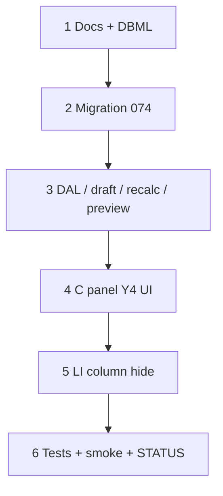

# 43 — Condition labor only + Y4 discontinued inherit

> **Status:** Complete (2026-07-14). Next: [37h](./37a-category-scope-decision-dbml-migration.md) (STATUS pointer — job FK renames).
>
> **Decision:** [condition labor only + Y4 discontinued](../decisions/estimate.md#decision-condition-labor-only--y4-discontinued-2026-07-14) (**L1–L12**). **Amends:** [W2b](../decisions/estimate.md#w2b--discontinued-part-filter-locked-2026-07-13) bare toggle. **Builds on:** [Y3/Y4](../decisions/estimate.md#decision-condition-only-commercial-tree-2026-07-09), [37aa](./37aa-estimate-line-live-preview.md) preview/recalc, [41ak](./41ak-part-discontinued-filter.md). **Schema change.**

**Out of scope:** Job-side `labor_only` flag / win copy schema (L9 defer); line-level labor-only override (L10); catalog item-picker filter (L8); hiding specs while labor-only (L5 keeps them visible).

---

## Locked summary (do not re-litigate)

| # | Choice |
|---|--------|
| **L1** | `labor_only` / UI **Labor only** |
| **L2** | Every condition; Y4 inherit/override |
| **L3** | Force M/F/I = 0; labor + complexity normal; labor markup; `sales_locked` OK |
| **L4** | Clear part/vendor + `material_locked`; skip resolver; keep `item_id` |
| **L5** | Specs + discontinued stay visible/editable |
| **L6** | Toggle off → re-resolve |
| **L7** | Hide Part, Unit, Material, Freight, Incidental, material-lock when selected condition effective labor-only |
| **L8** | Catalog orthogonal |
| **L9** | Win→job schema deferred; lines still job scope / completion; nothing to order |
| **L10** | Condition only — no line flag |
| **L11** | `labor_only_explicit` + `labor_only` |
| **L12** | Same task: `include_discontinued_explicit` + Y4 UI; backfill explicit=true |

---

## Goal

Add condition **Labor only** (OFCI / material by others): install labor calculated, material/freight/incidental excluded, no part pin. Bring **Include discontinued** onto the same Y4 inherit pattern as other C knobs.

**Exit:** Migration applied; C panel Y4 controls for both knobs; preview/save recalc honors labor-only; LI columns hide per L7; tests + smoke; STATUS + index updated.

---

## Execution order



---

## Step 1 — Docs + DBML

| File | Action |
|------|--------|
| [`docs/decisions/estimate.md`](../decisions/estimate.md) | L1–L12 locked *(authored with this task)* |
| [`docs/schema/current.dbml`](../schema/current.dbml) | `estimate_condition`: add `labor_only`, `labor_only_explicit`; add `include_discontinued_explicit` |
| [`docs/surface-specs/estimate.md`](../surface-specs/estimate.md) | C knobs + LI column behavior when labor-only |
| [`docs/decisions/README.md`](../decisions/README.md) | Index decision |

### Verify

- [x] Decision L1–L12 linked from W2b / Y4
- [x] DBML matches intended columns

---

## Step 2 — Migration

| File | Action |
|------|--------|
| `migrations/074_estimate_condition_labor_only.sql` | **Create** |

```sql
-- sketch
ALTER TABLE estimate_condition
  ADD COLUMN labor_only boolean NOT NULL DEFAULT false,
  ADD COLUMN labor_only_explicit boolean NOT NULL DEFAULT false,
  ADD COLUMN include_discontinued_explicit boolean NOT NULL DEFAULT false;

-- Preserve 41ak per-node discontinued values as explicit owns
UPDATE estimate_condition SET include_discontinued_explicit = true;

-- Roots always own labor_only (optional; resolution may treat root as always explicit)
UPDATE estimate_condition
SET labor_only_explicit = true
WHERE parent_condition_id IS NULL;
```

### Verify

- [x] Migration applied on dev; existing discontinued behavior unchanged after Y4 resolve

---

## Step 3 — DAL / draft / recalc / preview

| Area | Action |
|------|--------|
| Descriptor / form row | `labor_only`, `labor_only_explicit`, `include_discontinued_explicit` on condition read/PATCH |
| Effective resolve | Leaf→root: first `*_explicit` wins (same as phases); else false |
| `condition-draft` | Include effective `labor_only` (+ discontinued) for preview fingerprint / fan-out |
| `recalcProductLine` | If effective labor-only: skip material resolve; force M/F/I = 0; clear part/vendor when applying; labor path unchanged |
| Preview draft schema | Accept draft `labor_only` / explicit fields as needed for unsaved C edits |
| Config debounce snapshot | Include new knobs so fan-out preview runs |

### Verify

- [x] Labor-only line: labor > 0 possible; M/F/I = 0; `part_id` null after preview/save
- [x] Toggle off: part re-resolves (unless material_locked from before — L4 cleared lock on)
- [x] Child inherit / override matches phases pattern
- [x] Discontinued effective inherit works; explicit child can override parent

---

## Step 4 — C panel Y4 UI

| Control | Root | Child |
|---------|------|-------|
| **Labor only** | Own on/off control | Override checkbox + value (read-only when inheriting) |
| **Include discontinued** | Own on/off | Same Y4 pattern (replace bare checkbox from 41ak) |

Place near other commercial knobs (complexity / discontinued area). Specs remain visible (L5).

### Verify

- [x] Child unchecked shows ancestor effective value; checked edits own
- [x] Changing either knob fans out line preview for selected condition

---

## Step 5 — Line Items columns

When selected condition’s **effective** `labor_only` is true, omit columns: material-lock, Part, Unit, Material, Freight, Incidental.

Keep: Item, zone, Qty, Labor, Target, Cost, sales-lock, Sell.

### Verify

- [x] Columns hide/show when selecting labor-only vs normal conditions
- [x] Qty / labor / sell still editable per existing rules

---

## Step 6 — Tests + STATUS

| Action |
|--------|
| Unit tests: effective resolve; recalc labor-only; discontinued Y4 resolve |
| Smoke: C toggle → LI columns + $0 M/F/I + labor; child inherit; toggle off restores material |
| Update [`01-task-index.md`](./01-task-index.md) + [`STATUS.md`](../../STATUS.md) |

### Verify (stop gate)

- [x] Migration `074` + DBML
- [x] L3–L4 costing + part clear on preview and Save
- [x] L7 column hide
- [x] L11–L12 Y4 UI for labor-only and discontinued
- [x] Tests green; task Status Complete; STATUS updated

---

## Done when

Estimators mark a condition **Labor only**, see install labor without material columns/costs or part pins, inherit/override like other C knobs, and discontinued uses the same Y4 pattern — without changing job handoff schema yet.
