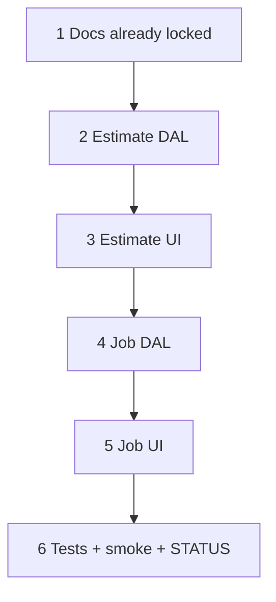

# 44 — Site anchor: warn-and-clear (estimate + job)

> **Status:** Complete (2026-07-14). Next: [37h](./37a-category-scope-decision-dbml-migration.md) (STATUS pointer — job FK renames) unless product repoints.
>
> **Decision:** [estimate + job site anchor — warn-and-clear](../decisions/estimate.md#decision-estimate--job-site-anchor--warn-and-clear-not-immutable-2026-07-14) (**S1–S9**). **Supersedes:** [immutable after create](../decisions/estimate.md#decision-estimate-site-anchor--gate-lines-immutable-after-create-2026-06-30) (task 33). **Parity:** [`job.md` decision](../decisions/job.md#decision-estimate--job-site-anchor--warn-and-clear-not-immutable-2026-07-14). **No schema change.**

**Out of scope:** Changing lifecycle freeze for `won`/`lost`/`expired` / `cancelled`; win→job copy; job Scope line editor UI (still stub); migrating historical `site_id_immutable` error codes in client messages beyond removing them.

---

## Locked summary (do not re-litigate)

| # | Choice |
|---|--------|
| **S1** | Site writable on create **and** edit while profile writable + record editable |
| **S2** | Lines/conditions do **not** freeze site |
| **S3** | Change with structure → confirm warn (clears conditions + lines) |
| **S4** | Empty structure / first pick → no confirm |
| **S5** | On confirm: clear `conditions` + `line_items` (+ `site_tree`); not stakeholders |
| **S6** | Save persists; Revert restores |
| **S7** | DAL allows site change; body must clear collections (or equivalent); drop `site_id_immutable` |
| **S8** | Still frozen: estimate `won`/`lost`/`expired`; job `cancelled`; job with `estimate_id` |
| **S9** | `LinkedSelectInput` when writable; read-only + open when S8; Line Items still gated on `site_id` |

---

## Goal

Replace hard site immutability with warn-and-clear on both estimate and job General/Overview, using the same linked-select chrome.

**Exit:** Edit estimate can change site (with confirm when structure exists); Save persists new site + empty conditions/lines; job matches (except `estimate_id` freeze); DAL tests updated; no `site_id_immutable`.

---

## Execution order

---

## Step 1 — Docs (this pass)

| File | Action |
|------|--------|
| [`docs/decisions/estimate.md`](../decisions/estimate.md) | S1–S9 locked; mark 2026-06-30 immutable **superseded** |
| [`docs/decisions/job.md`](../decisions/job.md) | Job mirror + wave-5a amendment |
| [`docs/surface-specs/estimate.md`](../surface-specs/estimate.md) | Profile / patch / UX / edge cases |
| [`docs/surface-specs/job.md`](../surface-specs/job.md) | Site change rules + LinkedSelect UX |
| [`docs/surfaces.md`](../surfaces.md) | Drop “immutable after create” |
| [`docs/decisions/README.md`](../decisions/README.md) | Index |

### Verify

- [x] Decision S1–S9 locked and linked from job decision
- [x] Specs no longer require `site_id_immutable` after create
- [x] Task 44 indexed; STATUS points here

---

## Step 2 — Estimate DAL

| File / area | Action |
|-------------|--------|
| `lib/estimates/repository/estimate-write.ts` | Remove `assertSiteIdUnchanged` / `site_id_immutable`; allow site change when status not frozen |
| Patch path | When `site_id` changes: require empty `conditions` + `line_items` in body **or** auto-clear in same tx (prefer require empty from client that already cleared — reject with structured conflict if non-empty collections would keep old-zone FKs) |
| Lifecycle | Reject site change when `won` / `lost` / `expired` (align with existing profile freeze if already covered) |
| Tests | `estimate-write.test.ts` — allow change + clear; reject frozen; remove immutable expectation |

**DAL contract (chosen):** Require empty `conditions` + `line_items` in the same PATCH when `site_id` changes. Reject with `ConflictError` `{ code: "site_change_requires_clear" }` if body has non-empty collections or omits them while DB still has structure. Frozen statuses → `{ code: "site_id_frozen" }`.

### Verify

- [x] PATCH with new `site_id` + empty collections succeeds
- [x] PATCH with new `site_id` + stale zone-linked conditions fails cleanly (or auto-clears — document which)
- [x] No remaining `site_id_immutable` references in estimate write path
- [x] Targeted unit tests pass

---

## Step 3 — Estimate UI

| File / area | Action |
|-------------|--------|
| `components/estimates/EstimateDetailForm.tsx` | Always render writable `LinkedSelectInput` when profile write + not lifecycle-frozen; remove edit-only `mode="read"` branch for Site |
| Site-change effect | Extend create-only clear to **edit**: on site change with non-empty `conditions`/`line_items`, `Modal.confirm` then clear; on cancel restore previous `site_id` |
| Empty switch | First pick / empty structure — no modal |
| Persist | Stop stripping `site_id` from PATCH body on edit (`profileBody` omit) — include when dirty/changed |
| Frozen | `won`/`lost`/`expired`: keep read-only + open icon |

### Verify

- [x] Edit draft: change site with lines → confirm → structure cleared → Save → reload shows new site, empty LI
- [x] Edit draft: change site empty → no confirm
- [x] Won estimate: site read-only
- [x] Line Items still hidden until site selected

---

## Step 4 — Job DAL

| File / area | Action |
|-------------|--------|
| `lib/jobs/repository/job-write.ts` | `assertSiteIdChangeAllowed`: remove “has line items” block; keep **`estimate_id` set → reject**; allow change when lines exist if body clears lines (or auto-clear) |
| Tests | Update job write tests for new rules |

**DAL contract (chosen):** Auto-clear `job_line` rows in the same `updateJob` transaction when `site_id` changes (`estimate_id` must be null). Job Scope PATCH still rejects `line_items` (editor stubbed).

### Verify

- [x] Site change with lines allowed when `estimate_id` null and lines cleared
- [x] Site change rejected when `estimate_id` set
- [x] Cancelled still blocks PATCH

---

## Step 5 — Job UI

| File / area | Action |
|-------------|--------|
| `components/jobs/JobDetailForm.tsx` | Replace bare `SelectInput` + “Open:” text link with `LinkedSelectInput` (parity with estimate: add-site when allowed, open icon) |
| Site-change | Same confirm-and-clear for `line_items` when present (even if Scope UI stubbed — clear form/DAL collections) |
| Frozen | When `estimate_id` or `cancelled`: read-only + open icon |

### Verify

- [x] Job Overview Site matches estimate chrome
- [x] Confirm fires when lines exist; Save persists
- [x] Job from won estimate: site frozen

---

## Step 6 — Tests + smoke + STATUS

| Action |
|--------|
| Run estimate + job write tests; any form helper tests |
| Manual smoke: create estimate → add condition/line → change site → confirm → Save; same on empty job if lines present via win-copy |
| Mark this task **Complete**; update [`01-task-index.md`](./01-task-index.md) row; update [`STATUS.md`](../../STATUS.md) |

### Verify (stop gate)

- [x] All Step 2–5 verifies checked
- [x] No `site_id_immutable` in app code (grep clean except historical docs)
- [x] Task Status line + index + STATUS updated

---

## Related

- [33-estimate-site-anchor.md](./33-estimate-site-anchor.md) — original immutability ship
- [43-estimate-labor-only.md](./43-estimate-labor-only.md) — prior estimate task
- [LinkedSelectInput](../../components/form/LinkedSelectInput.tsx)
