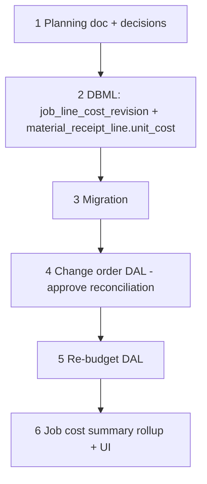

# 45 — Job costing and change-order reconciliation

> **Status:** Complete (2026-07-14). Next: [37h — Job FK renames](./37a-category-scope-decision-dbml-migration.md) (unresolved pool); wave **5d** CO Surfaces mount `approveChangeOrder` + `ChangeOrderApproveGuardsAlert`.
>
> **Decisions:** [job.md — CO ↔ BOM ↔ scope phase reconciliation](../decisions/job.md#decision-change-order--bom-and-scope-phase-reconciliation-2026-07-14), [costing.md — cost layers + re-budget](../decisions/costing.md). **Planning:** [15-job-costing-and-change-orders.md](../planning/15-job-costing-and-change-orders.md). **Amends:** [change orders — unified `job_line` ledger (2026-06-17)](../decisions/job.md#decision-change-orders--unified-job_line-ledger-2026-06-17).

**Out of scope:** Labor hours/$ actuals (no timesheet entity); WIP / revenue recognition; CO-level margin-delta UI; automatic vendor-return workflow when a CO is blocked on committed material; full wave **5d** Surfaces (draft/edit CO UI) — this task ships the approve reconciliation DAL those Surfaces call.

---

## Locked summary (do not re-litigate)

| # | Choice |
|---|--------|
| **C1** | Budget / committed / actual(material) / margin are **DAL rollups** over existing columns — no parallel cost ledger |
| **C2** | **Material actuals only** in v1 — add `material_receipt_line.unit_cost`; labor $ actuals deferred (no timesheet entity) |
| **C3** | Re-budget = new **`job_line_cost_revision`** table — distinct from change order, distinct from bare `latch_audit` history |
| **C4** | CO **`add`** → `job_line_part` (BOM) + `scope_phase` seed same as manual line add / win-copy |
| **C5** | CO **`deduct`** / **`revise`** → void BOM + `scope_phase`; **block** approve if BOM already `on_purchase_order` / `received`; **warn** (don't block) if any phase `completed_qty > 0` |
| **C6** | CO **`revise`** carries forward `completed_qty` to the replacement line's matching phases (by `name` / `sequence`) |

---

## Goal

Lock the data model and reconciliation rules for job-level cost visibility (budget / committed / actual / margin) and for change-order approve fallout on BOM + field progress — then land schema + DAL + read-only cost UI so wave 5d does not relitigate these forks.

**Exit:** Decisions locked; DBML + migration **075**; re-budget DAL; CO `approve` reconciliation (C4–C6); job cost summary rollup + Overview panel; CO approve guard alert component for 5d.

---

## Execution order

---

## Step 1 — Planning + decisions

| File | Action |
|------|--------|
| `docs/planning/15-job-costing-and-change-orders.md` | New — cost layers, re-budget vs. CO, CO ↔ BOM ↔ scope_phase matrix, sequencing |
| `docs/decisions/costing.md` | New domain file — job costing layers (locked), material actual cost column (locked), re-budget entity (locked) |
| `docs/decisions/job.md` | New decision block — CO/BOM/scope_phase reconciliation; amends 2026-06-17 CO decision in place |
| `docs/decisions/README.md` | Domain files table (+ `costing.md`); planning index (+ doc 15); All decisions table (+ 4 rows) |
| `docs/planning/README.md` | Index (+ doc 15); locked-at-a-glance row |
| `docs/tasks/01-task-index.md` | This task row (Slice 05) |
| `STATUS.md` | Recently completed bullet — docs locked, task authored |

### Verify

- [x] Cost layers table locked (Contract / Budget / Re-budgeted / Committed / Actual-material / Margin) with exactly two new schema elements identified
- [x] Re-budget entity (`job_line_cost_revision`) locked as distinct from change order and from bare audit history
- [x] CO `add` / `deduct` / `revise` × (`job_line_part`, `scope_phase`) matrix locked, including block/warn guardrails
- [x] Decisions cross-linked (`job.md` ↔ `costing.md` ↔ planning doc ↔ this task)
- [x] Indexes updated (`decisions/README.md`, `planning/README.md`, `01-task-index.md`, `STATUS.md`)

---

## Step 2 — DBML amendment

| File / area | Action |
|-------------|--------|
| `docs/schema/current.dbml` | Add `job_line_cost_revision` table; add `unit_cost` to `material_receipt_line`; place in job / procurement `TableGroup`s |
| `docs/architecture.md` | Update table summary + entity-flow diagram |

### Verify

- [x] DBML amended; manual schema review clean
- [x] `architecture.md` table list matches

---

## Step 3 — Migration

| File / area | Action |
|-------------|--------|
| `migrations/075_job_line_cost_revision.sql` | `CREATE TABLE job_line_cost_revision`; conditional `material_receipt_line.unit_cost`; also `change_order` / `job_line_part` / `scope_phase` when missing (approve + seed prerequisites) |

### Verify

- [x] Migration applies clean on dev (`--only=075_job_line_cost_revision.sql`)
- [x] Existing `material_receipt_line` rows backfilled from linked PO line when table exists; otherwise documented as known-`0`/inaccurate for historical receipts

---

## Step 4 — Change order DAL: approve reconciliation

| File / area | Action |
|-------------|--------|
| `lib/jobs/repository/change-order-write.ts` | `approve` / `preview` implement C4–C6; block on committed BOM (C5); carry forward `completed_qty` (C6) |
| Tests | Pure + conflict-shape coverage for add/deduct/revise guardrails and C6 carry-forward |
| `components/jobs/ChangeOrderApproveGuardsAlert.tsx` | Block/warn UI for 5d approve confirmation |

### Verify

- [x] All C4–C6 rules covered by DAL tests (carry-forward, committed BOM block, conflict shape)
- [x] Guardrail block returns a structured conflict (`code: bom_committed`), not a generic 500

---

## Step 5 — Re-budget DAL

| File / area | Action |
|-------------|--------|
| `lib/jobs/repository/job-line-cost-revision.ts` | Insert revision row + update `job_line.unit_cost` in one transaction; require `reason` |

### Verify

- [x] Revision insert + `job_line.unit_cost` update atomic (tested ordering)
- [x] History query returns original estimate cost → re-budget chain → current cost

---

## Step 6 — Job cost summary + UI

| File / area | Action |
|-------------|--------|
| `lib/jobs/repository/job-cost-summary.ts` | Budget / committed / actual(material) / margin per job |
| `JobCostSummaryPanel` on Overview | Read-only summary; CO approve alert component ready for 5d |

### Verify

- [x] Job cost summary rollup implemented (contract/budget/re-budgeted always; committed/actual when procurement tables exist)
- [x] CO approve UI component shows guardrail block/warn state before commit

---

## Related

- [15-job-costing-and-change-orders.md](../planning/15-job-costing-and-change-orders.md)
- [decisions/costing.md](../decisions/costing.md)
- [decisions/job.md — CO/BOM/scope_phase reconciliation](../decisions/job.md#decision-change-order--bom-and-scope-phase-reconciliation-2026-07-14)
- [decisions/job.md — original CO decision](../decisions/job.md#decision-change-orders--unified-job_line-ledger-2026-06-17)
- [03-jobs-progress.md](../planning/03-jobs-progress.md)
- [04-procurement.md](../planning/04-procurement.md)
