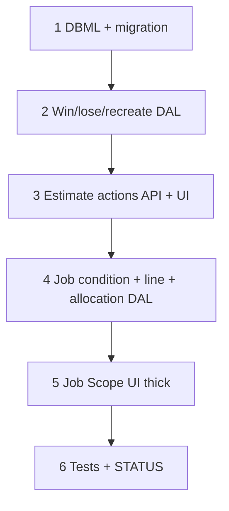

# 46 — Estimate win / lose → job copy (wave 5b, thick)

> **Status:** Authored (2026-07-15); **implementation not started**. Next: execute Step 1 (DBML + migration).
>
> **Decision:** [estimate win → job handoff (W0–W7)](../decisions/estimate.md#decision-estimate-win--job-handoff-2026-07-14). **Companion:** [`job.md`](../decisions/job.md#decision-estimate-win--job-handoff-2026-07-14). **Amends:** E3 one-job-per-win → **one job per catalog scope** (S2a). **Depends on:** [45](./45-job-costing-and-change-order-reconciliation.md) (CO model; 5d Surfaces still later). **Supersedes:** phantom **37h** (job FK renames — already landed in 033/045; see below).

**Out of scope:** Change-order Surfaces (**5d**); Field progress entry UI (**5c**); Billing tab; procurement beyond BOM seed; retiring colloquial “Job Scope” tab label.

---

## Locked summary (do not re-litigate)

| # | Choice |
|---|--------|
| **W0** | Vocabulary A — catalog scope / condition / site zone / job group / phase |
| **W1a** | One job per **catalog scope** per estimate; `job.catalog_scope_item_id`; `UNIQUE (estimate_id, catalog_scope_item_id)` |
| **W1b** | After job delete, recreate missing catalog-scope slice(s); estimate stays `won` |
| **W1c** | Second estimate on same site → C1-guided (new job(s) vs add-on/CO) |
| **W2** | Copy matrix **M2** — header, stakeholders×N, lines, `job_line_spec` |
| **W3** | Copy **editable** `job_condition*`; live costing; **sold price frozen**; sold vs current cost compare |
| **W4** | `job_line_allocation` carry-forward; job-editable places |
| **W5** | Seed **phases + BOM** when possible (**P1**) |
| **W6** | Toolbar **Win** / **Lose** / **Create job** actions (not status+Save); multi-job → first job + links (**U1**) |
| **W7** | **Thick 5b** — handoff + engineer UI (conditions, costing compare, places, line add/delete) |

---

## Goal

Ship estimate **Win** / **Lose** / recreate and a usable **job Scope** engineer loop: conditions, live vs sold costing, places, lines, BOM/phases — so ops can run after sale without waiting on 5c/5d.

**Exit:** Win on a multi–catalog-scope estimate creates N jobs; Lose marks lost; Create job fills missing slices; job Scope shows conditions + lines + sold/current cost + place edit; tests + STATUS complete.

---

## 37h — obsolete

**37h** (job FK renames in the 37a chain) is **cancelled / superseded**:

- `job_line.site_area_id` → `site_zone_id` already in migration **033**
- `job_line.phase_id` dropped in **045**; DAL stubs `phase_id: null`
- Live job code already uses `site_zone_id`

Do **not** author a 37h task. Optional drive-by: remove leftover DTO `phase_id` compat and stale `architecture.md` geography wording (can fold into 46 Step 1 docs).

---

## Execution order

---

## Step 1 — DBML + migration

| File / area | Action |
|-------------|--------|
| `docs/schema/current.dbml` | `job.catalog_scope_item_id`; UNIQUE `(estimate_id, catalog_scope_item_id)`; `job_condition*` (mirror estimate condition shape); `job_line_allocation`; sold snapshot columns on `job_line` (`sold_unit_price`, `sold_unit_cost`, sold cost buckets as needed); `job_line.job_condition_id` if lines bind to job conditions |
| `migrations/0NN_*.sql` | Apply above; backfill none required for empty jobs |
| `docs/architecture.md` / planning win section | Align with S2a + W0 vocabulary; note 37h obsolete |

### Verify

- [ ] DBML + migration apply clean on dev
- [ ] UNIQUE enforces one job per (estimate, catalog scope)

---

## Step 2 — Win / lose / recreate DAL

| File / area | Action |
|-------------|--------|
| `lib/estimates/repository/estimate-win.ts` (new) | `winEstimate` — partition lines by catalog scope root; create N jobs; copy per W2–W5; set `status = won` |
| | `loseEstimate` — `status = lost` |
| | `recreateMissingJobs` — W1b for missing slices |
| Tests | Single-scope win; multi-scope N jobs; second win conflict per slice; lose; recreate; C1-guided is UI (DAL accepts explicit proceed) |

### Verify

- [ ] Multi-scope estimate → N jobs with partitioned lines + stakeholders on each
- [ ] Sold snapshots set; conditions + allocations + BOM/phases seeded per W3–W5
- [ ] Structured conflicts for duplicate slice / bad status

---

## Step 3 — Estimate actions API + UI

| File / area | Action |
|-------------|--------|
| API | `POST .../win`, `/lose`, `/create-job` (or Surface action routes) — re-resolve `win`/`lose` grants |
| `EstimateDetailForm` | Toolbar Win / Lose / Create job; confirms; W1c dialog when site has active job; after win navigate U1 |

### Verify

- [ ] Win/Lose not via status+Save
- [ ] Multi-job toast/links; Create job when slice missing

---

## Step 4 — Job engineer DAL

| File / area | Action |
|-------------|--------|
| Job detail related | Load/replace `conditions`, `line_items` (+ allocations), cost summary with **sold vs current** |
| Costing | Shared engine against `job_condition*`; never overwrite sold price / sold snapshot from engineering recalc |
| Place write | Replace `job_line_allocation` independently of estimate |

### Verify

- [ ] Knob/line changes recompute current cost buckets; sold_* unchanged
- [ ] New engineering lines default sold price 0 (W3) until CO

---

## Step 5 — Job Scope UI (thick)

| File / area | Action |
|-------------|--------|
| Job Scope tab | Condition tree + config (estimate-parity); lines grid; sold vs current cost columns/summary; place edit; add/delete lines |
| Overview | Keep cost summary; link source estimate + catalog scope label |

### Verify

- [ ] Engineer can tweak condition knobs and see current vs sold cost
- [ ] Places editable; unassigned lines assignable
- [ ] Manual smoke: win multi-scope estimate → open jobs → edit place + condition → costs move, sold price does not

---

## Step 6 — Close out

| File | Action |
|------|--------|
| This task | Status Complete; all verify `[x]` |
| `STATUS.md` | Recently completed; next → 5c or product pick |
| `01-task-index.md` | 46 complete; 37h cancelled |

### Verify

- [ ] Task + indexes + STATUS updated
- [ ] 37h marked obsolete in 37a chain + STATUS pointers

---

## Related

- [Decision — win → job handoff](../decisions/estimate.md#decision-estimate-win--job-handoff-2026-07-14)
- [45 — job costing + CO](./45-job-costing-and-change-order-reconciliation.md)
- [23 — job wave 5a](./23-job-wave-5a.md)
- [37a — 37h cancelled](./37a-category-scope-decision-dbml-migration.md#follow-on-chain-37b37h)
