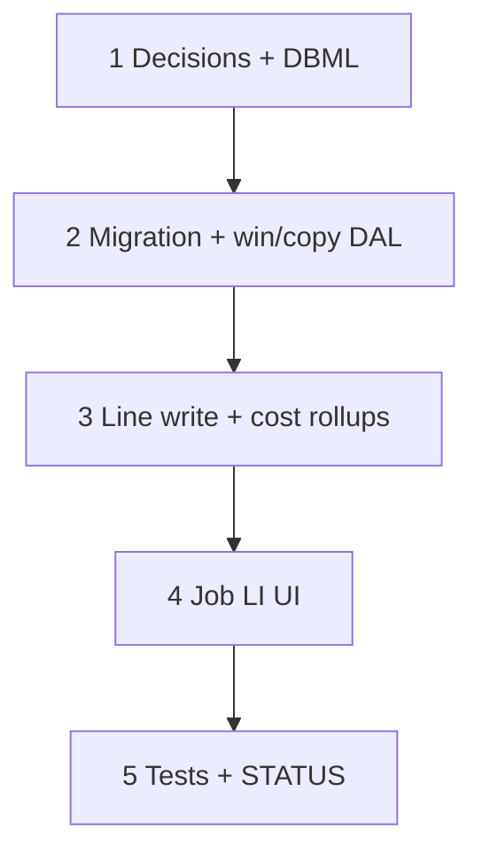

# 47 — Job Line Items parity (dual qty + estimate LI UX)

> **Status:** Complete (2026-07-15). Next: [48 — front doors + complexity drift](./48-job-create-front-doors-condition-drift.md) (then [49 — CO Surfaces](./49-change-order-surfaces.md)).
>
> **Amends:** [Scope-F1](../decisions/estimate.md#w3--conditions--costing-on-the-job-locked--amends-prior-estimate-only) (qty freeze → dual qty). **Depends on:** [46](./46-estimate-win-lose-job-copy.md). **Companion:** [`job.md`](../decisions/job.md#decision-estimate-win--job-handoff-2026-07-14).

**Out of scope:** Estimate-line peek popup (provenance drawer); CO Surfaces (**5d**); Field progress / “actual cost” UI (**5c**); estimate zone danger icon; renaming colloquial “Job Scope” tab.

---

## Locked summary (do not re-litigate)

| # | Choice |
|---|--------|
| **JLI-1** | Remove the **Sold** badge/tag on Description. No Sold “status column.” Keep **Sold unit $ / Sold cost / Current cost / Δ** for margin. Defer estimate-line peek popup. |
| **JLI-2** | Dual qty: **`sold_quantity`** (contract, frozen) + **`quantity`** (working/install, editable). UI labels: **Sold qty** \| **Qty**. Do **not** call working qty “actual” (reserved for field/actual cost later). |
| **JLI-3** | **Amend Scope-F1:** freeze `unit_price` / `sold_*` / **`sold_quantity`** / description. **`quantity` editable without CO.** Places may drive `quantity` (not `sold_quantity`). |
| **JLI-4** | **CO required when** customer contract changes: sold unit $, **sold qty**, delete/void of sold scope, CO revise of sold commercial identity. **No CO for:** zones/places, working qty, part pin, conditions/knobs, live cost, add line @ sold $0, re-budget. |
| **JLI-5** | LI columns: **Item** (read-only) + **Part** (editable). Reuse estimate Part picker patterns where practical. |
| **JLI-6** | Zones: estimate-parity **icon before Qty**; **no** zone tags on the table row. **Job-only** danger when `sum(allocation.quantity) ≠ quantity` (or qty > 0 and no allocations). Estimate stays quiet. |
| **JLI-7** | Ext sold / contract rollups use **`sold_quantity × sold_unit_price`**. Current / budget cost uses **`quantity × unit_cost`** (and live buckets). |

---

## Goal

Close Job Scope LI gaps vs estimate: dual sold/working qty, Item/Part columns, zone icon + job unplaced alert; drop the confusing Sold badge; lock CO vs engineering clearly around contract $.

**Exit:** Migration + DAL for `sold_quantity`; Job LI UI matches locked columns/behavior; Scope-F1 amended in decisions; tests + STATUS complete.

---

## Execution order

---

## Step 1 — Decisions + DBML

| File / area | Action |
|-------------|--------|
| `docs/decisions/estimate.md` | Amend **Scope-F1** / W3: dual qty; CO = contract $ / sold qty; working qty free; JLI-1…7 pointer |
| `docs/decisions/job.md` | Companion blurb: Scope-F1 dual qty; CO rule |
| `docs/decisions/README.md` | Row for this amend + task **47** |
| `docs/schema/current.dbml` | `job_line.sold_quantity numeric [not null, default: 0]` + note (frozen at win; Scope-E1 new = 0) |
| `docs/architecture.md` | One-line sold vs working qty if table summary mentions job_line |

### Verify

- [x] Scope-F1 no longer freezes working `quantity`
- [x] DBML has `sold_quantity`; notes say contract rollup vs live cost drivers
- [x] Indexes / companion docs point at task 47

---

## Step 2 — Migration + win/copy

| File / area | Action |
|-------------|--------|
| `migrations/077_*.sql` | Add `job_line.sold_quantity`; backfill `sold_quantity = quantity` where `sold_unit_price > 0` OR `source = 'estimate'`; else `0` |
| `lib/estimates/repository/estimate-win.ts` | On copy: set `sold_quantity` from estimate line `quantity`; also seed working `quantity` the same |
| Descriptors / generated Surface types as needed | Expose `sold_quantity` on job line DTO (read); writable schema must **not** accept client writes to `sold_*` / `sold_quantity` (server-owned) |

### Verify

- [x] Migration applies clean; backfill correct for sold vs $0 engineering lines
- [x] Win sets both qtys from estimate; new Scope-E1 lines keep `sold_quantity = 0`

---

## Step 3 — Line write + rollups

| File / area | Action |
|-------------|--------|
| `job-lines-write.ts` / collections | Allow PATCH of working `quantity` on sold lines; reject client mutation of `sold_quantity` / `sold_*`; places update `quantity` (+ allocations), never `sold_quantity` |
| Delete guard (**Scope-E1**) | Still block delete when sold contract value > 0 (`sold_unit_price` / sold ext); unchanged intent |
| Cost summary / Overview rollups | Contract/sold side × `sold_quantity`; budget/current cost × `quantity` |
| Form map `job-scope-tree.ts` | Map `sold_quantity`; `jobLineToPatch` omits sold fields |

### Verify

- [x] Engineer can change working qty on a sold line; sold qty + sold $ unchanged after Save
- [x] Place edits change working qty / allocations only
- [x] Rollups use JLI-7 formulas

---

## Step 4 — Job LI UI

| File / area | Action |
|-------------|--------|
| `JobLineItemsPanels.tsx` | **Remove** Sold tag on Description |
| | Columns (order): Description → **Item** (RO) → **Part** (editable) → **Zones icon** → **Sold qty** (RO) → **Qty** (editable) → Sold unit $ → Sold cost → Current cost → Δ → Delete |
| | Drop Places tag list from the row |
| | Zones: reuse estimate zone-tree popover helper (`EstimateLineZoneButton` / shared); scope to condition root zone |
| | **Danger** icon when `sum(alloc qty) ≠ quantity` (or qty > 0 && no allocs) — job only |
| Part picker | Wire estimate-style Part Select; Item display from line `item_id` / name (read-only) |
| `EstimateLineZoneButton` | **Do not** add danger styling on estimate |

### Verify

- [x] No Sold badge; no zone tags on rows
- [x] Item RO + Part editable; Sold qty RO + Qty editable on sold lines
- [x] Zone icon before Qty; danger only when job places mismatch working qty
- [x] Manual smoke: win → open job Scope → change Qty + zones + part → sold qty/$ unchanged; current cost moves

---

## Step 5 — Tests + close out

| File | Action |
|------|--------|
| Unit tests | Win sets `sold_quantity`; write allows qty change without touching sold_*; place save leaves sold_quantity; delete guard still blocks sold $ |
| This task | Status Complete; all verify `[x]` |
| `01-task-index.md` | Task **47** row |
| `STATUS.md` | Recently completed; Right now → next product pick |

### Verify

- [x] Tests green for dual-qty + write rules
- [x] Task + indexes + STATUS updated

---

## Related

- [46 — estimate win / lose → job copy](./46-estimate-win-lose-job-copy.md)
- [Decision — win → job handoff / W3 Scope-F1](../decisions/estimate.md#w3--conditions--costing-on-the-job-locked--amends-prior-estimate-only)
- [45 — job costing + CO](./45-job-costing-and-change-order-reconciliation.md)
- [42c — estimate zone tree popover](./42c-estimate-line-zone-tree-popover.md)
