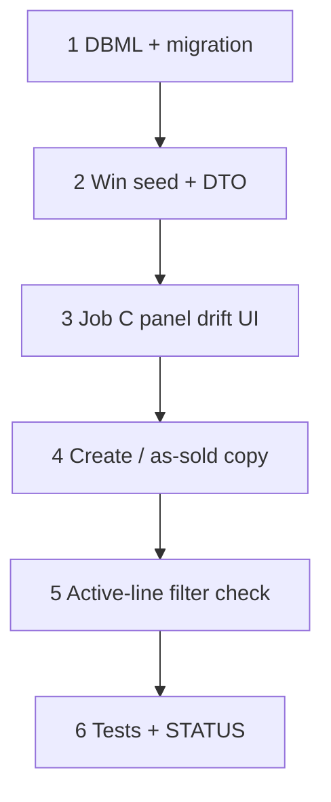

# 48 — Job create front doors + condition complexity drift

> **Status:** Complete (2026-07-15). Next: [49 — Change-order Surfaces (5d)](./49-change-order-surfaces.md).
>
> **Decision:** [estimate / job / CO commercial boundaries (JC1–JC7)](../decisions/job.md#decision-estimate--job--co-commercial-boundaries-2026-07-15). **Planning:** [16-estimate-job-co-boundaries.md](../planning/16-estimate-job-co-boundaries.md). **Depends on:** [46](./46-estimate-win-lose-job-copy.md), [47](./47-job-line-items-parity.md). **Companion:** [`estimate.md`](../decisions/estimate.md#decision-estimate--job--co-commercial-boundaries-2026-07-15).

**Out of scope:** Change-order Surfaces (**49** / 5d); Field progress UI (**5c**); phase-set drift badge (JC5 deferred); “New from estimate…” shortcut (optional later); sold-$ editor on job (rejected).

---

## Locked summary (do not re-litigate)

| # | Choice |
|---|--------|
| **JC1** | As-sold / external contract → rebuild **estimate** → **Win** |
| **JC2** | Keep Jobs → New; sold contract lines only via Win / CO |
| **JC5** | Snapshot `complexity_factor_id_at_win` on win; C panel flags when current ≠ at-win |
| **JC4** | (Docs only here) Job LI / rollups default to `status = active` — verify filters if missing |

---

## Goal

Land the product boundaries from JC1–JC2/JC5 in schema + Job Scope UX: win-time complexity baseline + drift badge; clear create/as-sold guidance so operators do not edit sold $ on the job.

**Exit:** Migration + win seed for `complexity_factor_id_at_win`; Job C panel drift affordance; Jobs create / estimate empty-state copy aligned with JC1–JC2; tests + STATUS.

---

## Execution order

---

## Step 1 — DBML + migration

| File / area | Action |
|-------------|--------|
| `docs/schema/current.dbml` | `job_condition.complexity_factor_id_at_win` nullable FK → `complexity_factor` — note: snapshot at win; null = no baseline |
| `migrations/0NN_*.sql` | Add column; backfill null (no historical win baseline required) |

### Verify

- [x] DBML + migration apply clean on dev
- [x] Column nullable; no NOT NULL backfill guess

---

## Step 2 — Win seed + DTO

| File / area | Action |
|-------------|--------|
| `lib/estimates/repository/estimate-win.ts` | On condition copy: set `complexity_factor_id_at_win = complexity_factor_id` (same value as copied current) |
| Job condition read / form map | Expose `complexity_factor_id_at_win` read-only on job detail DTO; writable schemas must **not** accept client writes to `*_at_win` |
| Manual / post-win condition add | Leave `complexity_factor_id_at_win` null |

### Verify

- [x] Win seeds at-win = current complexity on copied conditions
- [x] PATCH cannot overwrite `complexity_factor_id_at_win`
- [x] New job-only conditions keep null baseline

---

## Step 3 — Job C panel drift UI

| File / area | Action |
|-------------|--------|
| Job condition config panel (C) | When `complexity_factor_id_at_win` is non-null **and** current effective complexity ≠ at-win → show clear **Adjusted from sold** (or equivalent) flag near complexity control |
| | No flag when baseline null |
| Live costing | Unchanged — knob edit still recalcs current cost; sold_* frozen |

### Verify

- [x] Change complexity after win → badge shows; sold price unchanged
- [x] Manual job condition → no false badge

---

## Step 4 — Create / as-sold copy

| File / area | Action |
|-------------|--------|
| Jobs create / list empty help | Keep **New**; short copy: service/warranty/blank project OK; **sold contract** via estimate Win |
| Estimate detail (optional) | One-line help for as-sold reconstruction: match signed $ on the estimate, then Win — do not edit sold $ on the job |
| Do **not** remove Jobs → New or require estimate picker on create |

### Verify

- [x] Jobs → New still creates `estimate_id` null jobs
- [x] Copy does not instruct editing sold $ on Job Scope

---

## Step 5 — Active-line filter check

| File / area | Action |
|-------------|--------|
| Job Scope LI + cost rollups | Confirm default queries/UI use `job_line.status = active` (or equivalent). If voided/superseded appear in the working grid, filter them out. |
| | No “zero sold to hide” path |

### Verify

- [x] Working Scope LI does not list voided/superseded as normal editable sold rows (if any exist in seed/tests)

---

## Step 6 — Tests + close out

| File | Action |
|------|--------|
| Unit tests | Win sets `complexity_factor_id_at_win`; write rejects client mutation of at-win; drift comparison helper if extracted |
| This task | Status Complete; all verify `[x]` |
| `01-task-index.md` / `STATUS.md` | 48 complete; Right now → **49** (or product pick 5c) |

### Verify

- [x] Tests green
- [x] Task + indexes + STATUS updated

---

## Related

- [Decision — JC1–JC7](../decisions/job.md#decision-estimate--job--co-commercial-boundaries-2026-07-15)
- [Planning 16](../planning/16-estimate-job-co-boundaries.md)
- [46 — win → job](./46-estimate-win-lose-job-copy.md)
- [49 — CO Surfaces](./49-change-order-surfaces.md)
