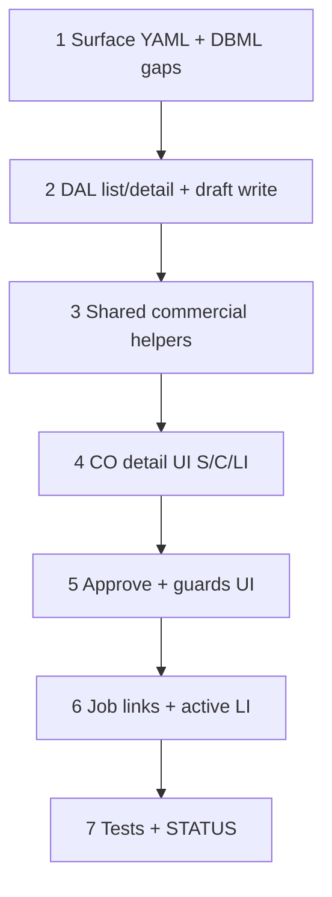

# 49 — Change-order Surfaces (wave 5d)

> **Status:** Ready (2026-07-15). Next after complete: product pick — **[51](./51-job-field-progress.md)** Field progress (5c) if not done, or billing/procurement follow-ons.
>
> **Decision:** [JC3 / JC4 / JC6 / JC7](../decisions/job.md#decision-estimate--job--co-commercial-boundaries-2026-07-15); [CO ledger](../decisions/job.md#decision-change-orders--unified-job_line-ledger-2026-06-17); [CO ↔ BOM ↔ scope_phase](../decisions/job.md#decision-change-order--bom-and-scope-phase-reconciliation-2026-07-14). **Planning:** [16](../planning/16-estimate-job-co-boundaries.md), [15](../planning/15-job-costing-and-change-orders.md). **Depends on:** [45](./45-job-costing-and-change-order-reconciliation.md) approve DAL, [46](./46-estimate-win-lose-job-copy.md), [47](./47-job-line-items-parity.md), [48](./48-job-create-front-doors-condition-drift.md) (docs + drift; can parallelize after 45 if needed).

**Out of scope:** Collapsing CO into `estimate` rows / `estimate.type`; mega shared estimate/job/CO form with mode flags; automatic vendor-return when approve blocked on committed BOM; Field progress entry UI (**5c**); CO-level margin-delta dashboard (rollup exists — rich UI TBD).

---

## Locked summary (do not re-litigate)

| # | Choice |
|---|--------|
| **JC3** | Separate `change_order_*` Surfaces; **share** commercial helpers with estimate/job; **Approve ≠ Win** |
| **Ledger** | `line_action`: `add` \| `deduct` \| `revise`; target line for deduct/revise; approve mutates `job_line` |
| **C4–C6** | Approve seeds/voids BOM + `scope_phase`; block on committed material; warn + carry `completed_qty` on revise; **never delete** `progress_entry*` |
| **JC4** | Job Scope shows **active** lines after approve |
| **JC6** | Mid-job phase remove with progress → prefer **revise**; history retained |
| **JC7** | Partial place cut on sold line → revise allocations/sold qty — no cross-line auto-sync |
| **Scope-S1 spirit** | CO-specific shell; reuse costing / condition / line / zone helpers; no `changeOrder=true` mega form |

---

## Goal

Ship wave **5d**: operators can draft and **approve** change orders against a live job using estimate-parity commercial editing (conditions + lines + costing), wired to the existing `approveChangeOrder` / preview guards from **45**.

**Exit:** `change_order_list` / `change_order_detail` (or job-nested CO collection + detail) live; draft S/C/LI; Approve with guards; job Scope reflects active ledger; tests + STATUS.

---

## Execution order

---

## Step 1 — Surface YAML + DBML gaps

| File / area | Action |
|-------------|--------|
| `docs/schema/current.dbml` | Confirm `change_order` / `change_order_line` match 5d needs (`job_id`, optional `estimate_id`, status draft/approved, line_action, target_job_line_id, commercial snapshots). Add only what’s missing for draft edit (e.g. condition forest on CO — **decide minimal**: either draft lines only against existing job conditions, or CO-owned condition snapshot — prefer **draft against job conditions + line deltas** unless product requires CO-local forest; document choice in task notes when implementing). |
| YAML | `change_order_list` + `change_order_detail` (or nested under `job_detail` if list is job-scoped only — pick one: **job-scoped list from job + dedicated detail Surface** recommended) |
| Policies | `read` / `write` / `approve` (or equivalent) — re-resolve on approve |

### Verify

- [ ] Surfaces declared; codegen / descriptors updated as required by repo patterns
- [ ] No merge of CO rows into `estimate` tables

---

## Step 2 — DAL list / detail + draft write

| File / area | Action |
|-------------|--------|
| CO repository | List by `job_id`; get detail with lines; create draft; PATCH draft (strict writable schema); reject PATCH when approved |
| Lines | Support `add` / `deduct` / `revise` payloads; validate `target_job_line_id` for deduct/revise belongs to job |
| Costing | Reuse shared line preview / recalc helpers for draft CO lines (same engine as estimate/job) |

### Verify

- [ ] Draft CRUD works; approved CO immutable
- [ ] Bad target line → structured conflict

---

## Step 3 — Shared commercial helpers

| File / area | Action |
|-------------|--------|
| Extract / reuse | Costing preview, part picker, zone allocation popover, condition config controls as needed for CO draft |
| | **Do not** invent a third fork of the line grid formulas |

### Verify

- [ ] CO draft line cost columns match estimate/job engine outputs for same inputs

---

## Step 4 — CO detail UI (S/C/LI as needed)

| Panel / chrome | Behavior |
|----------------|----------|
| Header | Job link, optional source estimate, status, title/notes |
| Lines | Grid for CO lines: action, target (deduct/revise), item/part, qty, sell, cost — estimate-like editors for **add** / **revise** replacement snapshots |
| Conditions | If Step 1 chose job-condition binding: pick existing job condition / show effective knobs read-mostly; if CO-local forest: estimate-parity S/C — document which shipped |
| Toolbar | Save / Revert while draft; **Approve** separate action |

### Verify

- [ ] Can draft add / deduct / revise against a live job
- [ ] UI is CO-specific shell + shared helpers (not estimate form with a flag)

---

## Step 5 — Approve + guards UI

| File / area | Action |
|-------------|--------|
| Approve action | Confirm → `previewChangeOrderApprove` / `approveChangeOrder` from **45** |
| Mount | `ChangeOrderApproveGuardsAlert` (or equivalent) — block on committed BOM; warn on `completed_qty > 0` |
| After approve | Navigate to job Scope (or stay on CO read-only); toast summary of lines applied |

### Verify

- [ ] Approve with progress warns and still succeeds when allowed
- [ ] Approve with committed BOM blocks with structured message
- [ ] Progress entries remain after approve (no delete)

---

## Step 6 — Job links + active LI

| File / area | Action |
|-------------|--------|
| Job Scope / Overview | Link to COs for this job; “New change order” entry |
| W1c | Estimate Win dialog already steers add-on → CO — ensure deep link lands on CO create for that job when implemented |
| Job LI | After approve, only **active** lines in working grid; voided/superseded available only via history if built |

### Verify

- [ ] Manual smoke: in-progress job → CO revise drop a phase/sold qty → approve → Scope shows replacement; field history intact if progress existed
- [ ] Partial place cut via revise updates allocations on replacement only

---

## Step 7 — Tests + close out

| File | Action |
|------|--------|
| Tests | Draft write; approve add/deduct/revise; guard block/warn; active filter after approve |
| This task | Status Complete; all verify `[x]` |
| `01-task-index.md` / `STATUS.md` | 49 complete; next → [51](./51-job-field-progress.md) or financial |

### Verify

- [ ] Tests green
- [ ] Task + indexes + STATUS updated

---

## Related

- [48 — front doors + drift](./48-job-create-front-doors-condition-drift.md)
- [45 — costing + approve DAL](./45-job-costing-and-change-order-reconciliation.md)
- [Planning 16 — boundaries](../planning/16-estimate-job-co-boundaries.md)
- [Planning 15 — costing / CO](../planning/15-job-costing-and-change-orders.md)
- [Decision — JC1–JC7](../decisions/job.md#decision-estimate--job--co-commercial-boundaries-2026-07-15)
