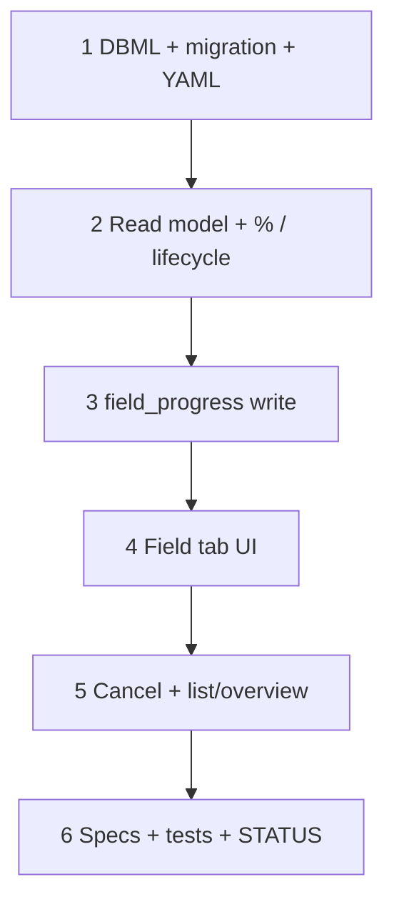

# 51 — Field progress (wave 5c)

> **Status:** Complete (2026-07-16). Next: [49 — Change-order Surfaces (5d)](./49-change-order-surfaces.md) if unfinished; else as-built publish / Complete (deferred) or financial follow-ons.
>
> **Decision:** [job Field progress — boolean zone snapshot (F1–F9)](../decisions/job.md#decision-job-field-progress--boolean-zone-snapshot-5c-2026-07-16). **Planning:** [18-job-field-progress.md](../planning/18-job-field-progress.md). **Depends on:** [45](./45-job-costing-and-change-order-reconciliation.md) `scope_phase` seed, [46](./46-estimate-win-lose-job-copy.md), [47](./47-job-line-items-parity.md). **Orthogonal to:** [49](./49-change-order-surfaces.md).

**Out of scope:** As-built publish / Complete toolbar; tech-only Field Surface; `progress_entry*` visit history UI; auto `billable_line` from % (B4); device-level Field (`site_asset`); sold-$ / CO Surfaces.

---

## Locked summary (do not re-litigate)

| # | Choice |
|---|--------|
| **F1** | Boolean complete/not per labor phase (no partial qty in Field UI) |
| **F2** | Geography = **`site_zone_id`** only (no area/asset on Field writes) |
| **F3** | No progress history — mutable snapshot; billing reads current % when invoicing |
| **F4** | Tree = allocations → zones + pseudo **General**; **no All Zones**; one scope category per job |
| **F5** | Surface Field **`field_progress`** (drop `work_items` / `job_work_item`) |
| **F6** | Whole-job Save/Revert on `job_detail` |
| **F7** | Progress only — no Complete / publish |
| **Lifecycle** | Derived: not started / in progress / completed; **stale** overlay; **cancelled** explicit at 0% only |
| **F8** | Hours-weighted % — **compute on read, never store** |
| **F9** | Include **General** in denominator; **active** lines only |

### Pins authored with this task

| Topic | Choice |
|-------|--------|
| **Stale** | In-progress **and** no successful `field_progress` write for **30 days** (derived; threshold constant in DAL — easy to retune) |
| **Cancel** | Allowed **only when progress = 0%**; sets stored cancelled flag; blocks further Field writes. Once progress &gt; 0% → no Cancel (stay in progress / stale) |
| **`progress_entry*`** | Do **not** write from this task |

---

## Goal

Replace the Field explore fixture with a **persisted** zone × phase checkbox board on `job_detail`, whole-job Save, hours-weighted derived % + lifecycle on read, and cancel-at-zero.

**Exit:** Migration + `field_progress` Field; DAL read/write + % / lifecycle helpers; Field tab wired to real data; Overview/list show derived state; tests + STATUS.

---

## Execution order

---

## Step 1 — DBML + migration + Surface YAML

| File / area | Action |
|-------------|--------|
| `docs/schema/current.dbml` | Add junction (name e.g. `scope_phase_zone_progress` or `job_field_progress_cell`) keyed by `(scope_phase_id, site_zone_id)` with **General** = `site_zone_id` NULL; `complete` boolean (or equivalent). Unique on `(scope_phase_id, site_zone_id)` with partial unique for General if needed. Note: v1 Field path; `progress_entry*` unused by product. Drop/ignore stale `site_area_id` on entry lines for new work. |
| | Stored **cancelled** on `job` if not already expressible — prefer reuse `job.status = cancelled` **or** a dedicated flag; **do not** store not_started / in_progress / completed / % / stale |
| `migrations/0NN_*.sql` | Create junction; any cancel column if needed |
| `modules/job/job_detail.surface.yaml` | Add Field **`field_progress`** (read/write); remove any `work_items` leftover from specs |
| Policies | Grant as for other job collections; cancel via existing write or dedicated action — pick one and document in step 5 |
| Codegen / descriptors | Regen; wire Field into `job-detail` descriptor |

### Verify

- [x] Junction exists; General representable without a fake `site_zone` row
- [x] YAML exposes `field_progress`; no `work_items`
- [x] % / lifecycle columns **not** added to `job`

---

## Step 2 — Read model + % / lifecycle

| File / area | Action |
|-------------|--------|
| DAL get job detail | Load active lines → allocations → `scope_phase` → progress cells; build Field DTO (zone tree + phase columns + checked state) |
| Hours | Per slice: seeded/catalog hours × allocation qty (full working qty on General) |
| `%` helper | \(\sum\) completed hours / \(\sum\) countable hours (F8/F9); never persist |
| Lifecycle helper | cancelled → cancelled; else 0% → not_started; 100% → completed; else in_progress; stale if in_progress and last `field_progress` write older than 30 days (track `updated_at` on junction or job-level `field_progress_updated_at`) |
| List projection | Optional: expose derived `lifecycle` + `progress_pct` on list DTO when summary granted |

### Verify

- [x] Multi-place line: Door 12 Install ✓ does not force Door 14 Install ✓
- [x] Equal phase count ≠ % when hours differ (Install-heavy example)
- [x] General qty in denominator until placed or checked
- [x] Voided lines excluded after CO (active only)

---

## Step 3 — `field_progress` write

| File / area | Action |
|-------------|--------|
| Writable schema | Strict replace-array (or patch set) of `{ scope_phase_id, site_zone_id \| null, complete }` — reject unknown keys |
| `updateJob` / collection writer | Upsert cells; clear omitted only if replace-array semantics chosen — document; **whole-job Save** sends with other Fields |
| Guards | Reject writes when job cancelled; reject when job has no `scope_phase` / create stub still client-gated |
| Optional | Roll completed slices into `scope_phase.completed_qty` for legacy readers — % still from cells |
| Audit | Latch audit on mutation path |

### Verify

- [x] Save round-trips checkboxes
- [x] Cancelled job → write conflict
- [x] No `progress_entry` rows created

---

## Step 4 — Field tab UI

| File / area | Action |
|-------------|--------|
| `JobFieldExplorePanels` (or rename) | Replace fixtures with detail DTO; tree = category root → allocated zones → **General**; remove **All Zones** / Unplaced label |
| Cascade | Parent check → descendant leaves with that phase; uncheck → indeterminate parents |
| `JobDetailForm` | Field tab: saved job only; wire to form/`field_progress` dirty + whole-job Save |
| Create | Keep “Save the job first…” (or equivalent) |

### Verify

- [x] Manual smoke: win job with places → Field shows zones; check Install → Save → reload persists
- [x] General appears for unplaced qty; rename visible as **General**

---

## Step 5 — Cancel + Overview / list

| File / area | Action |
|-------------|--------|
| Cancel | Affordance when derived progress = 0% and not already cancelled; sets cancelled; locks Field |
| Overview | Show derived lifecycle (+ optional %); hide/disable Cancel when progress &gt; 0% |
| List | Show lifecycle (and % if cheap) in summary column if Field granted |

### Verify

- [x] Cancel at 0% works; Field writes blocked after
- [x] After any complete check, Cancel unavailable
- [x] 100% → Completed label; billing tab unchanged

---

## Step 6 — Specs, tests, close out

| File | Action |
|------|--------|
| `docs/surface-specs/job.md` | Document `field_progress`; lifecycle derived; remove `work_items` / 5a stub copy for Field |
| `docs/planning/18-job-field-progress.md` | Point Status at this task Complete when done |
| Unit tests | % helper (hours-weighted); lifecycle (0 / mid / 100 / stale / cancelled); write guards |
| Integration / DAL | Round-trip cells; General null zone; multi-allocation independence |
| `01-task-index.md` / `STATUS.md` | 51 complete; Right now stays **49** if unfinished, else next product pick |

### Verify

- [x] Tests green
- [x] Specs + planning + indexes + STATUS updated
- [x] Task Status Complete; all verify `[x]`

---

## Related

- [Planning 18 — Field progress](../planning/18-job-field-progress.md)
- [Decision — F1–F9](../decisions/job.md#decision-job-field-progress--boolean-zone-snapshot-5c-2026-07-16)
- [49 — CO Surfaces](./49-change-order-surfaces.md)
- [47 — Job LI parity](./47-job-line-items-parity.md)
- [45 — costing / scope_phase](./45-job-costing-and-change-order-reconciliation.md)
- Explore: `components/jobs/JobFieldExplorePanels.tsx`
