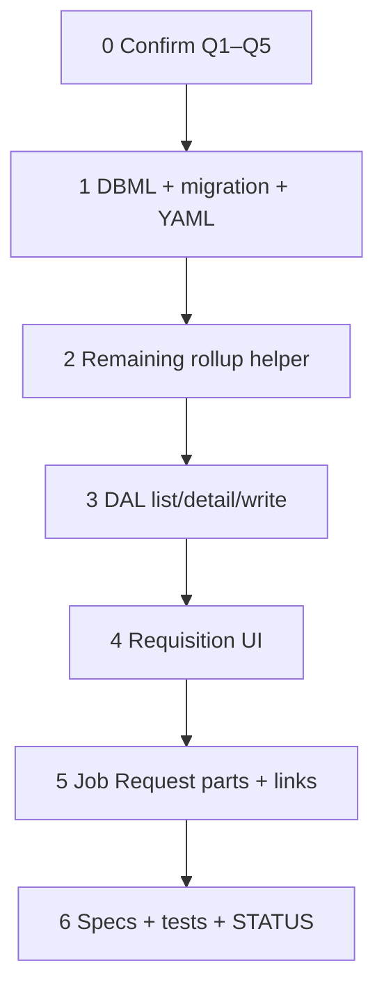

# 52 — Requisition Surfaces (wave 6a′)

> **Status:** Complete (2026-07-16). Next: **[53 — PO workbench](./53-purchase-order-workbench.md)**. Orthogonal to [49](./49-change-order-surfaces.md).
>
> **Decision:** [Requisition Surfaces UX (R1–R8)](../decisions/procurement.md#decision-requisition-surfaces-ux-r1r8-2026-07-16). **Planning:** [19-requisition-surfaces-open.md](../planning/19-requisition-surfaces-open.md). **Layer model:** [procurement — requisition layer](../decisions/procurement.md#decision-procurement--requisition-layer-and-job-site-inventory-2026-06-17). **Depends on:** [45](./45-job-costing-and-change-order-reconciliation.md) / [46](./46-estimate-win-lose-job-copy.md) `job_line_part` seed.

**Out of scope:** PO workbench / batch create / Send (**53**); receipts + job-site ledger (**54**); ready-pool UI (R7-D); shipping/ETA on req (R6 deferred); org WMS; vendor EDI; Job BOM grid chrome beyond Order rollup helper for the pool.

---

## Decide before Step 1 (product) ✅

| ID | Question | Answer |
|----|----------|--------|
| **Q1** | Wave split | **A** — requisitions = **52**; PO workbench = **53** |
| **Q2** | Line geography | **A** — drop place FKs for v1 |
| **Q3** | Header `phase_id` | **B** — DDL only, no UI v1 |
| **Q4** | Edit after save | **A** — edit while `open`; freeze after on PO |
| **Q5** | Withdraw / delete | **A** — per-line withdraw + note; delete header if no committed lines |

---

## Locked summary (do not re-litigate)

| # | Choice |
|---|--------|
| **R1 / R8** | List → New → pick job **and** Job → **Request parts**; same detail |
| **R2** | BOM still-needed pool **plus** freeform ad-hoc / TBD |
| **R3** | Qty editable, **cap at job-wide remaining** |
| **R4** | Many headers per job; remaining / Order rollup **job-wide** |
| **R6** | Show PO # + status when linked (empty until **53**) |
| **R7** | No ready UI |

### Pins (Q1–Q5 confirmed 2026-07-16)

| Topic | Choice |
|-------|--------|
| **Split** | Requisitions this task; PO workbench **53**; receipts **54** |
| **Geography** | No place FKs on `requested_order_line` v1 (drop stale area/asset from DBML for this table) |
| **`phase_id`** | DDL kept nullable; **no UI** v1 |
| **`job_id`** | Required; **immutable** after create |
| **`requested_by`** | Set from current employee when resolvable; else null |
| **Edit** | `open` lines editable (qty/desc/part/BOM link rules); non-open lines read-only |
| **Withdraw** | Line action → `withdrawn` + required `withdrawal_note` |
| **Delete header** | Allowed only when every line is `open` or `withdrawn` (or no lines); block if any `on_purchase_order` / `fulfilled` |
| **Remaining** | `remaining = bom.qty − Σ(req lines excl. withdrawn) − Σ(PO coverage)` — PO terms 0 until **53** tables used |
| **PO DDL** | Migrate `purchase_order*` (+ shipments) in **same** migration as `requested_order*` for FK readiness; **no PO Surfaces** here |
| **Receipt DDL** | Defer to **54** |

---

## Goal

Ship wave **6a′**: operators can create/edit requisitions (list + job entry), pull still-needed BOM rows and ad-hoc lines, withdraw open lines, and see job-wide remaining. Purchaser batching waits on **53**.

**Exit:** Migration + Surfaces + DAL + Job **Request parts** + list/detail UI + remaining helper + tests + STATUS.

---

## Execution order

---

## Step 0 — Confirm Q1–Q5 ✅

Q1–Q5 locked 2026-07-16 (see table above). Pins match. Migration may proceed.

### Verify

- [x] Q1–Q5 answered (or “ship as written”)
- [x] Pins section matches answers

---

## Step 1 — DBML + migration + Surface YAML

| File / area | Action |
|-------------|--------|
| `docs/schema/current.dbml` | Align `requested_order` / `requested_order_line` with pins (**drop** area/asset; keep `phase_id` nullable, no UI). Ensure `purchase_order*` tables match R5 FKs (`requested_order_line_id`, `job_id`, `vendor_party_id`). |
| `migrations/084_*.sql` (next free) | Create `requested_order`, `requested_order_line`; create `purchase_order`, `purchase_order_line`, `purchase_order_line_shipment` (no receipt tables unless required). CHECKs for line statuses. Indexes + FKs. |
| `modules/…/requested_order_*.surface.yaml` | `requested_order_list` + `requested_order_detail`; Fields: profile (`job_id`, `requested_by`, `requested_at`, `note`), `line_items` collection |
| Policies / grants | Read/write for procurement roles (mirror job/estimate pattern) |
| Nav | Procurement group: Requisitions |
| Codegen | Regen descriptors |

### Verify

- [x] Tables exist on dev; FKs to `job`, `job_line_part`, `manufacturer_part`
- [x] YAML + codegen green; list/detail routes stub-ready
- [x] No ready-pool columns; no receipt tables (unless explicitly pulled in)

---

## Step 2 — Remaining / Order rollup helper

| File / area | Action |
|-------------|--------|
| Shared helper | Per `job_line_part_id` (job-wide): remaining qty for BOM pool + Order status enum for future Job BOM column |
| Formula | Demand = `job_line_part.quantity`. Covered = Σ req line qty where status ≠ `withdrawn` (+ later PO/receipt). Remaining = max(0, demand − covered) |
| Pool DTO | List BOM rows with `remaining > 0` for a `job_id` (part label, unit, remaining, optional sold-line context) |

### Verify

- [x] Two requisitions on same BOM row: second pool default/cap uses leftover only
- [x] Withdrawn qty does not count as covered
- [x] Ad-hoc lines (null BOM FK) ignored by remaining helper

---

## Step 3 — DAL list / detail / write

| File / area | Action |
|-------------|--------|
| List | Filter by job, status rollup (any open line?), date; join job title |
| Detail get | Header + lines; join PO #/status when `purchase_order_line` exists (null-safe until **53** writes) |
| Create | Require `job_id`; set `requested_by` / `requested_at`; create lines from BOM picks and/or freeform |
| BOM pick validate | Cap qty ≤ remaining (R3); reject over-request |
| Freeform | Require description and/or `part_id`; `job_line_part_id` null |
| Patch | Enforce edit/withdraw/delete pins; re-authorize |
| Withdraw | Action or PATCH → `withdrawn` + note required |

### Verify

- [x] Over-remaining BOM qty rejected
- [x] Cannot edit line once `on_purchase_order` (simulate status in test)
- [x] Delete header blocked when any committed line exists
- [x] PermissionContext on every DAL path

---

## Step 4 — Requisition UI

| File / area | Action |
|-------------|--------|
| List | `/requisitions` — job, requested at, open-line count / rollup |
| Detail | `/requisitions/[id]` and `/requisitions/new` |
| New from list | Job `LinkedSelect` required before lines |
| Lines | BOM pool (check + qty ≤ remaining) + Add ad-hoc row (part Select + description) |
| Withdraw | Per-line with note |
| PO columns | Show PO # + status when present; blank until **53** |

### Verify

- [x] Create empty-then-add lines; save; reload
- [x] Partial BOM qty leaves remainder for next requisition
- [x] Ad-hoc description-only line saves

---

## Step 5 — Job entry + links

| File / area | Action |
|-------------|--------|
| Job chrome | **Request parts** → `/requisitions/new?jobId=` (R1/R8) |
| Job Scope / Overview | Links to requisitions for this job (list filtered or related panel — keep thin) |
| Prefill | `job_id` set and immutable on create-from-job |

### Verify

- [x] From job, new requisition opens with job locked
- [x] From list New, job picker required

---

## Step 6 — Specs, tests, STATUS

| File / area | Action |
|-------------|--------|
| Tests | Remaining helper; create/cap; withdraw; delete guards; multi-header remaining |
| `docs/surfaces.md` | Mark `requested_order_*` beyond draft |
| Task index + `STATUS.md` | Complete this task; point next at **53** (or **49** if still active) |
| Author **53** stub | If missing: PO workbench per R5 (select open lines, vendor pick, one PO per job×vendor, Send) |

### Verify

- [x] `npm test` (touched packages) green
- [x] Verify checklist all `[x]`; STATUS updated

---

## Follow-ons (do not implement here)

| Task | Scope |
|------|--------|
| **53** | PO workbench — R5 batch create, vendor pick, draft→Send, req line → `on_purchase_order`, R6 fills in |
| **54** | Receipts + `job_material_movement`; req → `fulfilled` when received covers |
| Later | Ready-pool UI (R7); shipping on req; Job BOM Order column polish |

---

## Related

- [planning/19](../planning/19-requisition-surfaces-open.md)
- [decisions/procurement.md](../decisions/procurement.md)
- [planning/04-procurement.md](../planning/04-procurement.md)
- [45](./45-job-costing-and-change-order-reconciliation.md) — CO blocks on committed BOM
- [49](./49-change-order-surfaces.md) — parallel Jobs track
