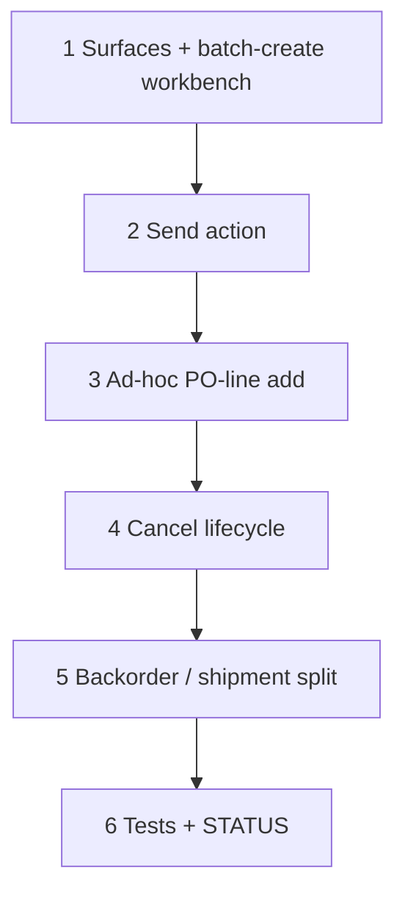

# 53 — Purchase-order workbench (wave 6a″)

> **Status:** Complete (2026-07-20). Next: [58-requisitions-po-pool-ux.md](./58-requisitions-po-pool-ux.md) (fold workbench into `/requisitions`) or [57-zone-issues-and-field-adhoc.md](./57-zone-issues-and-field-adhoc.md) / [49-change-order-surfaces.md](./49-change-order-surfaces.md).
>
> **Depends on:** [56](./56-job-material-request-migration.md) (`job_material_request` + `purchase_order_line_source`), [52](./52-requisition-surfaces.md) (`purchase_order*` DDL, migration 084).
>
> **Decision:** [R5 / R6](../decisions/procurement.md#decision-requisition-surfaces-ux-r1r8-2026-07-16) · [planning/21 §2](../planning/21-po-lifecycle-issues-field-adhoc-open.md#§2--locked-po-cancel--retract-lifecycle-task-53) (PO1–PO6) · [§7](../planning/21-po-lifecycle-issues-field-adhoc-open.md#§7--locked-po-line-rollup-vs-zone-traceability-for-receiving) (PO7–PO9). **Chrome amend:** [RQ-UI1–RQ-UI8](../decisions/procurement.md#decision-requisitions--po-pool-ux-fold-workbench-rq-ui1rq-ui8-2026-07-20) / task [58](./58-requisitions-po-pool-ux.md) — selection UI moves to `/requisitions`; delete `/purchase-orders/workbench`.

**Goal (locked intent):** Purchaser selects open `job_material_request` rows across jobs; picks vendor when multiple; **Create POs** emits **one draft PO per job × vendor**, rolling multiple zone-tagged requests for the same part into one PO line via `purchase_order_line_source`; Send issues the PO; sourced requests → `on_purchase_order`. Full **cancel/retract lifecycle** at header/line/shipment granularity, plus purchaser-initiated ad-hoc adds. *(Shipped 53 used a separate `/purchase-orders/workbench`; task 58 folds that chrome into `/requisitions`.)*

**Out of scope:** Receipts (`material_receipt*` — separate task); ready UI (R7); cross-job single PO header; PM approval gate (AP1–AP2, v2).

---

## Execution order

---

## Step 1 — Surfaces + batch-create workbench

| Area | Action |
|------|--------|
| Surfaces | `purchase_order_list` / `purchase_order_detail` + a workbench selection view (not a persisted Surface — a picker over open `job_material_request` rows, grouped by job × vendor-if-known × part) |
| DAL — batch create | Given selected `job_material_request` ids + a vendor choice per part (purchaser picks when a part has multiple candidate vendors): group selected rows by `(job_id, vendor_party_id)` → one draft `purchase_order` per group; within each PO, roll up rows with the same part/vendor into **one `purchase_order_line`** with summed quantity, and attach one `purchase_order_line_source` row per contributing `job_material_request` (qty = that request's own quantity) via the `attachSourceTx` helper from [56 Step 4](./56-job-material-request-migration.md#step-4--purchase_order_line_source-primitive). Flip each sourced request to `on_purchase_order`. |
| Manual add-to-existing-draft-PO | Purchaser can add more rows onto an existing `draft` PO before Send (still rolls up by part the same way). |

### Verify

- [x] Selecting requests across 2 zones for the same part/vendor produces **one** PO line with **two** source rows, qty split matching each zone's ask
- [x] Selecting requests across 2 vendors (or 2 jobs) produces separate draft POs
- [x] Sourced requests flip to `on_purchase_order` on batch-create

---

## Step 2 — Send action

| Area | Action |
|------|--------|
| Send | `draft` → `sent`; `ordered_at` stamped; blocks further ad-hoc line adds unless PO is reopened to `draft` (not a locked flow here — keep simple: Send is one-way until cancel) |
| Line/shipment defaults | Single shipment per line by default (full qty, `scheduled`, no ETA) — split happens later if the vendor backorders (Step 5) |

### Verify

- [x] Send stamps `ordered_at`; line status `ordered`
- [x] Default single-shipment row created per line

---

## Step 3 — Ad-hoc PO-line add (PO9)

| Area | Action |
|------|--------|
| Purchaser adds a part directly to a PO (no existing `job_material_request` behind it) | **Transparently creates the backing `job_material_request`** (zone = purchaser-picked, or **General** if unspecified — "base zone") **+** the `purchase_order_line` **+** the `purchase_order_line_source` link, in one DAL call — request lands straight at `on_purchase_order` since it's created already-ordered. |
| No direct zone column | `purchase_order_line` never gets its own `site_zone_id` — every line's zone attribution is always derivable via `purchase_order_line_source` → `job_material_request.site_zone_id`, with zero exceptions. |

### Verify

- [x] Ad-hoc add on a PO with no zone picked lands the backing request in General
- [x] Ad-hoc add on a PO with a zone picked lands the backing request in that zone
- [x] No PO line ever exists with zero source rows

---

## Step 4 — Cancel lifecycle (PO1–PO6)

| Area | Action |
|------|--------|
| **PO1 — cancellable window** | Cancel available at header/line/shipment (Step 5) any time before that line is fully `received` — **no hard block on shipment state.** Pre-ship: clean cancel. Post-ship (`shipped`/`delivered`, not `received`): still cancellable — recorded intent, doesn't stop a shipment physically in motion. |
| **PO2 — request revert** | On cancel, revert the affected line's still-`on_purchase_order` source requests back to `open` (delete the `purchase_order_line_source` row, flip the request status). Already-`fulfilled` sources (covered by a real receipt) are untouched. Per **PO8**, "still pending" = whatever the FCFS-by-`requested_at` rule hasn't yet marked `fulfilled` — no extra bookkeeping needed, that ordering already answers "which sources revert." |
| **PO3 — granularity** | Three levels: **header** (cascade to every not-yet-resolved line), **line** (single bad line off a multi-line PO), **shipment** (Step 5 — cancel just one split portion, leave the rest of the line alone). One cascade code path for header cancel, not two. |
| **PO4 — guard/confirm UI** | No hard block. Escalating confirm: plain confirm while nothing's shipped; strong warning ("vendor may have already sent this — confirm you've contacted them") once any covering shipment is `shipped`/`delivered`; not offered once fully `received` (that's a return/RMA, out of scope). |
| **PO5 — audit** | `latch_audit` on every cancel action — actor, timestamp, before/after status, affected line/shipment id (invariant #6). |
| **PO6 — revise vs. recreate** | Edit in place only while `draft`. Once `sent`, always **cancel(-the-affected-portion) + recreate** — no in-place revise-after-send flow, including quantity reduction or a part-number swap on a still-open portion. |

### Verify

- [x] Cancel a line with a `shipped` shipment → strong-warning confirm, not a block
- [x] Cancel a line → its still-`on_purchase_order` sources revert to `open`; `fulfilled` sources untouched
- [x] Header cancel cascades the line rule to every open line
- [x] `latch_audit` row on every cancel

---

## Step 5 — Backorder / shipment split (PO3 shipment-level, ties PO2/PO6)

| Area | Action |
|------|--------|
| Backorder = a normal shipment split | Vendor short-ships → split the line's single shipment into two `purchase_order_line_shipment` rows (near-ETA qty + later/TBD-ETA qty for the backordered remainder). No new schema. |
| Purchaser options on the backordered shipment | **Leave as-is** — update ETA, no state change. **Reduce qty / source elsewhere** — shipment-level cancel on just the backordered shipment (line's other shipment(s) untouched); reverts that shipment's still-pending sources to `open` (PO2, scoped to that shipment's qty) — free for a fresh line/PO to a different vendor. **Different part number** — same mechanism, fresh line with the new part, sourced from the same now-`open` requests. |

### Verify

- [x] Shipment-level cancel on a 2-shipment line leaves the other shipment's status/sources untouched
- [x] Reverted sources from a shipment-level cancel are selectable again in the Step 1 workbench

---

## Step 6 — Tests + STATUS

| Area | Action |
|------|--------|
| Tests | Batch-create rollup + source split; Send; ad-hoc add (zone default + explicit); cancel at all three granularities; PO2 revert-vs-fulfilled-untouched; shipment split/backorder flows. |
| `surfaces.md` / STATUS / task index | Mark 53 complete when done; point next at [57 — zone issues + Field ad-hoc](./57-zone-issues-and-field-adhoc.md) or [49 — CO Surfaces](./49-change-order-surfaces.md). |

### Verify

- [x] All touched tests green
- [x] Verify checklist all `[x]`; STATUS updated

---

## Related

- [56 — `job_material_request` migration](./56-job-material-request-migration.md)
- [52 — Requisition Surfaces](./52-requisition-surfaces.md)
- [planning/21 §2, §7](../planning/21-po-lifecycle-issues-field-adhoc-open.md)
- [planning/19](../planning/19-requisition-surfaces-open.md)
