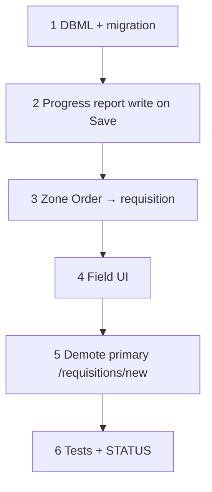

# 55 — Field progress reports + zone Order

> **Status:** Complete (2026-07-18). Next: **[53 — PO workbench](./53-purchase-order-workbench.md)** and/or **[49 — CO Surfaces](./49-change-order-surfaces.md)**; schedule **issues** cycle (planning/20 follow-on).
>
> **Decision:** [Field — progress reports + zone Order](../decisions/job.md#decision-field--progress-reports--zone-order-compose-2026-07-17) · [Field zone Order → requisition snapshots](../decisions/procurement.md#decision-field-zone-order--requisition-snapshots-2026-07-17). **Planning:** [20](../planning/20-field-labor-materials-open.md). **Depends on:** [51](./51-job-field-progress.md), [52](./52-requisition-surfaces.md).

**Out of scope this task:** progress notes UI; report history UI; issues DB/UI; report scheduling; PO workbench (**53**); receipts; soft-spec purchaser chrome beyond allow description-only demand.

---

## Goal

Job → Field: living labor board + ☐ **Order** (leaf zone all-or-nothing). Diff-aware Job **Save** appends a **progress report** (full board) and/or creates a **new requisition** (lines tagged `site_zone_id`). Order checkbox derived from req lines. `/requisitions` remains purchaser/history list.

**Exit:** Migration + DBML; DAL write paths; Field UI Order + PO trail; tests; STATUS; planning/20 stays locked reference.

---

## Execution order

---

## Step 1 — DBML + migration

| Area | Action |
|------|--------|
| `job_progress_report` | `id`, `job_id`, `recorded_at`, `recorded_by` (nullable employee) |
| `job_progress_report_cell` | `report_id`, `scope_phase_id`, `site_zone_id` null=General, `complete` |
| `requested_order_line` | Add nullable `site_zone_id` (FK `site_zone`, null = General) |
| `current.dbml` | Align; note amend of 52 no-geography pin |

### Verify

- [x] Tables/columns on dev; FKs + indexes
- [x] Living `job_field_progress_cell` unchanged as editable board

---

## Step 2 — Progress report on Job Save

| Area | Action |
|------|--------|
| Job / field_progress write | After living cell replace, if progress **changed** vs prior → insert report + full cell copy |
| Actor | `recorded_by` from current employee when resolvable |
| No change | Skip report insert |

### Verify

- [x] Save with no progress change → no new report
- [x] Check phase + Save → one report with full board
- [x] Uncheck + Save → another full-board report

---

## Step 3 — Zone Order → requisition

| Area | Action |
|------|--------|
| Order state | Derive per leaf (+ General) from non-withdrawn req lines for that `site_zone_id` |
| Save Order delta | Newly checked leaves → **new** `requested_order` + lines (`site_zone_id`, BOM qty per L22, soft-spec L18) |
| Uncheck | While open: withdraw (or remove) open lines for that zone; block if on PO |
| Remaining | Keep job-wide caps (52 helper) |
| Shared materials | Leaf Order only lines allocated to that leaf; General for unplaced/shared (L19) |

### Verify

- [x] Order Floor 2 + Save → req lines only for Floor 2 with `site_zone_id` set
- [x] Second Save Order Lobby → **new** requisition header
- [x] Checkbox reflects derived state after reload
- [x] Cannot uncheck zone once lines on PO

---

## Step 4 — Field UI

| Area | Action |
|------|--------|
| Under Phases | Horizontal ☐ **Order** — parent cascade / indeterminate like Done |
| Work table | Add PO trail column (number/status when present) |
| Default | Unchecked while remaining orderable |
| Locked | On PO / fulfilled — checked, not freely unchecked |
| Issues / notes | **Do not** ship issues stub or notes field this task |

### Verify

- [x] Parent Order cascades to leaves; child mix → indeterminate
- [x] PO column blank until 53 writes exist

---

## Step 5 — Entry paths

| Area | Action |
|------|--------|
| Job Field | Primary compose for Order |
| Job **Request parts** | Prefer open Field tab / deep-link `?tab=field` (or keep new-req as secondary) — document choice in PR |
| `/requisitions` | Keep list + detail for purchaser/history; New optional/secondary |

### Verify

- [x] Operator can complete Order flow without `/requisitions/new` as the happy path

**Choice (2026-07-18):** Toolbar **Order materials** + Overview link open Job `?tab=field`. `/requisitions/new` remains as secondary “new requisition” link on Overview.

---

## Step 6 — Tests + STATUS

| Area | Action |
|------|--------|
| Tests | Report append; Order→req; zone tag; withdraw guards; remaining cap |
| `surfaces.md` / STATUS / task index | Mark 55 complete when done; point next |
| Follow-on note | Issues cycle still required (planning/20) |

### Verify

- [x] Touched tests green
- [x] Verify checklist all `[x]`; STATUS updated

---

## Related

- [planning/20](../planning/20-field-labor-materials-open.md)
- [51](./51-job-field-progress.md) · [52](./52-requisition-surfaces.md) · [53](./53-purchase-order-workbench.md)
