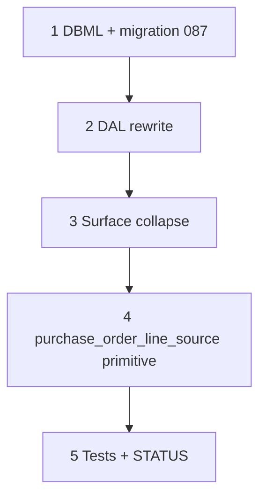

# 56 — `job_material_request` migration (collapse requisition header)

> **Status:** Complete (2026-07-18). Next: [53-purchase-order-workbench.md](./53-purchase-order-workbench.md).
>
> **Depends on:** [52](./52-requisition-surfaces.md), [55](./55-field-progress-reports-zone-order.md). **Blocks:** [53](./53-purchase-order-workbench.md) (needs `purchase_order_line_source`), part of [57](./57-zone-issues-and-field-adhoc.md) (AH1 needs the new table).
>
> **Decision:** [planning/21 §6](../planning/21-po-lifecycle-issues-field-adhoc-open.md#§6--locked-drop-requested_order--requested_order_line-replace-with-job_material_request-amends-r4-task-5255-ddl) (RQ1–RQ4) · [§7](../planning/21-po-lifecycle-issues-field-adhoc-open.md#§7--locked-po-line-rollup-vs-zone-traceability-for-receiving) (PO7–PO9).

**Goal:** Drop `requested_order` + `requested_order_line` outright; replace with one flat `job_material_request` table. Add `purchase_order_line_source` join table so a PO line can trace back to N originating requests with an explicit qty split (no more singular `purchase_order_line.requested_order_line_id`). Rewrite `lib/requested-orders/*` DAL and collapse the Surface pair (`requested_order_list` + `requested_order_detail`) into a single filterable list.

**Out of scope:** PO cancel lifecycle write paths (task 53 consumes `purchase_order_line_source`, doesn't build cancel logic here); zone issues / Field ad-hoc (task 57).

---

## Execution order

---

## Step 1 — DBML + migration `087`

| Area | Action |
|------|--------|
| `job_material_request` (new) | `id`, `job_id` NOT NULL FK job (cascade), `site_zone_id` FK site_zone (restrict, null = General), `job_line_part_id` FK job_line_part (set null, null = ad-hoc), `part_id` FK manufacturer_part (set null), `description` text default `''`, `quantity` numeric default 1 check >0, `unit` default `'ea'`, `status` default `'open'` — CHECK `open \| on_purchase_order \| fulfilled` (no `withdrawn`), `requested_by` FK employee.party_id (set null), `requested_at` default now(), `updated_at` default now() |
| `purchase_order_line_source` (new) | `id`, `purchase_order_line_id` NOT NULL FK purchase_order_line (cascade), `job_material_request_id` NOT NULL FK job_material_request (restrict), `quantity` numeric check >0; UNIQUE `(purchase_order_line_id, job_material_request_id)` |
| `purchase_order_line` | Drop `requested_order_line_id` column (superseded by source rows) |
| Backfill (data migration, same file) | For every `requested_order_line` row: insert one `job_material_request` (carry `job_id` from its `requested_order` header, since the header is going away). For every `purchase_order_line.requested_order_line_id` that's set: insert one `purchase_order_line_source` row pointing at the new `job_material_request`, `quantity` = that PO line's full `quantity` (today's schema is 1:1, so this is always a full-qty single source). |
| Drop | `requested_order`, `requested_order_line` (after backfill, same migration) |
| `current.dbml` | Replace the `requested_order` / `requested_order_line` Table blocks with `job_material_request`; add `purchase_order_line_source`; update `purchase_order_line` note (drop the `requested_order_line_id` reference, mention `purchase_order_line_source` instead) |

### Verify

- [x] Migration `087` applies clean on dev
- [x] Row-count spot check: `job_material_request` count == pre-migration `requested_order_line` count; `purchase_order_line_source` count == pre-migration count of `purchase_order_line` rows with `requested_order_line_id` set
- [x] `current.dbml` matches applied schema

---

## Step 2 — DAL rewrite

| File | Action |
|------|--------|
| `lib/requested-orders/repository/write.ts` | Rewrite `insertRequestedOrder` / `updateRequestedOrder` / `replaceRequestedOrderLineItemsTx` into single-table CRUD on `job_material_request` — no header insert/update. Drop `assertWithdrawalNote` / `withdrawal_note` handling entirely (no `withdrawn` status, RQ2). Keep `assertFreeformOrEngineered`, `assertNotFrozen` (still guards `on_purchase_order`/`fulfilled`), `assertFrozenLinesNotRemoved`, `assertWithinRemaining` — same logic, same-table instead of joined-through-header. Uncheck-while-`open` on Field is a **hard delete** (RQ2) — `deleteRequestedOrder`'s per-header delete-blocker check collapses into a per-row guard (`assertNotFrozen` already covers this: reject delete when `status` is frozen). |
| `lib/requested-orders/repository/detail-load.ts` | Delete — no detail Surface anchor (RQ4). Any read helpers still needed move into `list.ts`. |
| `lib/requested-orders/repository/list.ts` | Query directly off `job_material_request`; support filters: `job_id`, `status`, `site_zone_id`. |
| `lib/requested-orders/repository/remaining.ts` (+ `remaining.test.ts`) | Collapse the `requested_order_line rol INNER JOIN requested_order ro ON ro.id = rol.requested_order_id WHERE ro.job_id = $1` pattern (both `loadRequisitionedCoverageForJob` and `loadPurchaseOrderCoverageForJob`) to single-table `WHERE job_material_request.job_id = $1`. |
| `lib/requested-orders/descriptors/requested-order-detail.ts`, `descriptors/requested-order-list.ts` | Rewrite/merge into one descriptor set matching the flat shape — no header/line split. |
| `lib/jobs/repository/job-field-zone-order-write.ts` | Retarget insert/delete to `job_material_request`; RQ2 hard-delete/fresh-insert semantics on Field Order checkbox toggle (unchanged behavior, new table). |
| `lib/jobs/repository/job-field-progress.ts`, `job-field-progress-load.ts` | Update Order-state derivation queries to read `job_material_request` instead of `requested_order_line`. |
| `lib/requested-orders/repository/write.test.ts` | Rewrite against the new single-table shape; drop withdrawal-note test cases. |

### Verify

- [x] No `db.*` raw access outside the DAL (invariant #2)
- [x] Every DAL method still receives a `PermissionContext` (invariant #1)
- [x] Touched tests green

---

## Step 3 — Surface collapse

| File | Action |
|------|--------|
| `modules/requested_order/requested_order_detail.surface.yaml` | Delete — no detail route (RQ4). |
| `modules/requested_order/requested_order_list.surface.yaml` | Repoint at `job_material_request`; add `job_id` / `status` / `site_zone_id` filter Fields. Consider renaming the module folder to `job_material_request` at this point (mechanical; do alongside codegen regen, not a separate pass). |
| `modules/requested_order/generated/*` | Regenerate via `npm run codegen`; delete the now-orphaned `requested_order_detail.*.generated.ts` files. |
| `app/(private)/requisitions/[id]/page.tsx` | Delete — no detail route. |
| `app/(private)/requisitions/page.tsx`, `layout.tsx` | Update to list-only (no create/detail nav affordance beyond filters). |
| `components/requisitions/RequisitionDetailForm.tsx` | Delete. |
| `components/requisitions/RequisitionList.tsx` | Update to the flat-row shape (no header grouping); add zone/status filter controls. |
| `app/api/requisitions/[id]/route.ts` | Delete (no single-header read/write route needed — Field's own write path and the purchaser pool cover writes; if a single-row read is still useful for some caller, repoint at `job_material_request` by id instead of by header). |
| `app/api/requisitions/route.ts`, `bom-pool/route.ts`, `pickers/jobs/route.ts` | Repoint queries at `job_material_request`. |
| `lib/master-detail-registry.ts`, `lib/nav.ts`, `lib/policy-registry.ts`, `lib/surfaces/load-surface-detail.ts`, `lib/surfaces/load-surface-list.ts`, `lib/surfaces/surface-loader-registry.ts` | Drop the detail-Surface registration; update list-only wiring/nav entry. |

### Verify

- [x] `npm run codegen -- --check` clean
- [x] `/requisitions` renders a flat, filterable list (by job / status / zone) with no detail click-through
- [x] Manifest-driven Fields only — no forbidden columns leak (invariant #4)

---

## Step 4 — `purchase_order_line_source` primitive

| Area | Action |
|------|--------|
| New shared helper (e.g. `lib/purchase-orders/repository/source-links.ts`) | `attachSourceTx(client, purchaseOrderLineId, sources: {jobMaterialRequestId, quantity}[])` — validates sum(sources.quantity) === line.quantity (app-level, not a DB constraint, same style as `assertWithinRemaining`); on attach, flips each referenced `job_material_request.status` to `on_purchase_order`. This is the primitive task **53** will call when it builds PO-line creation — not built here beyond the shared helper, since no PO-line-creation UI exists yet. |
| `lib/jobs/repository/job-cost-summary.ts` | No change needed — the committed-cost query (§5 fix) is already scoped by `purchase_order.job_id` directly, not through the requisition join. Confirm with a quick read, don't touch unless a regression turns up. |

### Verify

- [x] `attachSourceTx` unit-tested: qty-sum mismatch rejected; status flip on attach; multiple sources per line supported

---

## Step 5 — Tests + STATUS

| Area | Action |
|------|--------|
| Tests | Backfill correctness; `write.ts` CRUD (create/edit/hard-delete-while-open); `remaining.ts` cap logic; `job-field-zone-order-write.ts` hard-delete/insert on checkbox toggle; `attachSourceTx`. |
| `surfaces.md` / STATUS / task index | Mark 56 complete when done; point next at 53. |

### Verify

- [x] All touched tests green
- [x] Verify checklist all `[x]`; STATUS updated

---

## Related

- [planning/21 §6, §7](../planning/21-po-lifecycle-issues-field-adhoc-open.md)
- [52](./52-requisition-surfaces.md) · [55](./55-field-progress-reports-zone-order.md)
- [53 — PO workbench](./53-purchase-order-workbench.md) (depends on this)
