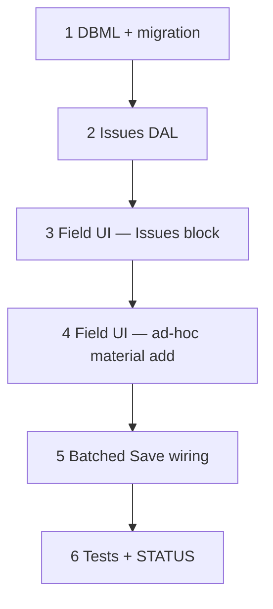

# 57 — Zone issues + Field-direct ad-hoc material

> **Status:** Complete (2026-07-20). Next: [60-field-issues-table-revert-adhoc.md](./60-field-issues-table-revert-adhoc.md) (FI1–FI12 amends Issues UI + **reverts AH1**).
>
> **Decision:** [planning/21 §3](../planning/21-po-lifecycle-issues-field-adhoc-open.md#§3--locked-zone-issues-required-follow-on-l4l31) (ISS1–ISS7) · [§4](../planning/21-po-lifecycle-issues-field-adhoc-open.md#§4--locked-field-direct-ad-hoc-amends-l9) (AH1–AH3 — **superseded 2026-07-20** by [FI1–FI12](../decisions/job.md#decision-field-issues--signal-only--revert-field-ad-hoc-fi1fi12-2026-07-20)).
>
> **Partial supersede:** Task [60](./60-field-issues-table-revert-adhoc.md) replaces Issues list chrome with a table (ISS3 UI) and removes Field-direct ad-hoc. `job_issue` DDL + batched Save + ISS1/2/4/5/6 keep.

**Goal:** Add a third Field zone-panel block, **Issues**, for reporting/resolving/cancelling per-zone problems (flat log, no snapshot table, decoupled from progress). Amend **L9** to let ad-hoc material requests happen directly from the Field zone panel instead of requiring a Scope detour first. Both are batched into the same whole-job Save as progress/Order (**not** immediate writes).

**Out of scope:** ISS7's `blocking` flag/severity (explicitly left out this pass — see planning/21 §3); PM approval gate (AP1–AP2, v2); PO cancel lifecycle (task 53).

---

## Execution order

---

## Step 1 — DBML + migration

| Area | Action |
|------|--------|
| `job_issue` (new) | `id`, `job_id` NOT NULL FK job (cascade), `site_zone_id` FK site_zone (restrict, null = General — no uniqueness constraint, a zone can hold any number of issue rows), `description` NOT NULL, `status` default `'open'` CHECK `open \| resolved \| cancelled` (both terminal — no reopen path), `reported_by` FK employee.party_id (set null), `reported_at` default now(), `resolved_by` FK employee.party_id (set null), `resolved_at` nullable, `resolution_note` default `''` |
| `current.dbml` | Add `job_issue` Table block + refs |

### Verify

- [x] Table/columns on dev; FKs + indexes
- [x] No unique constraint on `(job_id, site_zone_id)` — multiple open issues per zone insert cleanly

---

## Step 2 — Issues DAL

| Area | Action |
|------|--------|
| New repository (e.g. `lib/jobs/repository/job-issue.ts`) | `listOpenIssuesForJob`, `createIssueTx`, `resolveIssueTx` (requires `resolution_note`), `cancelIssueTx` — both resolve/cancel are terminal, no reopen/update path back to `open` |
| Report/rollup query | Live filtered/grouped read (`WHERE status = 'open' GROUP BY site_zone_id`, and a job-list-wide grouped variant for a PM) — no snapshot table (**ISS6**) |
| Wire into whole-job Save | Same transaction as `job-field-progress-write.ts` — issues writes are part of the same DB transaction as progress-cell replace + zone-order delta (Step 5 covers the client-side batching; this step is the server-side single-transaction acceptance) |

### Verify

- [x] Create/resolve/cancel each produce a `latch_audit` row (actor, timestamp, before/after status)
- [x] Resolve without `resolution_note` rejected
- [x] Grouped-by-zone / grouped-by-job read helpers return correct live counts

---

## Step 3 — Field UI — Issues block

| Area | Action |
|------|--------|
| `components/jobs/JobFieldExplorePanels.tsx` | Add a third stacked block per zone (alongside Phases/Order): **Issues** — list of the zone's issue rows (open prioritized; resolved/cancelled collapsed/greyed) + "Report issue" (description field, adds a new pending row) + per-row Resolve (prompts `resolution_note`) / Cancel |
| Zone tree badge | Small visual-only indicator on a zone with ≥1 open issue — **no gate** on marking phases complete in that zone (**ISS4** — decoupled) |
| Form slice | Extend the Field form's local slice type (alongside `field_progress` / `field_zone_orders`) with a `field_issues` array of pending create/resolve/cancel actions |

### Verify

- [x] A zone can show 2+ open issues simultaneously, each with independent Resolve/Cancel
- [x] Open-issue badge shows on the zone tree; phase-complete checkbox is unaffected by it
- [x] Resolved/cancelled issues render collapsed, not mixed into the open list

---

## Step 4 — Field UI — ad-hoc material add (AH1–AH3)

| Area | Action |
|------|--------|
| Work table | Add a "+ Add material" row under the Field zone's Work table — freeform `job_material_request` (per [56](./56-job-material-request-migration.md)'s shape: `job_line_part_id` null, `part_id`/description only), tagged with that zone's `site_zone_id` |
| No BOM write | Never creates/touches a `job_line_part` row (**AH2**) — costless freeform request only; its eventual PO cost lands in committed/actual (§5 fix), never in budget, by design (unplanned-pickup signal, not a gap) |
| Scope-first path stays | `job_line`/Scope ad-hoc entry (existing path) is untouched — still the right entry for *planned* extras that should hit budget (**AH3**) |

### Verify

- [x] "+ Add material" on a zone creates a pending freeform request tagged to that zone, no `job_line_part` row created
- [x] Scope's existing ad-hoc line-item path still works unchanged

---

## Step 5 — Batched Save wiring (ISS5)

| Area | Action |
|------|--------|
| Field page local state | Pending issue actions (new reports, queued resolve/cancel) and pending ad-hoc material adds join the existing pending progress-cell and zone-order-checkbox state — **one Save button commits all of it together**, same transaction, same diff-aware Save entry point as `job-field-progress-write.ts` |
| Trade-off (accepted, not re-litigate) | An unsaved issue report or ad-hoc add is lost if the tech navigates away before hitting Save — same as an unsaved progress tick today |

### Verify

- [x] Save with pending issue + ad-hoc-material + progress changes commits all three in one transaction
- [x] Navigating away before Save discards all three consistently (no partial persistence)

---

## Step 6 — Tests + STATUS

| Area | Action |
|------|--------|
| Tests | Issue create/resolve/cancel (terminal, no reopen); multi-issue-per-zone; grouped live-report queries; ad-hoc material add (zone tag, no BOM write); batched-Save commits all three slices together. |
| `surfaces.md` / STATUS / task index | Mark 57 complete when done. |

### Verify

- [x] All touched tests green
- [x] Verify checklist all `[x]`; STATUS updated

---

## Related

- [planning/21 §3, §4](../planning/21-po-lifecycle-issues-field-adhoc-open.md)
- [51](./51-job-field-progress.md) · [55](./55-field-progress-reports-zone-order.md) · [56](./56-job-material-request-migration.md)
