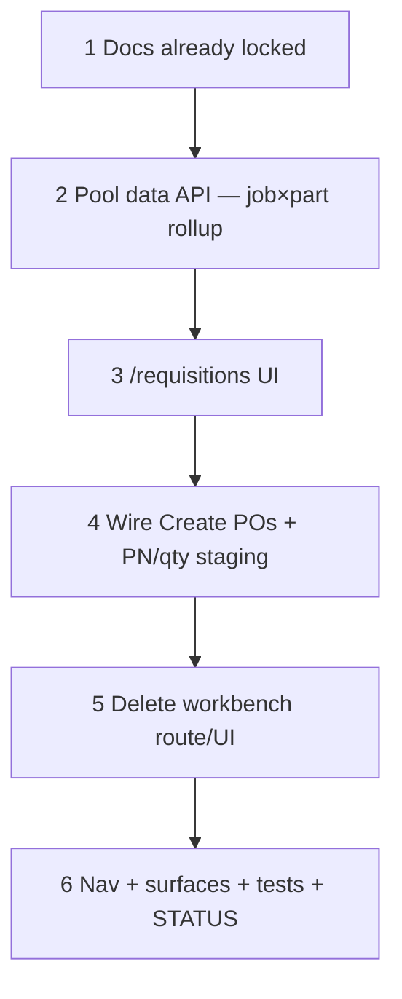

# 58 — Requisitions = PO pool UX (fold workbench)

> **Status:** Complete (2026-07-20). Next: [59-material-request-item-id-and-descriptions.md](./59-material-request-item-id-and-descriptions.md) (IT1–IT8), or [57-zone-issues-and-field-adhoc.md](./57-zone-issues-and-field-adhoc.md) / [49-change-order-surfaces.md](./49-change-order-surfaces.md).
>
> **Depends on:** [53](./53-purchase-order-workbench.md) (batch-create + cancel lifecycle shipped), [56](./56-job-material-request-migration.md) (`job_material_request` + sources).
>
> **Decision:** [Requisitions PO pool UX (RQ-UI1–RQ-UI8)](../decisions/procurement.md#decision-requisitions--po-pool-ux-fold-workbench-rq-ui1rq-ui8-2026-07-20). **Amends:** R5 route/chrome ([R1–R8](../decisions/procurement.md#decision-requisition-surfaces-ux-r1r8-2026-07-16)); task 53 Step 1 “workbench” as a separate `/purchase-orders/workbench` screen. **RQ-UI2 amend:** no All-jobs view — job dropdown required.

**Goal:** Collapse the duplicated purchaser UIs. `/requisitions` becomes the **open-demand PO pool** (job×part rollup, vendor, Create POs). Delete `/purchase-orders/workbench` (hard remove, no redirect). Keep `/purchase-orders` list + detail for Send / cancel / ad-hoc. Nav label **Requisitions**.

**Out of scope:** Receipts; ready UI (R7); cross-job single PO header; PM approval (AP1–AP2); restoring a flat all-status history list on `/requisitions` (deferred — trail lives on PO Surfaces).

---

## Locked product (RQ-UI1–RQ-UI8)

| Id | Choice |
|----|--------|
| **RQ-UI1** | Nav label **Requisitions** (route stays `/requisitions`; entity remains `job_material_request`) |
| **RQ-UI2** | Job dropdown = **required** picker of jobs with open demand (**no All jobs**). Table = that job’s rollup |
| **RQ-UI3** | Table rows = open demand rolled up by **`job × part`** (never roll the same part across jobs into one row). Soft-spec / unnarrowed → blank PN |
| **RQ-UI4** | Zone column = **icon only** (no “Zone” label); click → popover of zones in the rollup (and optional per-zone qty when decreasing) |
| **RQ-UI5** | PN editable on the row (pick/change exact PN; blank = TBD). Applied at **Create POs**, not live Field mutation while typing |
| **RQ-UI6** | Qty / zone contributions: **decrease only** (≤ open ask). No increase and no add-zone on this screen (increase = PO detail ad-hoc, PO9) |
| **RQ-UI7** | Vendor defaulted (preferred / sole candidate); override allowed. Header + row checkboxes select what goes on POs |
| **RQ-UI8** | After Create POs: **stay on `/requisitions`**; refresh open pool. Delete `/purchase-orders/workbench` with **no redirect** |

**Keeps from R5 / 53:** Create POs still emits **one draft PO per `(job_id, vendor_party_id)`**; multi-zone sources via `purchase_order_line_source`.

---

## Execution order

---

## Step 1 — Docs (this change set)

| Area | Action |
|------|--------|
| Decision | [procurement.md](../decisions/procurement.md) — RQ-UI1–RQ-UI8 locked |
| Surfaces / index / STATUS | Point R5 chrome at `/requisitions`; drop workbench route from catalog |
| This task | Author executable steps below |

### Verify

- [x] Decision + task authored; STATUS “do next” can point here when pulled
- [x] No application code in the docs-only change set

---

## Step 2 — Pool data API (`job × part` rollup)

| Area | Action |
|------|--------|
| Read model | For `status = open` `job_material_request` rows: group by `(job_id, part_id)` — treat null `part_id` + description as a soft-spec key (do not merge unrelated TBD descriptions). Include job title, summed qty, unit, candidate vendors, and per-zone contribution list (`site_zone_id`, name, request ids, qty) |
| Job dropdown source | Distinct jobs that have ≥1 open request (not “all jobs in the company”) |
| Filter | `job_id` query param **required** for rows (no all-jobs table) |
| Reuse | `GET /api/requisitions/pool`; keep `POST /api/purchase-orders/batch` as the write |

### Verify

- [x] Two zones requesting the same part on one job → **one** rollup row with two zone contributions
- [x] Same part on two jobs → **two** rows (separate job-scoped loads)
- [x] Soft-spec (null part) shows blank PN and is selectable

---

## Step 3 — `/requisitions` UI

| Area | Action |
|------|--------|
| Replace | Current flat `RequisitionList` (all-status Surface table) with the pool UI |
| Chrome | Title/nav **Requisitions**; job dropdown (jobs with open demand only; auto-select first; **no All**) |
| Table | Columns: checkbox, Part # (editable), description, Qty (editable, decrease-only), Vendor (Select), Zone icon |
| Zone popover | Lists contributing zones; allow decrease/drop per zone capped at that zone’s open qty; total qty follows |
| Selection | Table header + row checkboxes; Create POs enabled when ≥1 selected and every selected row has a vendor |
| Auth | Gate Create POs on **PO create** permission (not only material-request read) |

### Verify

- [x] Job picker lists open-demand jobs; table shows rollup for the selected job only
- [x] Zone icon has no text label; popover lists zones
- [x] Qty cannot be typed above open sum; increase rejected in UI and/or API

---

## Step 4 — Create POs + staging semantics

| Area | Action |
|------|--------|
| Payload | Selected rollup rows → expand to `job_material_request` ids (respecting decreased per-zone qty). Staged PN applied to contributing open requests and/or PO line at write time (same transaction as batch-create) |
| Partial qty | Unordered remainder of a decreased ask stays `open` for a later PO |
| Success | Toast; invalidate pool query; **stay on `/requisitions`** (RQ-UI8) |
| Grouping | Unchanged R5: one draft PO per `(job × vendor)` |

### Verify

- [x] Decrease qty on a 2-zone rollup → sources/qty on the PO match the staged split; leftover requests stay open
- [x] PN pick on TBD row → PO line has that part; requests updated per chosen write rule
- [x] After Create POs, stay on `/requisitions` and refresh pool

---

## Step 5 — Delete workbench route / UI

| Area | Action |
|------|--------|
| Routes | Delete `app/(private)/purchase-orders/workbench/` |
| Components | Delete `PurchaseOrderWorkbench.tsx` |
| Nav / chrome | Remove workbench link from `PurchaseOrderList`; clear `routes.purchaseOrders.workbench`; fix `master-detail-registry` `newPath` → `/requisitions` |
| API | Replace with `GET /api/requisitions/pool`; remove `GET /api/purchase-orders/workbench` |
| Redirect | **None** — old URL 404s (RQ-UI8) |

### Verify

- [x] `/purchase-orders/workbench` 404s
- [x] No nav or list affordance to the deleted workbench
- [x] `/purchase-orders` list + detail unchanged for Send / cancel / ad-hoc

---

## Step 6 — Docs drift + tests + STATUS

| Area | Action |
|------|--------|
| `surfaces.md` | `/requisitions` = open pool UX; `purchase_order_*` routes without workbench |
| Tests | Rollup grouping; decrease-only; batch-create from staged pool; workbench route gone |
| STATUS / task index | Mark 58 complete; repoint “do next” |

### Verify

- [x] Touched tests green
- [x] Verify checklist all `[x]`; STATUS updated

---

## Related

- [53 — PO workbench + cancel](./53-purchase-order-workbench.md) (lifecycle stays; chrome moves)
- [56 — `job_material_request`](./56-job-material-request-migration.md)
- [57 — zone issues + Field ad-hoc](./57-zone-issues-and-field-adhoc.md) (parallel; demand creation)
- [decisions/procurement.md](../decisions/procurement.md)
