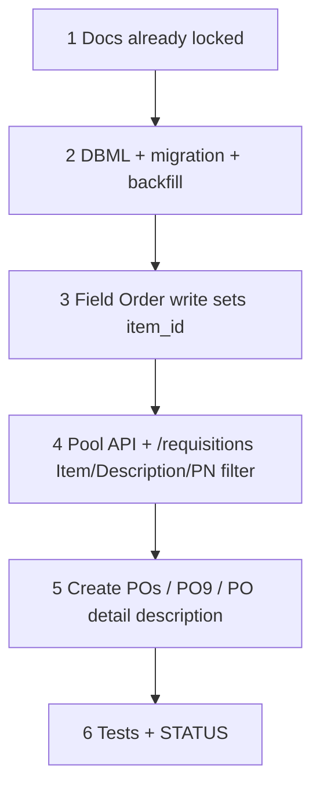

# 59 — Material request `item_id` + pool/PO descriptions

> **Status:** Complete (2026-07-20). Next: [57-zone-issues-and-field-adhoc.md](./57-zone-issues-and-field-adhoc.md) or [49-change-order-surfaces.md](./49-change-order-surfaces.md).
>
> **Depends on:** [58](./58-requisitions-po-pool-ux.md) (pool UX), [55](./55-field-progress-reports-zone-order.md) (Field ☐ Order write), [53](./53-purchase-order-workbench.md) (Create POs / PO9).
>
> **Decision:** [IT1–IT8](../decisions/procurement.md#decision-material-request-item_id--poolpo-descriptions-it1it8-2026-07-20). **Amends:** RQ-UI3 *display* (keeps `job × part` rollup); Field Order snapshot write; PO line seed description.

**Goal:** Snapshot catalog **`item_id`** from Field ☐ Order onto `job_material_request` (and through to `purchase_order_line`) so `/requisitions` can show Field-equivalent **Item**, narrow Part # picks, and seed PO descriptions from vendor → manufacturer → request text (overridable on the PO).

**Out of scope:** Changing rollup key away from `job × part`; receipts; inventing `item_id` for ad-hoc; reopening task 58 as the owner of this work.

---

## Locked product (IT1–IT8)

| Id | Choice |
|----|--------|
| **IT1** | Snapshot `item_id` on JMR at Field ☐ Order from `job_line.item_id` (via `job_line_part`). Not inferred from PN. Item label = Field Item. |
| **IT2** | Also `purchase_order_line.item_id`; copy at Create POs / PO9. |
| **IT3** | Null job-line item → null; ad-hoc → null. |
| **IT4** | Rollup **`job × part`**; mixed items → Item **Multiple**; PN Select = **union** of those items’ parts. |
| **IT5** | Pool: Qty · **Item** (RO) · Part # · **Description** (mfr PN desc; soft-spec = `jmr.description`; staged PN live-updates Description) · Vendor. |
| **IT6** | PO seed = `vendor_description \|\| manufacturer_description \|\| jmr.description`; **overridable** on PO. |
| **IT7** | Backfill existing rows via `job_line_part → job_line.item_id`. |
| **IT8** | Item is display + PN-narrowing only on the pool. |

---

## Execution order

---

## Step 1 — Docs (this change set)

| Area | Action |
|------|--------|
| Decision | [procurement.md](../decisions/procurement.md) — IT1–IT8 locked |
| This task | Author executable steps below |
| Index / STATUS / surfaces | Point “do next” / catalog at this task; note pool Item + description rules |

### Verify

- [x] Decision + task authored; STATUS “do next” can point here
- [x] No application code in the docs-only change set

---

## Step 2 — DBML + migration + backfill

| Area | Action |
|------|--------|
| `job_material_request` | Nullable `item_id` FK → `item` (`ON DELETE SET NULL`); index partial WHERE NOT NULL |
| `purchase_order_line` | Nullable `item_id` FK → `item` (same) |
| `current.dbml` | Add columns + refs |
| Backfill (IT7) | `UPDATE … SET item_id = jl.item_id FROM job_line_part jlp JOIN job_line jl …` on JMR where `job_line_part_id` set; similarly PO lines joinable via `job_line_part_id` or sources |

### Verify

- [x] Columns + FKs on dev
- [x] Existing BOM-backed open requests get `item_id` where `job_line.item_id` was set
- [x] Ad-hoc / null `job_line_part_id` rows remain null

---

## Step 3 — Field ☐ Order write sets `item_id`

| Area | Action |
|------|--------|
| Zone Order insert | When creating `job_material_request` from BOM, set `item_id` from the parent `job_line.item_id` (IT1 / IT3) |
| Ad-hoc paths | Leave `item_id` null (IT3) — Field ad-hoc (57) / PO9 unless later tied to a line |

### Verify

- [x] New ☐ Order request carries `item_id` matching Scope/Field Item’s catalog id when the line has one
- [x] Null job-line item → null `item_id`; Order still succeeds

---

## Step 4 — Pool API + `/requisitions` UI

| Area | Action |
|------|--------|
| Pool DTO | Expose `item_id`(s) / display label; manufacturer description for current/staged part; flag or list when Multiple |
| Columns | Insert read-only **Item** between Qty and Part #; Description per IT5 |
| Part # Select | Filter by single `item_id`, or **union** when Multiple (IT4) |
| Staging | On staged PN change, Description live-updates to that MPN’s `manufacturer_part.description` |

### Verify

- [x] BOM row shows Field-equivalent Item text
- [x] Soft-spec shows freeform Description until PN chosen; then mfr description
- [x] Mixed-item same-part rollup shows **Multiple**; PN options include union of both items’ parts

---

## Step 5 — Create POs / PO9 / PO detail

| Area | Action |
|------|--------|
| Batch-create | Copy `item_id` onto each PO line; seed `description` per IT6 |
| PO9 ad-hoc | `item_id` null unless input supplies a line/item; description seed same fallback |
| PO detail | Description editable (override sticks on draft save) |

### Verify

- [x] New draft PO line has `item_id` from sources when present
- [x] Seed text prefers vendor description, else mfr, else request text
- [x] Editing PO description and saving keeps the override

---

## Step 6 — Tests + STATUS

| Area | Action |
|------|--------|
| Tests | Order write snapshot; pool Item/Multiple/Description; batch-create `item_id` + description seed; backfill SQL covered or migration-reviewed |
| STATUS / index | Mark 59 complete; repoint “do next” |

### Verify

- [x] Touched tests green
- [x] Verify checklist all `[x]`; STATUS updated

---

## Related

- [58 — Requisitions PO pool UX](./58-requisitions-po-pool-ux.md)
- [55 — Field zone Order](./55-field-progress-reports-zone-order.md)
- [53 — PO workbench + cancel](./53-purchase-order-workbench.md)
- [decisions/procurement.md](../decisions/procurement.md)
