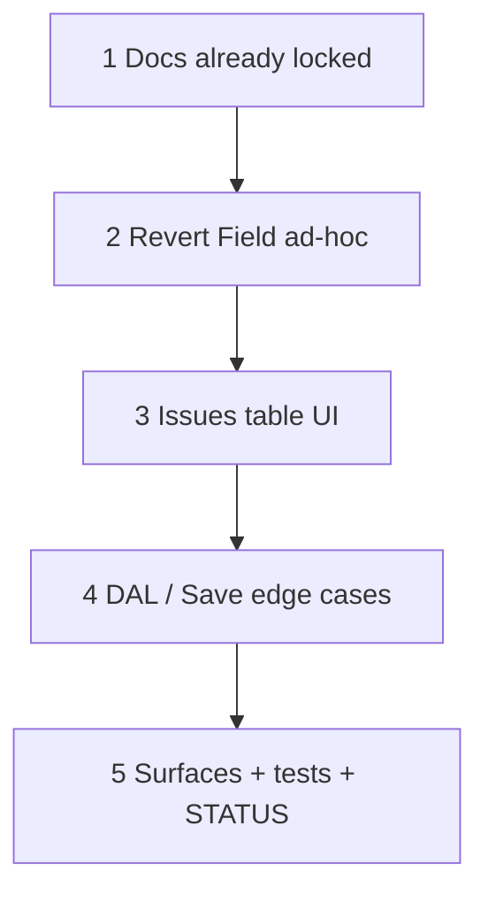

# 60 — Field Issues table + revert Field ad-hoc

> **Status:** Complete (2026-07-20). Next: [49-change-order-surfaces.md](./49-change-order-surfaces.md) or receipts.
>
> **Depends on:** [57](./57-zone-issues-and-field-adhoc.md) (`job_issue` + Field Issues shipped).
>
> **Decision:** [FI1–FI12](../decisions/job.md#decision-field-issues--signal-only--revert-field-ad-hoc-fi1fi12-2026-07-20). **Amends:** ISS3 UI ([planning/21 §3](../planning/21-po-lifecycle-issues-field-adhoc-open.md#§3--locked-zone-issues-required-follow-on-l4l31)). **Supersedes:** AH1–AH3 ([planning/21 §4](../planning/21-po-lifecycle-issues-field-adhoc-open.md#§4--locked-field-direct-ad-hoc-amends-l9)). **Restores:** L9 plan-entry via Scope Line Items.

**Goal:** Issues become a Stakeholders-like **table** (signal-only log, including free-text material asks). **Remove** Field “+ Add material” / `field_adhoc_materials`. Planned material enters only via **Scope → Line Items → Add line**. Field ☐ Order + informational Work table stay.

**Out of scope:** `external` / stakeholder reports (FI8); structured qty/part on issues (FI7); PM-only close (FI11); rename Issues; ISS7 blocking; receipts; CO Surfaces (49).

---

## Locked product (FI1–FI12)

| Id | Choice |
|----|--------|
| **FI1** | Issue = signal only — no JMR / BOM write |
| **FI2** | Revert Field-direct ad-hoc (AH1) |
| **FI3** | Pending → delete; after Save → Resolve / Cancel only (no hard delete) |
| **FI4** | Edit description while `open` |
| **FI5** | Resolve note required; cancel note optional |
| **FI6** | Keep name Issues / `job_issue` |
| **FI7** | Material ask = free text in description |
| **FI8** | Defer `external` |
| **FI9** | Table: Description · Status · actions; Add under table; no empty-state “No data” chrome |
| **FI10** | Open by default; Show closed toggle |
| **FI11** | Field write → create / edit / resolve / cancel |
| **FI12** | Work informational + ☐ Order; Scope Add line for new material |

---

## Execution order

---

## Step 1 — Docs (this change set)

| Area | Action |
|------|--------|
| Decision | [job.md FI1–FI12](../decisions/job.md#decision-field-issues--signal-only--revert-field-ad-hoc-fi1fi12-2026-07-20); procurement Field Order amend; planning 20/21 pointers |
| This task | Author executable steps below |
| Task 57 | Note partial supersede (AH1 + ISS3 UI) |

### Verify

- [x] Decision + task authored; STATUS can point here when pulled
- [x] No application code in the docs-only change set

---

## Step 2 — Revert Field ad-hoc (FI2 / FI12)

| Area | Action |
|------|--------|
| UI | Remove “+ Add material” draft row / controls from Field Work in `JobFieldExplorePanels` (and any related copy) |
| Form / store | Drop `field_adhoc_materials` from Field form values, descriptors, Save payload |
| DAL | Remove or no-op `applyFieldAdhocMaterialsTx` / `job-field-adhoc-write` from whole-job Field Save; delete dead helpers/tests that only served AH1 |
| Create paths | Confirm JMR creation remains: Field ☐ Order + purchaser PO9 only (RQ3 amended by FI2) |

### Verify

- [x] Field Work has no add-material affordance
- [x] Saving Field never inserts freeform JMR from the Field panel
- [x] Scope → Line Items → Add line still works; ☐ Order still creates JMR from BOM

---

## Step 3 — Issues table UI (FI3–FI5, FI9–FI11)

| Area | Action |
|------|--------|
| Chrome | Replace Issues list/form with Stakeholders-like `FieldArrayTable` (or equivalent): columns **Description** · **Status** · actions |
| Empty | Zero rows → table + **Add issue** only — **no** “No data” / “No issues” empty-state paragraph |
| Pending rows | Local-only until Job Save → show **Delete** (not Resolve/Cancel) |
| Persisted `open` | Description editable; **Resolve** (prompt/modal — note required) + **Cancel** (note optional) |
| Closed | Locked description; no delete; visible only when **Show closed** is on (default: open only) |
| Zone | Still scoped to selected zone / General; open-issue tree badge unchanged (ISS4) |
| Save | Keep batched into whole-job Save (`field_issues` patches) |

### Verify

- [x] Add issue appends a row; discard before Save leaves no DB row
- [x] After Save, Delete is gone; Resolve without note rejected; Cancel with empty note OK
- [x] Show closed toggles Resolved/Cancelled into view
- [x] Empty zone Issues block has no bulky empty-state copy

---

## Step 4 — DAL / Save edge cases (FI3–FI5)

| Area | Action |
|------|--------|
| Delete | Reject hard-delete of persisted `job_issue` rows (client should not send; server guard) |
| Update | Allow description patch while `status = open` only |
| Resolve / Cancel | Keep terminal transitions; resolve requires `resolution_note`; cancel note optional (store empty string if omitted) |
| Schema | **No** `external` column; **no** migration unless a small CHECK/comment cleanup is needed |

### Verify

- [x] Persisted delete attempted → rejected
- [x] Description edit after resolve/cancel → rejected
- [x] Audit still covers create / resolve / cancel (and open description edits if audited today)

---

## Step 5 — Surfaces + tests + STATUS

| Area | Action |
|------|--------|
| `surfaces.md` | Field: Issues table; drop `field_adhoc_materials`; note Scope Add line for plan entry |
| Tests | Update/remove AH1 ad-hoc tests; add Issues table lifecycle tests (pending delete vs resolve/cancel; edit while open) |
| STATUS / task index | Mark 60 complete when done; point “do next” at 49 or receipts |

### Verify

- [x] All touched tests green
- [x] Verify checklist all `[x]`; STATUS updated

---

## Related

- [FI1–FI12](../decisions/job.md#decision-field-issues--signal-only--revert-field-ad-hoc-fi1fi12-2026-07-20)
- [57](./57-zone-issues-and-field-adhoc.md) · [55](./55-field-progress-reports-zone-order.md) · [planning/21](../planning/21-po-lifecycle-issues-field-adhoc-open.md)
