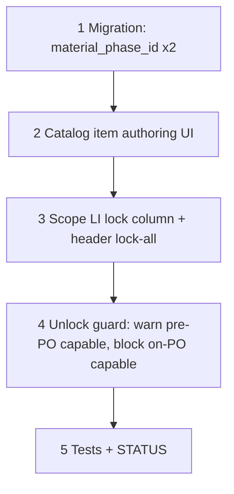

# 61 — Job material lock + material phase (catalog + Scope)

> **Status:** Complete (2026-07-21). Next: [62-field-zone-phase-order.md](./62-field-zone-phase-order.md).
>
> **Decision:** [MP1–MP4](../decisions/catalog.md#decision-material-phase--item-default--job-line-override-mp1mp4-2026-07-21) · [JML1–JML5](../decisions/job.md#decision-job-material-lock-phase-aware-zone-order-and-live-requisition-pool-jml1jml12-2026-07-21). **Blocks:** [62](./62-field-zone-phase-order.md), [63](./63-requisitions-live-pool.md), [64](./64-general-bucket-purchase-orders.md). **Depends on:** [47](./47-job-line-items-parity.md) (JLI-5 Item RO / Part editable), [37aa](./37aa-estimate-line-live-preview.md) (`material_locked`).

**Goal:** Give catalog items a default material phase (overridable per job line), and turn Job Scope Line Items' existing `material_locked` flag into a real, explicit lock/unlock affordance that supports soft-lock (no PN) — the gate that later tasks (62–64) key off of.

**Out of scope:** Field UI changes (62); requisitions pool derivation (63); PO rules (64). This task only touches catalog authoring + Scope Line Items.

---

## Execution order

---

## Step 1 — Migration

| File / area | Action |
|-------------|--------|
| `migrations/090_material_phase.sql` | `ALTER TABLE item ADD COLUMN material_phase_id TEXT REFERENCES labor_phase(id) ON DELETE SET NULL`; `ALTER TABLE job_line ADD COLUMN material_phase_id TEXT REFERENCES labor_phase(id) ON DELETE SET NULL` |
| `docs/schema/current.dbml` | Already amended (this change set) — verify migration matches DBML exactly |

### Verify

- [x] Migration applies clean on dev
- [x] `current.dbml` matches applied schema (`codegen --check` if wired to this table)

---

## Step 2 — Catalog item authoring UI

| File / area | Action |
|-------------|--------|
| `item_detail` descriptor / Surface | Add `material_phase_id` — Select of the item's own `item_labor_phase` rows (resolved set, not raw catalog `labor_phase` table — an item can only route material to a phase it actually has labor for) |
| Write guard | Reject `material_phase_id` not present in the item's resolved labor-phase set |

### Verify

- [x] Item detail: pick a material phase from the item's own resolved phases only
- [x] Write rejects a phase the item doesn't have

---

## Step 3 — Scope Line Items lock column (JML1–JML3)

| File / area | Action |
|-------------|--------|
| `JobLineItemsPanels.tsx` | New icon column, left of **Part** — filled = locked, outline = unlocked. Click toggles `material_locked` directly (not just as a side effect of picking a part) |
| | Header control (above the column, scoped to currently visible/selected-condition rows): lock-all / unlock-all |
| `JobPartSelect` | Manual PN pick still auto-locks (existing). Picking with **no PN** and hitting the new lock icon is a valid **soft lock** — Part cell shows **TBD** instead of blank when `material_locked && !part_id` |
| Scope LI descriptor | Add `job_line.material_phase_id` as an optional override Select — options = **that line's own seeded `scope_phase` rows** (via their `labor_phase_id`), not the raw catalog list |

### Verify

- [x] Lock icon toggles independent of PN presence
- [x] Soft lock (no PN) shows TBD, not blank
- [x] Header lock-all/unlock-all affects only visible rows for the selected condition
- [x] Per-line material phase override Select is scoped to that line's own phases

---

## Step 4 — Unlock guard (JML4)

| File / area | Action |
|-------------|--------|
| DAL write guard | On `material_locked: true → false`: if any qty for this `job_line_part` is on a `purchase_order_line` → **reject** (structured conflict, `code: "part_on_purchase_order"`). Else if the pool currently includes this line (i.e. its effective-phase/zone `job_field_order_cell.requested = true` — lands fully in task 62/63, this task can stub the check against `job_material_request.status != 'fulfilled'` if 62/63 aren't landed yet) → **allow**, UI shows warn-confirm client-side first |
| UI | Warn-confirm dialog: "This part is requested for ordering and not yet purchased. Unlocking removes it from the pool until re-locked. Continue?" — only shown when the pre-PO condition applies |

### Verify

- [x] Unlock blocked (structured error) once any qty is on a PO line
- [x] Unlock allowed pre-PO after confirm
- [x] No dialog shown when the line has no open demand at all

---

## Step 5 — Tests + close out

| File | Action |
|------|--------|
| Unit tests | Item material-phase write guard; job_line material-phase override scoping; unlock guard (blocked on-PO, allowed pre-PO) |
| `01-task-index.md` | Add row for task 61 |
| `STATUS.md` | Recently completed; Right now → point at [62](./62-field-zone-phase-order.md) |

### Verify

- [x] Tests green
- [x] Task + indexes + STATUS updated

---

## Related

- [Decision — MP1–MP4](../decisions/catalog.md#decision-material-phase--item-default--job-line-override-mp1mp4-2026-07-21)
- [Decision — JML1–JML12](../decisions/job.md#decision-job-material-lock-phase-aware-zone-order-and-live-requisition-pool-jml1jml12-2026-07-21)
- [62 — Field zone × phase Order column](./62-field-zone-phase-order.md)
- [47 — Job LI parity (JLI-1…7)](./47-job-line-items-parity.md)
