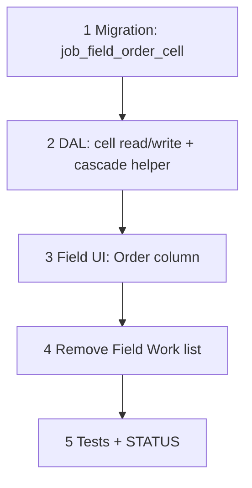

# 62 — Field zone × phase Order column (drop Work/item list)

> **Status:** Complete (2026-07-21). Next: [63-requisitions-live-pool.md](./63-requisitions-live-pool.md).
>
> **Decision:** [JML6–JML9](../decisions/job.md#decision-job-material-lock-phase-aware-zone-order-and-live-requisition-pool-jml1jml12-2026-07-21). **Amends:** [FI12](../decisions/job.md#decision-field-issues--signal-only--revert-field-ad-hoc-fi1fi12-2026-07-20) (Field Work item/part/PO-trail list — dropped); [Field zone Order compose (L5–L7, L27)](../decisions/job.md#decision-field--progress-reports--zone-order-compose-2026-07-17) (derivation superseded). **Depends on:** [61](./61-job-material-lock-and-phase.md) (material phase + lock). **Blocks:** [63](./63-requisitions-live-pool.md).

**Goal:** Add an **Order** column to Field's zone × phase grid (same tri-state cascade as the existing **Done** column), resolved against locked `job_line_part` rows via effective material phase + zone allocation. Remove the Field Work item/part/PO-trail list entirely — Field becomes readiness-only.

**Out of scope:** `/requisitions` derivation itself (63) — this task only produces the persistent `job_field_order_cell` state and the Field UI to set it. The live pool read-side lands in 63.

---

## Execution order

---

## Step 1 — Migration

| File / area | Action |
|-------------|--------|
| `migrations/091_job_field_order_cell.sql` | Create `job_field_order_cell` per `current.dbml` (mirrors `job_field_progress_cell` shape exactly — same partial unique indexes for zone vs General) |

### Verify

- [x] Migration applies clean

---

## Step 2 — DAL

| File / area | Action |
|-------------|--------|
| `job-field-order-write.ts` (new, sibling to `job-field-progress-load.ts` / write) | Load: derive per (scope_phase, zone) tri-state the same way `job_field_progress_cell` derives Done tri-state (reuse the existing cascade/indeterminate helper — do not fork a second implementation) |
| | Write: replace-array on Field Save, same batching as `field_progress` |
| Eligibility filter | Only include a `job_line`'s `scope_phase` rows in the orderable set when that line has `material_locked = true` **and** at least one `job_line_part` row (BOM exists). Unlocked-but-otherwise-eligible lines are excluded from the toggle's *effect*, not from being checkable — surface count via a small DTO field (`unlocked_excluded_count`) for the "N unlocked lines excluded" UI badge |

### Verify

- [x] Cascade/indeterminate logic matches Done's existing behavior exactly (shared helper, not duplicated)
- [x] Unlocked lines never get pulled into pool eligibility even when their zone/phase cell is `requested = true`
- [x] `unlocked_excluded_count` correct when some lines in a cell are unlocked

---

## Step 3 — Field UI

| File / area | Action |
|-------------|--------|
| `JobFieldExplorePanels.tsx` | New **Order** column, placed **before Done** in the per-phase row. Reuse the exact `Checkbox` + `indeterminate` pattern already used for Done (same component, new data source) |
| | "N unlocked lines excluded" badge/tooltip on cells where `unlocked_excluded_count > 0` |

### Verify

- [x] Order column renders with correct tri-state per (phase, zone)
- [x] Checking a parent zone cascades to descendant leaves + General
- [x] Checking one leaf makes ancestor indeterminate
- [x] Badge shows when unlocked lines are excluded

---

## Step 4 — Remove Field Work list (JML8, amends FI12)

| File / area | Action |
|-------------|--------|
| `JobFieldExplorePanels.tsx` | Remove the informational Work/parts table (qty / item / part / PO trail) entirely from Field |
| Form / store | Drop any Field-side item/part row bindings that only served that list |
| Copy | Update any Field help text referencing "Work" parts list |

### Verify

- [x] Field shows only phases (Done + Order) and Issues — no item/part rows anywhere
- [x] PO trail remains visible from Scope / `/requisitions` (unaffected by this removal)

---

## Step 5 — Tests + close out

| File | Action |
|------|--------|
| Unit tests | Order cell cascade parity with Done; eligibility filter (locked-only); unlocked-excluded count |
| `01-task-index.md` | Add row for task 62 |
| `STATUS.md` | Recently completed; Right now → point at [63](./63-requisitions-live-pool.md) |

### Verify

- [x] Tests green
- [x] Task + indexes + STATUS updated

---

## Related

- [Decision — JML1–JML12](../decisions/job.md#decision-job-material-lock-phase-aware-zone-order-and-live-requisition-pool-jml1jml12-2026-07-21)
- [61 — job material lock + material phase](./61-job-material-lock-and-phase.md)
- [63 — requisitions live pool](./63-requisitions-live-pool.md)
- [51 — job field progress (Done column origin)](./51-job-field-progress.md)
