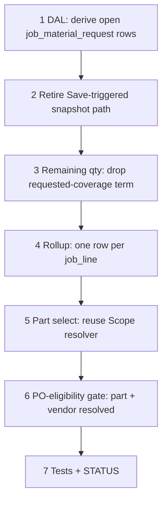

# 63 — Requisitions live pool + per-line rollup + PN resolver reuse

> **Status:** Complete (2026-07-21). Next: [64-general-bucket-purchase-orders.md](./64-general-bucket-purchase-orders.md).
>
> **Decision:** [RP1–RP6](../decisions/procurement.md#decision-requisitions-live-pool-per-line-rollup-and-po-job-lock-rp1rp10-2026-07-21). **Reverses:** [IT4/IT8](../decisions/procurement.md#decision-material-request-item_id--poolpo-descriptions-it1it8-2026-07-20) (`job × part` rollup); [RQ-UI5](../decisions/procurement.md#decision-requisitions--po-pool-ux-fold-workbench-rq-ui1rq-ui8-2026-07-20) (PN may stay blank until Create POs). **Depends on:** [61](./61-job-material-lock-and-phase.md), [62](./62-field-zone-phase-order.md). **Blocks:** [64](./64-general-bucket-purchase-orders.md).

**Goal:** Make `/requisitions` a live derived pool (no more Save-triggered snapshot creation), drop the `job × part` rollup to one row per `job_line`, and reuse Scope's real Part-picker resolver (item + condition-aware) instead of the looser item-only union.

**Out of scope:** PO-side job-lock rules and general-bucket PO (64) — this task only changes how `/requisitions` is populated and displayed.

---

## Execution order

---

## Step 1 — DAL: derive open rows

| File / area | Action |
|-------------|--------|
| `job-material-request-derive.ts` (new) | Compute the target open set: `job_line_part` rows where `job_line.material_locked = true`, joined to the line's effective material phase (`catalog.md` MP3 resolution) and `job_line_allocation` (or General), filtered to `job_field_order_cell.requested = true` for that (phase, zone) |
| | On read (and after any write to `job_line`, `job_line_part`, `job_line_allocation`, `material_locked`, or `job_field_order_cell`): **sync** `job_material_request` `open` rows to match the derived set — insert missing, delete rows no longer in the derived set (never touch `on_purchase_order` / `fulfilled` rows) |

### Verify

- [x] Derived set matches (locked × phase × zone × Order=true) exactly
- [x] Sync never deletes/mutates `on_purchase_order` or `fulfilled` rows
- [x] Removing a line from Scope (or unlocking it) removes its open row on next read

---

## Step 2 — Retire Save-triggered snapshot path

| File / area | Action |
|-------------|--------|
| Field Save write path | Remove the "Order-changing Save → new demand" trigger (already mostly collapsed by task 56; confirm no remaining code path creates `job_material_request` rows directly from a Save diff) |
| Tests | Remove/update tests asserting Save-triggered creation; replace with sync-on-read/write assertions from Step 1 |

### Verify

- [x] No code path creates `job_material_request` open rows from a Job Save diff anymore
- [x] Old Save-triggered tests removed or rewritten against the new derivation

---

## Step 3 — Remaining qty formula

| File / area | Action |
|-------------|--------|
| `remaining.ts` | Drop the "requested coverage" subtraction term — with Step 1's derivation, a row's presence in the pool already means "not on a PO." Remaining = `job_line_part.quantity − PO coverage` only |

### Verify

- [x] `remaining.ts` unit tests updated for the simplified two-term → one-term formula
- [x] No regression in existing PO-coverage tests

---

## Step 4 — Rollup: one row per `job_line`

| File / area | Action |
|-------------|--------|
| `/requisitions` list DAL | Remove the `job × part` merge (IT4). Each open `job_material_request` row (keyed by `job_line_part_id`, one per `job_line`) is its own pool row, even when two lines share an identical `part_id` |
| UI | Drop the "Multiple" Item-column merge case (IT4) — no longer applicable once rollup is one-row-per-line |

### Verify

- [x] Two lines with the same part show as two separate rows
- [x] "Multiple" Item chip removed from `/requisitions`

---

## Step 5 — Part # Select reuses Scope resolver (RP5)

| File / area | Action |
|-------------|--------|
| Pool row DTO | Carry the contributing `job_line_id` and its `job_condition_id` |
| Part # Select | Call `fetchJobPartPicker(item_id, job_condition_id, draft)` — same resolver `JobPartSelect` (Scope) uses — instead of the item-only union |

### Verify

- [x] Pool Part # options match what Scope's Part picker would show for that exact line
- [x] Soft-locked (TBD) rows still resolve options correctly once purchaser opens the Select

---

## Step 6 — PO-eligibility gate (RP6)

| File / area | Action |
|-------------|--------|
| Create POs / pool selection | A row is only selectable for Create POs when both `part_id` **and** vendor are resolved. Unresolved rows stay visible but disabled for selection, with a tooltip ("resolve part # and vendor first") |

### Verify

- [x] Row with blank PN cannot be added to a PO
- [x] Row with PN but no vendor cannot be added to a PO
- [x] Resolved row selects normally

---

## Step 7 — Tests + close out

| File | Action |
|------|--------|
| Unit tests | Derivation sync; remaining formula; one-row-per-line rollup; resolver reuse; PO-eligibility gate |
| `01-task-index.md` | Add row for task 63 |
| `STATUS.md` | Recently completed; Right now → point at [64](./64-general-bucket-purchase-orders.md) |

### Verify

- [x] Tests green
- [x] Task + indexes + STATUS updated

---

## Related

- [Decision — RP1–RP10](../decisions/procurement.md#decision-requisitions-live-pool-per-line-rollup-and-po-job-lock-rp1rp10-2026-07-21)
- [62 — Field zone × phase Order column](./62-field-zone-phase-order.md)
- [64 — general bucket purchase orders](./64-general-bucket-purchase-orders.md)
- [58 — Requisitions = PO pool UX](./58-requisitions-po-pool-ux.md)
- [59 — material request item_id + descriptions](./59-material-request-item-id-and-descriptions.md)
