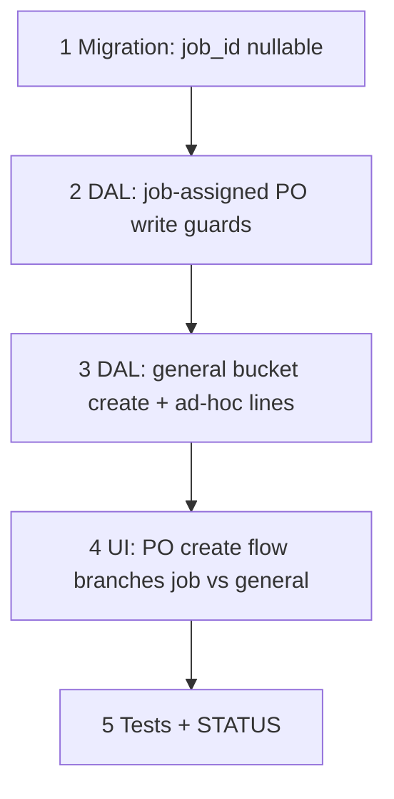

# 64 — PO job-lock rules + general/job-less bucket PO

> **Status:** Complete (2026-07-21). Next: [49-change-order-surfaces.md](./49-change-order-surfaces.md) or receipts.
>
> **Decision:** [RP7–RP10](../decisions/procurement.md#decision-requisitions-live-pool-per-line-rollup-and-po-job-lock-rp1rp10-2026-07-21). **Depends on:** [63](./63-requisitions-live-pool.md). **Retires (job-assigned POs only):** PO9 freeform ad-hoc line ([53](./53-purchase-order-workbench.md)) — kept for the new general bucket.

**Goal:** Lock down job-assigned PO line editing (part frozen, qty editable, deletable, no new lines), and introduce a job-less **general bucket** PO for overhead/stock-ahead/incidental purchasing with `purchase_order.job_id` nullable.

**Out of scope:** Any change to how job-assigned PO lines are created (still only via the requisitions pool, task 63). Job costing rollups (general bucket never touches job cost, per RP9).

---

## Execution order

---

## Step 1 — Migration

| File / area | Action |
|-------------|--------|
| `migrations/093_purchase_order_job_id_nullable.sql` | `ALTER TABLE purchase_order ALTER COLUMN job_id DROP NOT NULL` |

### Verify

- [x] Migration applies clean; existing job-assigned POs unaffected

---

## Step 2 — Job-assigned PO write guards (RP7–RP8)

| File / area | Action |
|-------------|--------|
| PO line write DAL | Reject `part_id` change on any line belonging to a PO with `job_id IS NOT NULL` (frozen). Allow `quantity` PATCH. Allow line delete (cancel) |
| PO line create DAL | Reject creating a **new** line directly on a PO with `job_id IS NOT NULL` outside the Create-POs-from-pool path (task 63) — that path remains the only entry |

### Verify

- [x] Part swap attempt on a job-assigned PO line → rejected (structured conflict)
- [x] Qty PATCH on a job-assigned PO line → allowed
- [x] Line delete on a job-assigned PO → allowed
- [x] Direct "add line" attempt on a job-assigned PO → rejected

---

## Step 3 — General bucket PO (RP9–RP10)

| File / area | Action |
|-------------|--------|
| `purchase_order` create DAL | Allow create with `job_id: null` |
| PO line write DAL | For `job_id IS NULL` POs: allow freeform ad-hoc line add/edit at will (existing PO9 `adhoc-line.ts` path, scoped to this PO type) — description and/or `part_id`, no `job_line_part_id` |
| Cost rollup guards | Confirm no job cost summary / billing query ever includes a general-bucket PO or its lines (audit `job-cost-summary.ts` and similar — should already be naturally excluded since they filter by `job_id`, but add an explicit test) |

### Verify

- [x] General bucket PO create succeeds with no job
- [x] Ad-hoc line add/edit works freely on a general bucket PO
- [x] Job cost summary queries never surface a general-bucket PO or line, even by accident

---

## Step 4 — UI

| File / area | Action |
|-------------|--------|
| PO create flow | Branch: "From job" (existing pool-select path) vs "General" (job-less — new manual-entry flow, freeform lines) |
| PO detail | When `job_id IS NULL`: hide job-scoped chrome (job link, job cost context); show ad-hoc line editor unconditionally (not gated on `draft` + job-assigned rules) |

### Verify

- [x] PO list/detail clearly distinguishes job-assigned vs general bucket
- [x] General bucket PO detail never shows a job reference anywhere

---

## Step 5 — Tests + close out

| File | Action |
|------|--------|
| Unit tests | Job-assigned write guards; general bucket create + ad-hoc; cost-exclusion assertion |
| `01-task-index.md` | Add row for task 64 |
| `STATUS.md` | Recently completed; Right now → back to [49 — CO Surfaces](./49-change-order-surfaces.md) or receipts |

### Verify

- [x] Tests green
- [x] Task + indexes + STATUS updated

---

## Related

- [Decision — RP1–RP10](../decisions/procurement.md#decision-requisitions-live-pool-per-line-rollup-and-po-job-lock-rp1rp10-2026-07-21)
- [63 — requisitions live pool](./63-requisitions-live-pool.md)
- [53 — PO workbench + cancel lifecycle](./53-purchase-order-workbench.md)
