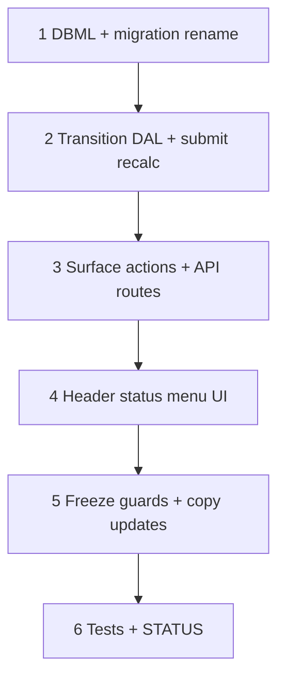

# 65 — Estimate status dropdown lifecycle

> **Status:** Complete (2026-07-21). Next: [63-requisitions-live-pool.md](./63-requisitions-live-pool.md) (or [66](./66-estimate-draft-recalculate.md) / [67](./67-estimate-accept-customer-po.md) when picked).
>
> **Decision:** [ST1–ST10](../decisions/estimate.md#decision-estimate-status-dropdown-lifecycle-st1st10-2026-07-21). **Supersedes:** [W6](../decisions/estimate.md#w6--win--lose-ui--api-superseded-2026-07-21) Win/Lose buttons ([46](./46-estimate-win-lose-job-copy.md) UI). **Keeps:** accept → job handoff W0–W5 / W1b / W1c. **Follow-ons (do not forget):** [66](./66-estimate-draft-recalculate.md), [67](./67-estimate-accept-customer-po.md).

**Goal:** Replace Win / Lose toolbar buttons with a header **status action menu** (`draft` → `submitted` → `accepted` / `rejected`), rename status enum, force full costing on submit, then freeze.

**Out of scope:** Draft **Recalculate** for catalog-only rate changes ([66](./66-estimate-draft-recalculate.md)); accept-time **customer PO** capture ([67](./67-estimate-accept-customer-po.md)); change-order Surfaces ([49](./49-change-order-surfaces.md)).

---

## Skipped / follow-on (tracked)

| # | Task | Why skipped from 65 |
|---|------|---------------------|
| **66** | [Draft Recalculate](./66-estimate-draft-recalculate.md) | Catalog markup/freight/incidental/labor edits are rare; W1 + Save cover day-to-day; explicit Recalculate is a separate UX |
| **67** | [Accept customer PO](./67-estimate-accept-customer-po.md) | Accept must ship without blocking on PO schema; capture customer PO # / date on accept modal later |

---

## Locked summary (do not re-litigate)

| # | Choice |
|---|--------|
| **ST1** | Status enum: `draft` \| `submitted` \| `accepted` \| `rejected` |
| **ST2** | New estimate = `draft` |
| **ST3** | Header status dropdown / action menu; remove Win / Lose |
| **ST4** | Transitions = confirm + dedicated API (not PATCH) |
| **ST5** | Actions: `submit` / `accept` / `reject` / `recall` + `create_job` |
| **ST6** | Draft costing = existing W1 + Save |
| **ST7** | Enter `submitted` → full recalc all lines, then freeze |
| **ST8** | Enter `accepted` → existing win handoff (no PO fields yet) |
| **ST9** | `rejected` from draft or submitted; lock; no job |
| **ST10** | `submitted` → `draft` recall OK; accepted/rejected terminal |

---

## Execution order

---

## Step 1 — DBML + migration

| File / area | Action |
|-------------|--------|
| `docs/schema/current.dbml` | `estimate.status` note: `draft \| submitted \| accepted \| rejected` |
| `migrations/092_estimate_status_rename.sql` | Backfill `sent`→`submitted`, `won`→`accepted`, `lost`→`rejected`, `expired`→`rejected`; drop old CHECK; add new CHECK; default `'draft'` |

### Verify

- [x] Migration applies clean on dev
- [x] No rows remain with `sent` / `won` / `lost` / `expired`
- [x] New estimates default `draft`

---

## Step 2 — Transition DAL + submit recalc

| File / area | Action |
|-------------|--------|
| Win/lose/recreate repository | Rename status targets; expose `submitEstimate`, `acceptEstimate` (ex-win), `rejectEstimate` (ex-lose), `recallEstimate`; keep recreate |
| Submit path | Before freeze: `recalcLineItems` for **all** lines (live catalog), persist snapshots, then `status = submitted` |
| Accept / reject / recall | Accept = existing handoff; reject = status only; recall = `submitted` → `draft` only |
| Guards | Illegal transitions → 409; dirty-form is UI-only (API assumes saved state) |

### Verify

- [x] Submit recalcs then freezes; subsequent preview/PATCH quote fields blocked
- [x] Accept creates jobs (W1a/S2a); W1c dialog still works
- [x] Reject locks without jobs
- [x] Recall unlocks only from `submitted`

---

## Step 3 — Surface actions + API

| File / area | Action |
|-------------|--------|
| `estimate_detail.surface.yaml` / policies | Replace `win`/`lose` with `submit`/`accept`/`reject`/`recall`; keep `create_job` |
| Routes | Map old `/win` `/lose` → new transition routes (or rename paths); re-resolve per action |
| Codegen / grants | Update role seeds / policy YAML so existing estimators keep ability to transition |

### Verify

- [x] Manifest exposes new actions; old `win`/`lose` gone
- [x] Unauthorized transition → 403

---

## Step 4 — Header status menu UI

| File / area | Action |
|-------------|--------|
| `EstimateDetailForm.tsx` | Remove Win / Lose buttons; add header **Status** dropdown/action menu (current label + allowed next targets) |
| | Confirm modals per target; block when form dirty (same as Win today) |
| | Keep **Create job** when `accepted` + missing slice (toolbar or menu item) |
| Tags / lists | Status colors/labels for new vocabulary; estimate list filter if any |

### Verify

- [x] No Win / Lose buttons
- [x] Menu only shows legal next statuses
- [x] Accept navigates per U1; multi-job toast still lists siblings

---

## Step 5 — Freeze guards + copy

| File / area | Action |
|-------------|--------|
| Recalc / preview / write | Treat `submitted`/`accepted`/`rejected` like former non-draft freeze |
| Docs / strings | Prefer Accept / Submit / Reject in user-facing copy; update surface-spec notes |

### Verify

- [x] Draft preview still works; non-draft preview no-ops / frozen
- [x] Form disabled appropriately for frozen statuses

---

## Step 6 — Tests + STATUS

| Area | Action |
|------|--------|
| Unit / integration | Transition graph; submit recalc; freeze; accept handoff smoke; recall |
| STATUS / index | Mark 65 complete; point next (63/64 chain or 66/67 when picked) |

### Verify (stop gate)

- [x] All Step 1–5 verifies checked
- [x] `codegen:check` / targeted tests green
- [x] STATUS + task index updated
- [x] Follow-ons **66** / **67** still listed as planned (not silently dropped)

---

## Manual smoke

1. Create estimate → status **Draft**.
2. Add lines; change item/part/config → costs update (W1).
3. Status → **Submitted** → confirm → costs refresh once; LI/C frozen.
4. Status → **Draft** (recall) → editable again.
5. Submit again → **Accepted** → job(s) created; navigate.
6. Separate estimate → **Rejected** from draft or submitted → locked, no job.
7. Confirm Create job still appears when an accepted estimate is missing a catalog-scope job.
