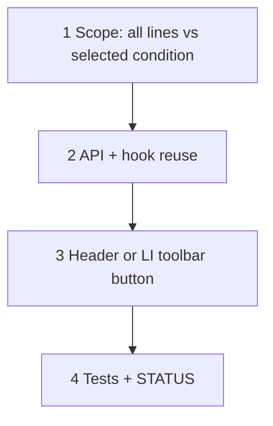

# 66 — Estimate draft Recalculate (catalog rates)

> **Status:** Planned — **skipped from [65](./65-estimate-status-dropdown.md)**; implement after 65 (or when catalog commercial edits bite estimators).
>
> **Decision:** [ST6](../decisions/estimate.md#decision-estimate-status-dropdown-lifecycle-st1st10-2026-07-21). **Depends on:** [65](./65-estimate-status-dropdown.md). **Companion context:** draft costing stays live on item/part/config (W1); this closes the **catalog-only** gap (markup / freight / incidental / labor rate types on item or org tables).

**Goal:** On a **draft** estimate, provide an explicit **Recalculate** (refresh costs) control that re-runs `recalcProductLine` for all lines (or all lines under the selected condition — pick one in Step 1 and stick to it) against the live commercial catalog, respecting `sales_locked` / `material_locked`.

**Out of scope:** Auto-recalc on every estimate mount/focus; recalc after `submitted`+; changing W1 triggers.

---

## Why this was skipped

Day-to-day costs already update when item, part, or condition configuration changes. Catalog margin/labor policy edits are rare. Status work (65) should not block on a second chrome control — but without this task, navigating back from `/items` after a markup change leaves draft line snapshots stale until Save or a W1 nudge.

---

## Locked summary

| # | Choice |
|---|--------|
| **R1** | Draft-only control (hidden/disabled when not `draft`) |
| **R2** | Server preview or persist-via-dirty form — prefer same line-preview batch path as W1, then user Saves (or offer “Recalculate & Save” — decide in implement) |
| **R3** | Honor dual locks: costs + target update; sell sticks if `sales_locked`; item/part stick if `material_locked` |
| **R4** | Toast when values change (`N` lines updated) |

---

## Execution order

---

## Steps (outline)

1. **Scope** — Prefer **all draft lines** on the estimate (catalog edits are estimate-wide). Document if product prefers selected-condition only.
2. **Wire** — Reuse `line-preview` / `recalcProductLine`; no client formula fork.
3. **UI** — Button near status menu or Line Items header: **Recalculate**. Dirty-form OK (results dirty the form).
4. **Verify** — Change item markup in catalog → open draft → Recalculate → freight/incidental/target (and unlocked sell) update; locked sell unchanged.

### Verify (stop gate)

- [ ] Recalculate only when `status = draft`
- [ ] Catalog rate change visible after Recalculate without item/part/config edit
- [ ] Dual locks respected
- [ ] STATUS updated; this task no longer “skipped”
