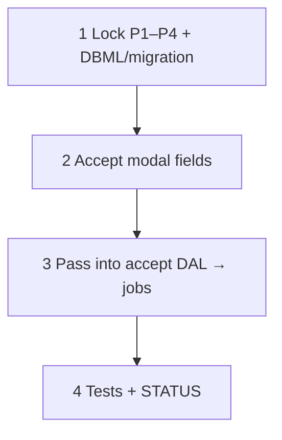

# 67 — Estimate accept — customer PO capture

> **Status:** Planned — **skipped from [65](./65-estimate-status-dropdown.md)**; implement after accept handoff works with the status menu.
>
> **Decision:** [ST8](../decisions/estimate.md#decision-estimate-status-dropdown-lifecycle-st1st10-2026-07-21). **Depends on:** [65](./65-estimate-status-dropdown.md). **Keeps:** accept → job copy (W1–W5); W1c site active-job dialog.

**Goal:** When transitioning **submitted → accepted**, collect **customer PO** (and related refs) in the confirm modal and persist onto the created job(s) (and/or estimate header — lock storage in Step 1).

**Out of scope:** Full billing / AR; vendor POs ([53](./53-purchase-order-workbench.md)); changing when jobs are created (still on accept).

---

## Why this was skipped

Accept already creates N jobs, conditions, sold snapshots, BOM, and phases. Blocking 65 on PO schema/UI would delay the status dropdown. Product still wants “add customer PO, etc.” on accept — track here so it is not forgotten.

---

## Open (lock in Step 1 before coding)

| # | Question | Lean |
|---|----------|------|
| **P1** | Where stored? | Prefer `job.customer_po_number` (+ optional date) copied to each job created; optional mirror on `estimate` |
| **P2** | Required vs optional? | Optional v1 (empty OK) unless ops demand required |
| **P3** | Multi-job (N catalog scopes)? | Same PO stamped on every job from that accept |
| **P4** | Edit after accept? | Job Overview editable later; estimate frozen |

---

## Execution order

---

## Steps (outline)

1. **Schema** — Add columns per P1; migrate.
2. **UI** — Accept confirm modal: Customer PO #, optional date/notes.
3. **DAL** — Accept handoff writes fields onto each created job.
4. **Verify** — Accept with PO → all jobs show it; accept without PO still succeeds if optional.

### Verify (stop gate)

- [ ] P1–P4 locked in decision or this task notes
- [ ] Accept modal collects fields; values land on job(s)
- [ ] 65 accept path unchanged when fields empty (if optional)
- [ ] STATUS updated; this task no longer “skipped”
