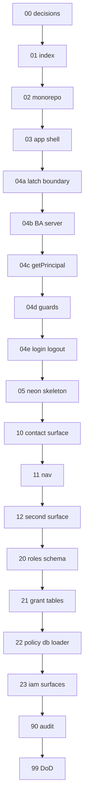

# 01 — Task index (read once)

> **Status:** Complete (2026-06-03). Next: schedule [02-monorepo-entry.md](./02-monorepo-entry.md) when ready to write code.

## Goal

Orient the test1 task chain. **Do not implement code in this file.**

## Prerequisites

- [00-decisions.md](./00-decisions.md) verify gate passed.
- Skim [../PLAN.md](../PLAN.md) and [../decisions.md](../decisions.md).

## Execution order

```
00-decisions (docs) ✓
  → 01-task-index (read once) ✓
  → 02-monorepo-entry + 03-app-shell-scaffold (one pass)
  → 04-better-auth (04a → 04b → 04c → 04d → 04e)
  → 05-neon-migrations-skeleton
  → 10-contact-surface → 11-nav → 12-second-surface
  → 20-latch-roles-schema → 21-grant-tables → 22-policy-db-loader → 23-iam-surfaces
  → 90-audit-policy-version → 99-phase-dod
```

## Dependency diagram



## Full table

| # | Task | Type | Status | Delivers |
|---|------|------|--------|----------|
| 00 | [00-decisions.md](./00-decisions.md) | Docs | **Complete** | Locked decisions |
| 01 | [01-task-index.md](./01-task-index.md) | Docs | **Complete** | This index |
| 02 | [02-monorepo-entry.md](./02-monorepo-entry.md) | Code | Not scheduled | Workspace, `dev:test1`, port 3003 |
| 03 | [03-app-shell-scaffold.md](./03-app-shell-scaffold.md) | Code | Not scheduled | Next shell, AntD layout, empty nav |
| 04 | [04-better-auth.md](./04-better-auth.md) | Code | Not scheduled | Parent — Better Auth + Latch seam |
| 04a | [04a-latch-auth-boundary.md](./04a-latch-auth-boundary.md) | Docs | **Complete** | Read map: Latch vs Better Auth |
| 04b | [04b-better-auth-server.md](./04b-better-auth-server.md) | Code | Not scheduled | `auth.ts` + API route + env |
| 04c | [04c-principal-seam.md](./04c-principal-seam.md) | Code | Not scheduled | `getPrincipal` + stub roles |
| 04d | [04d-session-guards.md](./04d-session-guards.md) | Code | Not scheduled | `requireSession`, drop placeholders |
| 04e | [04e-login-logout.md](./04e-login-logout.md) | Code | Not scheduled | Login/logout UI + parent verify |
| 05 | [05-neon-migrations-skeleton.md](./05-neon-migrations-skeleton.md) | Code | Not scheduled | Migrations hook, `latch_users`, audit |
| 10 | [10-contact-surface.md](./10-contact-surface.md) | Code | Not started (**10a–10e**) | First business Surface (`contact`, YAML policies, DAL, `/contacts`) |
| 11 | [11-nav-minimal.md](./11-nav-minimal.md) | Code | Planning stub | Policy-driven nav catalog |
| 12 | [12-second-surface.md](./12-second-surface.md) | Code | Planning stub | Second business Surface (repeat loop) |
| 20 | [20-latch-roles-schema.md](./20-latch-roles-schema.md) | Code | Planning stub | `latch_roles` + seed system roles |
| 21 | [21-grant-tables.md](./21-grant-tables.md) | Code | Planning stub | `latch_role_grants` (+ row scope) |
| 22 | [22-policy-db-loader.md](./22-policy-db-loader.md) | Code | Planning stub | `@latch/policy` reads DB grants |
| 23 | [23-iam-surfaces.md](./23-iam-surfaces.md) | Code | Planning stub | `user` + `role` Surfaces + pages |
| 90 | [90-audit-policy-version.md](./90-audit-policy-version.md) | Code | Planning stub | Audit + policyVersion on IAM mutations |
| 99 | [99-phase-dod.md](./99-phase-dod.md) | Docs | Planning stub | test1 v1 definition of done |

## Reference apps

| Need | Look at |
|------|---------|
| Auth.js seam (same pattern) | [`apps/crm/src/lib/auth/`](../../../crm/src/lib/auth/) |
| Nav | [`apps/crm/src/lib/nav.ts`](../../../crm/src/lib/nav.ts) |
| Split view | [`apps/crm/src/app/(app)/jobs/page.tsx`](../../../crm/src/app/(app)/jobs/page.tsx) |
| Surface YAML | [`apps/crm/modules/`](../../../crm/modules/) |

## Status discipline

When a task completes implementation:

1. Add **Status** line under task title with date and next task link.
2. Mark all **Verify** checkboxes `[x]`.
3. Update [../STATUS.md](../STATUS.md) **Right now** and **Recently completed**.

## Out of scope for test1 task chain

- New `docs/phases/08-test1/` folder (tasks live here)
- CRM changes unless extracting shared tooling
- Phase 07 scale-out (multi-company, RLS, publish)
