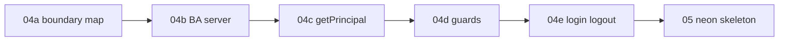

# 04 — Better Auth (parent)

> **Status:** Split into subtasks (2026-06-03). **Complete (2026-06-03).** Parent verify gate passed. **Next:** [05-neon-migrations-skeleton.md](./05-neon-migrations-skeleton.md).

## Goal

Wire [Better Auth](https://better-auth.com/) for email/password login and replace the task **03** placeholders with the same **Latch auth seam** CRM uses (Auth.js there, Better Auth here). Session carries **user id + label only**; `getPrincipal()` returns `@latch/contracts` `Principal` with **stub `roles: []`** until task **05** loads roles from DB.

## Why subtasks

Task **04** mixed three concerns: (1) what Latch owns vs the auth library, (2) Better Auth server wiring, (3) UI and route guards. Splitting keeps each stop gate small and makes the **Latch boundary** explicit before any implementation.

## Subtask chain

Execute in order. Parent verify gate passes only when **all** children are complete.

| # | Task | Type | Delivers |
|---|------|------|----------|
| 04a | [04a-latch-auth-boundary.md](./04a-latch-auth-boundary.md) | **Docs / read** | Map: Better Auth vs app vs `@latch/*`; what task 04 uses and defers |
| 04b | [04b-better-auth-server.md](./04b-better-auth-server.md) | Code | `auth.ts`, API route, env vars in CONFIG |
| 04c | [04c-principal-seam.md](./04c-principal-seam.md) | Code | `provider-session`, `getPrincipal`, stub roles + `LATCH_STUB_*` |
| 04d | [04d-session-guards.md](./04d-session-guards.md) | Code | `requireSession`, `(app)/layout` — drop placeholders |
| 04e | [04e-login-logout.md](./04e-login-logout.md) | Code | Login RHF + Server Action, logout action, redirects |

## Prerequisites

- [03-app-shell-scaffold.md](./03-app-shell-scaffold.md) complete.
- Read [../AUTH.md](../AUTH.md) and complete **04a** before writing code.

## Latch packages in this band (summary)

| Package | Task 04 | Why |
|---------|---------|-----|
| `@latch/contracts` | **Yes** — `Principal` type on `getPrincipal()` | Platform auth seam; roles are data, not session JWT fields |
| `@latch/policy` | **No** (until surfaces / task 22) | Needs `Principal` + YAML/DB grants → manifest |
| `@latch/dal` | **No** (until task 10+) | Needs `PermissionContext` (principal + manifest + Surface) |
| `@latch/react` | **No** (until task 10+) | Consumes manifest from server components |
| `@latch/audit` | **No** (until mutations) | IAM/business writes |

**Invariant:** No `@latch/*` package imports Better Auth or Auth.js. The app implements `getPrincipal()`.

Detail: [04a-latch-auth-boundary.md](./04a-latch-auth-boundary.md).

## Files (rollup — by subtask)

| File | Subtask |
|------|---------|
| `src/lib/auth/auth.ts` | 04b |
| `src/app/api/auth/[...all]/route.ts` | 04b |
| `src/lib/auth/provider-session.ts` | 04c |
| `src/lib/auth/getPrincipal.ts` | 04c |
| `src/lib/auth/requireSession.ts` | 04d |
| `src/app/(app)/layout.tsx` | 04d |
| `src/app/login/page.tsx` + form/action | 04e |
| `src/app/actions/auth.ts` | 04e |
| Remove `placeholder-principal.ts`, `placeholder-session.ts`, login placeholder | 04d–04e |

## Parent verify (stop gate)

Complete when **04a–04e** verify sections are all `[x]`:

- [x] **04a** — Boundary map read; team agrees session never carries `roles[]`
- [x] **04b** — Better Auth handler responds; env documented
- [x] **04c** — `getPrincipal()` returns `Principal`; stub env works in tests
- [x] **04d** — Protected routes redirect when logged out
- [x] **04e** — Login/logout flows; post-login redirect (e.g. `/contacts` or home)
- [x] No `@latch/dal` imported from client components
- [x] [../STATUS.md](../STATUS.md) → **05-neon-migrations-skeleton.md**

## Out of scope (unchanged)

- `latch_user_roles` DB load (task **05**)
- IAM pages
- OAuth providers (document env matrix only in CONFIG)
- Better Auth organization/role plugins for Latch authz
