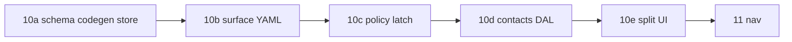

# 10 — First business Surface (`contact`)

> **Status:** Not started — prerequisites met (task **05** complete, 2026-06-04). Execute sub-phases **10a → 10e** in order. **Next after complete:** [11-nav-minimal.md](./11-nav-minimal.md).

## Goal

End-to-end Latch loop on the simplest domain: unified Surface id **`contact`** with **`list`** and **`detail`** modes on `PolicyScope`, YAML policies, codegen, DAL, and a split `/contacts` page with `<FieldControl>`. Two YAML-defined roles must produce visibly different Field visibility in list and detail.

## Why sub-phases

Task **10** spans platform codegen, SQL migration, policy registry, DAL, and UI. Splitting keeps each stop gate reviewable and mirrors task **04** (boundary → wire → seam → guards → UI).

## Sub-phase chain

Execute in order. Parent verify passes only when **all** sub-phases are complete.

| Phase | Focus | Delivers |
|-------|--------|----------|
| **10a** | Platform + data | Multi-app codegen; `contacts` table; store + business seed |
| **10b** | Metadata | `contact.surface.yaml`, `contact.policies.yaml`, generated Zod |
| **10c** | Policy seam | Hand-synced policy module, registry, `resolveContext` + `mode` |
| **10d** | DAL | `src/lib/contacts/` descriptors, repository, Vitest |
| **10e** | UI + rollup | `/contacts` split view, Server Actions, docs + parent verify |

## Prerequisites

- Tasks **02–05** complete ([05-neon-migrations-skeleton.md](./05-neon-migrations-skeleton.md)).
- Neon branch or local Postgres with `npm run db:migrate:test1` applied through **002**.
- Skim [../PLAN.md](../PLAN.md) § Surfaces, [../decisions.md](../decisions.md) (unified Surface + mode), [../discussions/02-policy-roles-and-resolution.md](../discussions/02-policy-roles-and-resolution.md).

## Latch packages in this band

| Package | Task 10 | Why |
|---------|---------|-----|
| `@latch/contracts` | **Yes** — `PermissionContext`, `PolicyScope.mode` | Manifest + principal types |
| `@latch/policy` | **Yes** — `PolicyService`, registry | YAML → `defineSurfacePolicy`; `resolve(principal, { surface: "contact", mode })` |
| `@latch/dal` | **Yes** — `createSurfaceDal` | List/get/patch with manifest projection |
| `@latch/react` | **Yes** — `CapabilitiesProvider`, `<FieldControl>` | Client reads manifest from server only |
| `@latch/codegen` | **Yes** — generalize scan roots | test1 `modules/` + CRM in one `npm run codegen` |
| `@latch/audit` | **Optional** | INSERT on contact mutations if quick; else defer to **90** |

## Invariants (do not violate)

| Rule | Detail |
|------|--------|
| One Surface id | **`contact`** only — no `contact_list` / `contact_detail` registry keys |
| Modes | `PolicyScope.mode` = `list` \| `detail`; mode overlays **restrict only** (never widen `read`) |
| DAL boundary | No `db.*` / Drizzle in `src/app/**`, route handlers, or client components |
| Manifest | Every DAL call receives `PermissionContext` (principal + manifest + surface) |
| Strict writes | Patch Zod from codegen uses `.strict()` |
| Nav | Policy-driven sidebar is **task 11** — `/contacts` may be URL-only until then |

---

## 10a — Platform, migration, store

### Goal

Codegen discovers test1 modules; `contacts` table exists; in-memory + Postgres store adapters hold sample rows; two policy role ids are assigned to seed users.

### Files

| File | Action |
|------|--------|
| `packages/codegen/src/generate.ts` | **Edit** — scan `apps/*/modules/` (or env `LATCH_CODEGEN_APPS`) instead of CRM-only path |
| Root `package.json` / `packages/codegen` | **Edit** — document if new script flags needed |
| [`../../crm/docs/CODEGEN.md`](../../crm/docs/CODEGEN.md) | **Edit** — target behavior = implemented |
| `apps/test1/migrations/003_contacts.sql` | **Create** — `contacts` table + `latch_app` grants |
| `apps/test1/migrations/002_latch_app_role.sql` | **Edit** (if needed) — grant pattern for new table |
| `apps/test1/db/schema.ts` | **Edit** — Drizzle `contacts` table |
| `apps/test1/db/memory-store.ts` | **Edit** — contact rows API |
| `apps/test1/db/store.ts` | **Edit** — `StoreAdapter` for contacts |
| `apps/test1/db/seed.ts` | **Edit** — business contacts + role assignments (keep platform seed separate) |
| `apps/test1/migrations/001_init.sql` or `003` | **Edit** — assign `contact_editor` / `contact_viewer` (or chosen ids) on `seed-user` / `seed-readonly` |
| `apps/test1/docs/DATABASE.md` | **Edit** — step 3 migration, contacts table, seed roles table |

**Suggested `contacts` columns (adjust in implementation):**

| Column | Type | Notes |
|--------|------|-------|
| `id` | `TEXT` PK | Stable id for `?id=` |
| `name` | `TEXT` NOT NULL | Field e.g. `profile` |
| `email` | `TEXT` | |
| `phone` | `TEXT` | |
| `notes` | `TEXT` | **Sensitive** — deny `read` for restricted role |

### Steps

1. Generalize `@latch/codegen` so `npm run codegen` emits under each app’s `modules/**/generated/`.
2. Add `COLUMN_ZOD` entries for `contacts.*` in codegen (pilot map pattern — same as CRM jobs).
3. Write `003_contacts.sql`; ensure `latch_app` can `SELECT`/`INSERT`/`UPDATE`/`DELETE` on `contacts`.
4. Extend Drizzle schema + memory/Postgres store; wire adapter used by DAL in **10d**.
5. Seed ≥2 sample contacts; assign two **distinct** role ids to `seed-user` and `seed-readonly` (names illustrative — lock in policies in **10b**).
6. `npm run db:migrate:test1` applies **003** on fresh DB.

### Verify (10a)

- [ ] `npm run codegen` writes CRM + test1 generated files; `npm run codegen:check` passes
- [ ] `npm run db:migrate:test1` applies **001–003** without error
- [ ] `seed-user` and `seed-readonly` have different `role_id` values in `latch_user_roles` (or memory store equivalent)

---

## 10b — Surface metadata + codegen

### Goal

Author structure and role grants in YAML; commit generated Zod; field ids drive policy module in **10c**.

### Files

| File | Action |
|------|--------|
| `apps/test1/modules/contact/contact.surface.yaml` | **Create** — `id: contact`, `anchorTable: contacts`, `fields` → columns |
| `apps/test1/modules/contact/contact.policies.yaml` | **Create** — `surface: contact`, two roles with different Field grants |
| `apps/test1/modules/contact/generated/contact.schema.generated.ts` | **Create** (codegen) — commit to git |
| `apps/test1/modules/README.md` | **Edit** — note contact module present |

**Policies sketch (illustrative — lock in implementation):**

| Role id | Typical assignee | Intent |
|---------|------------------|--------|
| `contact_editor` | `seed-user` | `read`/`write` on most fields including `notes` |
| `contact_viewer` | `seed-readonly` | `read` on `profile`; **no** `read` on `notes` |

Optional: `modes.detail` / `modes.list` overlay section (restrict-only, e.g. list has no `write` on surface). Base grants must align on `rowScope` across modes.

### Steps

1. Define Fields (`profile`, `contact_info`, `notes`, …) mapping to `contacts` columns.
2. Write `contact.policies.yaml` with **two** explicit role blocks (do not rely on `data_master` alone for the learning demo).
3. Run `npm run codegen`; commit YAML + `generated/`.
4. Note field id list for hand-sync in **10c**.

### Verify (10b)

- [ ] `contact.surface.yaml` parses; `id` is `contact` (not `contact_detail`)
- [ ] `contact.policies.yaml` has `surface: contact` and two role keys with different Field `read` grants
- [ ] Generated schema file exists and matches field ids used in policies

---

## 10c — Policy registry + `latch.ts`

### Goal

`PolicyService` resolves `contact` with `mode: list | detail`; `resolveContext` / `resolveContextFresh` replace the stub in `latch.ts`.

### Files

| File | Action |
|------|--------|
| `apps/test1/src/lib/policy/contact.ts` | **Create** — hand-synced from `contact.policies.yaml` (+ mode overlays if used) |
| `apps/test1/src/lib/policy/registry.ts` | **Create** — `definePolicyRegistry(contact…)` |
| `apps/test1/src/lib/latch.ts` | **Edit** — `PolicyService`, `resolveContext`, scope helper for `contact` + `mode` |
| `apps/test1/src/lib/latch-config.ts` | **Create** (optional) — manifest cache mode, mirror CRM if needed |

### Steps

1. Mirror YAML into `contact.ts` (`SurfacePolicies` + `FIELD_IDS` + `surfaceActionsByRole`).
2. Register with `defineSurfacePolicy(…, { kind: "business", fieldIds, modes? })`.
3. Implement `scopeFromInput`: `{ surfaceId: "contact", entityId?, mode: "list" | "detail" }` → `PolicyScope`.
4. Export `getContactsDal()` factory (wired in **10d**).
5. Unit-test: `policyService.resolve(principal, { surface: "contact", mode: "list" })` differs by role for restricted Field.

### Verify (10c)

- [ ] `resolveContext({ surfaceId: "contact", mode: "list" })` returns manifest with `read` when role grants it
- [ ] Restricted role manifest omits `notes` (or chosen sensitive field) on both list and detail
- [ ] Registry has exactly one business entry keyed `contact` (no `contact_list` key)

---

## 10d — Contacts DAL

### Goal

`@latch/dal` list/get/patch (and optional delete) for `contacts` with manifest-driven projection; Vitest covers policy + DAL.

### Files

| File | Action |
|------|--------|
| `apps/test1/src/lib/contacts/descriptors.ts` | **Create** — list + detail capabilities on anchor `contacts` |
| `apps/test1/src/lib/contacts/project.ts` | **Create** — detail projection |
| `apps/test1/src/lib/contacts/list-project.ts` | **Create** — list row projection |
| `apps/test1/src/lib/contacts/schemas.ts` | **Create** — import/narrow from generated Zod |
| `apps/test1/src/lib/contacts/repository.ts` | **Create** — `createContactsDal(store)` |
| `apps/test1/src/lib/contacts/repository.test.ts` | **Create** — role matrix + strict patch |
| `apps/test1/src/lib/test1-store.ts` | **Edit** — expose store singleton for DAL |

**Reference:** [`apps/crm/src/lib/customers/`](../../../crm/src/lib/customers/), [`apps/crm/src/lib/jobs/repository.ts`](../../../crm/src/lib/jobs/repository.ts).

### Steps

1. Implement descriptors; pass `surfaceId: "contact"` (match registry).
2. `list(ctx, opts)` uses manifest from ctx resolved with `mode: "list"`.
3. `get(ctx, id)` uses `mode: "detail"`; row scope enforced via policy + store filter.
4. `patch` uses `.strict()` writable schema from codegen.
5. Wire `getContactsDal()` in `latch.ts` to shared store.
6. Tests: forbidden field absent from DTO; unknown patch key rejected.

### Verify (10d)

- [ ] `contactsDal.list` / `get` / `patch` require `PermissionContext`
- [ ] Vitest passes for `apps/test1/src/lib/contacts/` and policy resolve tests from **10c**
- [ ] No imports of `db/schema` from `src/app/**`

---

## 10e — UI, actions, docs rollup

### Goal

Split list/detail page at `/contacts`; save via Server Actions; update layout docs; complete parent stop gate.

### Files

| File | Action |
|------|--------|
| `apps/test1/src/app/(app)/contacts/page.tsx` | **Create** — RSC + `?id=` + `resolveContext` |
| `apps/test1/src/components/contacts/ContactsSplitView.tsx` | **Create** — Table + detail + `<FieldControl>` |
| `apps/test1/src/app/actions/contacts.ts` | **Create** — patch (and optional delete) → `resolveContextFresh` → DAL |
| `apps/test1/src/app/actions/auth.ts` | **Edit** — post-login `redirect` to `/contacts` |
| `apps/test1/docs/LAYOUT.md` | **Edit** — post-login redirect = `/contacts` |
| [../STATUS.md](../STATUS.md) | **Edit** on parent complete → **11-nav-minimal.md** |

**Reference:** [`apps/crm/src/app/(app)/customers/page.tsx`](../../../crm/src/app/(app)/customers/page.tsx), [`apps/crm/src/components/customers/`](../../../crm/src/components/customers/).

### Steps

1. List pane: `resolveContext({ surfaceId: "contact", mode: "list" })` → `dal.list(ctx)`.
2. Row click sets `searchParams.id`; detail loads with `mode: "detail"` + `entityId`.
3. Wrap detail in `CapabilitiesProvider`; render Field groups with `<FieldControl>`.
4. Save action: `resolveContextFresh` → `patch`; surface validation errors to Ant Design form.
5. Manual: log in as `user@test1.local` vs `readonly@test1.local` — sensitive field visible only for editor role.
6. Update LAYOUT redirect decision; point STATUS at task **11**.

### Verify (10e)

- [ ] `/contacts` renders list without `?id=`; selecting row shows detail pane
- [ ] Restricted seed user does not see sensitive field in UI (and not in network payload for that field)
- [ ] Editor seed user can save allowed fields; strict patch rejects extra keys
- [ ] Client components import only `@latch/contracts` + `@latch/react` (not `@latch/dal`)

---

## Parent verify (stop gate)

All sub-phase boxes above **plus**:

- [ ] End-to-end: login → `/contacts` → list → select → edit/save (where permitted) → logout
- [ ] `npm run codegen:check` and test1 Vitest green
- [ ] [../DATABASE.md](../DATABASE.md) documents `003` and contact seed roles
- [ ] [../STATUS.md](../STATUS.md) **Right now** → [11-nav-minimal.md](./11-nav-minimal.md)

## Out of scope

| Item | Task |
|------|------|
| Policy-driven nav (`NAV_CATALOG`) | **11** |
| Second business Surface | **12** |
| `latch_roles` / `latch_role_grants` tables | **20–21** |
| DB-backed policy loader | **22** |
| IAM `user` / `role` Surfaces | **23** |
| Bulk toolbar, pending/approval, restore-from-audit | deferred |
| Better Auth ↔ `latch_users` sync plugin | manual seed v1 |
| CRM module changes (unless extracting shared codegen only) | — |

## Reference

- [../PLAN.md](../PLAN.md) · [../LAYOUT.md](../LAYOUT.md) · [../DATABASE.md](../DATABASE.md) · [../STACK.md](../STACK.md)
- [../decisions.md](../decisions.md) — unified Surface + codegen at task 10
- [../../crm/docs/CODEGEN.md](../../crm/docs/CODEGEN.md)
- CRM: [`apps/crm/modules/customer/`](../../../crm/modules/customer/), [`apps/crm/src/lib/customers/`](../../../crm/src/lib/customers/), [`apps/crm/src/lib/latch.ts`](../../../crm/src/lib/latch.ts)
- Platform: [`docs/foundations/glossary.md`](../../../docs/foundations/glossary.md) (list/detail as modes), [`docs/reference/metadata-and-codegen.md`](../../../docs/reference/metadata-and-codegen.md)

## Note

Use unified Surface id **`contact`** with **`PolicyScope.mode`** — do not create `contact_list` / `contact_detail` policy surfaces. CRM split ids (`job_list`, `customer_detail`) are transitional references only; test1 implements the target model.
