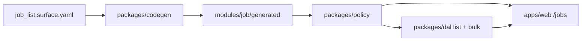

# Phase 01 — Data access (`@latch/dal`)

> **Home package:** `@latch/dal` · **Status:** active · **Phase STATUS:** [`STATUS.md`](./STATUS.md)
>
> **Execution:** Work one file at a time under [`tasks/`](./tasks/). After each task passes its **Verify** gate, update this phase's [`STATUS.md`](./STATUS.md) (and the root [`STATUS.md`](../../../STATUS.md) if the active phase changes).

## Goal

Prove **list semantics**, **column-level manifest projection**, and **bulk update / bulk delete** on the `@latch/*` stack that Phase 00 established for single records. The in-flight vehicle is the `job_list` Surface. This is the largest remaining v1 architectural gap (bulk was deferred during the `job_detail` pilot).

## Depends on

- **Phase 00 (Foundation)** — manifest types (`@latch/contracts`), `PolicyService` (`@latch/policy`), codegen, single-record DAL read/write. See [`../00-foundation/README.md`](../00-foundation/README.md).

> Sequenced, not blocking: phases are self-contained. If a change order re-prioritizes work, see [`../README.md`](../README.md) for how to re-sequence.

## In / out of scope

| In scope | Out of scope (this phase) |
|----------|---------------------------|
| `job_list` Surface YAML + policies + codegen | `customer_detail` (Phase 02) |
| DAL `list` with row scope + Field narrowing (list DTO) | Real IdP (Phase 03) — keep stub principal |
| DAL `bulkUpdate` + bulk delete per [`../../reference/bulk-operations.md`](../../reference/bulk-operations.md) | Restore-from-audit UI (Phase 04) |
| REST: `GET` collection, `PATCH` / `DELETE` `:bulk` | Polished CRM UX (Phase 02) |
| `/jobs` list page + minimal bulk UI (or API-only + E2E) | Manifest caching / RLS (Phase 06) |
| Threat test **T15** (+ list DTO coverage for **T2**) | Cross-Surface links to `customer_detail` |

> **Lifecycle note:** **Hard delete only** (locked 2026-05-30). Single-record `delete` is in the pilot DAL; bulk delete and restore-from-audit tooling follow this phase and Phase 04. See [`decisions.md`](./decisions.md).

## Reuse from Phase 00 / pilot

Same packages, same `jobs` anchor table, same role seeds (`field_tech`, `office_admin`). New Surface id → new manifest scope, different Field set (display columns only for techs).

## Sub-goals — what this phase must prove

1. **List manifest** — per-role column/Field set differs (tech: no `financial_terms`; admin: optional extra columns).
2. **Row scope on list** — `field_tech` sees only assigned jobs; same existence-hiding as detail (404 / empty set per global option).
3. **Bulk per-row auth** — mixed batch: writable rows succeed, forbidden rows in `skipped` (`partial` default); `all_or_nothing` is atomic (T15).
4. **Strict bulk patch** — unknown keys rejected for whole request (T1 on bulk body).
5. **Re-authorize** — bulk handler re-resolves manifest (T3).
6. **Audit** — one row per successful change; optional `bulk_summary` with `request_id` (see [`../../reference/audit-and-lifecycle.md`](../../reference/audit-and-lifecycle.md)).
7. **Codegen** — `job_list` generated artifacts; `codegen --check` green (T11).

Proof artifacts: DAL list + bulk contract tests, E2E for S1 list leg + S2 bulk reassign, threat **T15** (and extend **T2** snapshots for list DTOs).

## Surface sketch (proposal — lock in task 06)

Align with [`../../foundations/use-cases.md`](../../foundations/use-cases.md) S1–S2:

| Field id | List columns (proposal) | Notes |
|----------|-------------------------|--------|
| `summary` | `jobs.id`, `jobs.title`, `jobs.status`, `jobs.scheduled_at` | Row identity + status |
| `customer_site` | join: customer name, site label | Display-only join Field |
| `financial_terms` | `jobs.contract_amount` | `office_admin` read; omitted for `field_tech` |
| `assignments` | patch target for bulk reassign | Writable for admin; drives `assignments` table updates |

Policies: same row-scope pattern as `job_detail` (`own` for `field_tech`, `all` for `office_admin`).

## API sketch (proposal — lock in task 13)

Per [`../../reference/api-style.md`](../../reference/api-style.md) and [`../../reference/bulk-operations.md`](../../reference/bulk-operations.md):

| Method | Path | Purpose |
|--------|------|---------|
| `GET` | `/api/jobs` | List for `job_list` scope (query: filter/sort TBD minimal) |
| `PATCH` | `/api/jobs:bulk` | Bulk update (`ids`, `patch`, `mode`) |
| `DELETE` | `/api/jobs:bulk` | Bulk delete |

## Task order

Executable task files live under [`tasks/`](./tasks/). Start at [06-surface-yaml.md](./tasks/06-surface-yaml.md) (00–01 are docs-only setup, complete).

| # | Task | Type |
|---|------|------|
| 00 | Lock list/bulk defaults (pagination cap, `mode` default, filter MVP) | Docs |
| 01 | Task index | Docs |
| 06 | `job_list.surface.yaml` | Metadata |
| 07 | `job_list.policies.yaml` | Metadata |
| 08 | Codegen for `job_list` | Code |
| 09 | DAL `list` + list projection | Code |
| 10 | DAL `bulkUpdate` | Code |
| 11 | DAL bulk delete | Code |
| 12 | DAL contract tests (list + bulk) | Code |
| 13 | REST list + bulk routes | Code |
| 16 | `/jobs` list page (minimal table + link to detail) | Code |
| 20 | E2E: tech list scope + admin bulk partial success | Code |
| 21 | Threat T15 (+ list T2 snapshots) | Code |

Tasks **14–15, 17–19** are unchanged from the pilot (Server Action, stub principal, audit triggers, approval, react gates) — only extend if the list page needs new gates. See the archived pilot tasks: [`../../archive/tasks/job_detail/`](../../archive/tasks/job_detail/).

## Definition of done

- [ ] Tasks above pass verify gates
- [ ] `field_tech` `GET /api/jobs` omits financial columns; row set = assigned jobs only
- [ ] `office_admin` bulk PATCH 20 ids with 5 forbidden → `partial` returns 15 `succeeded`, 5 `skipped`; DB consistent
- [ ] `all_or_nothing` with any forbidden → `409`, no rows changed (T15)
- [ ] `npm run codegen:check` and `npm run test` green
- [ ] Root [`STATUS.md`](../../../STATUS.md) points at the next phase

## References

- [`../../foundations/scope.md`](../../foundations/scope.md) · [`../../foundations/use-cases.md`](../../foundations/use-cases.md) (S1, S2) · [`../../reference/bulk-operations.md`](../../reference/bulk-operations.md)
- Pilot history: [`../../archive/step-3-pilot-surface.md`](../../archive/step-3-pilot-surface.md) · [`../../archive/tasks/job_detail/`](../../archive/tasks/job_detail/)
- [`../../foundations/threat-model.md`](../../foundations/threat-model.md) (T15)
