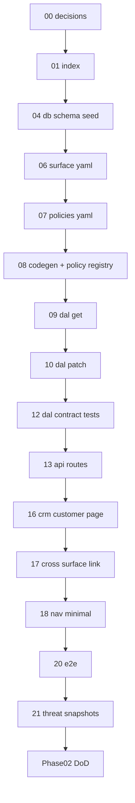

# 01 — Task index (read once)

## Goal

Orient the Phase 02 `customer_detail` + UI-sync task chain. **Do not implement code in this file.**

## Prerequisites

- [00-decisions.md](./00-decisions.md) complete (Verify gate passed).
- **[Phase 02b platform extraction](../../02b-platform-extraction/STATUS.md) complete** — `@latch/*` genericized; `apps/crm` owns domain. All code tasks below target `apps/crm` (not `packages/dal` / `apps/web`).
- Skim the [phase README](../README.md) and [`../decisions.md`](../decisions.md).

## Execution order

```
00-decisions (docs)
  → 04-db-schema → 06-surface-yaml → 07-policies-yaml → 08-codegen
  → 09-dal-get → 10-dal-patch → 12-dal-contract-tests → 13-api-routes
  → 16-crm-customer-page → 17-cross-surface-link → 18-nav-minimal
  → 20-e2e-customer-detail → 21-threat-snapshots
```

## Dependency diagram



## Full table

| # | Task | Type | Delivers |
|---|------|------|----------|
| 00 | [00-decisions.md](./00-decisions.md) | Docs | Lock sketch, roles, cross-link, response semantics |
| 01 | [01-task-index.md](./01-task-index.md) | Docs | This index |
| 04 | [04-db-schema.md](./04-db-schema.md) | Code | `customers`, `sites` tables; `jobs.customer_id`; seed + store **in `apps/crm`** |
| 06 | [06-surface-yaml.md](./06-surface-yaml.md) | Metadata | `customer_detail.surface.yaml`; add `customer_ref` Field to `job_detail.surface.yaml` |
| 07 | [07-policies-yaml.md](./07-policies-yaml.md) | Metadata | `customer_detail.policies.yaml` (admin only); `customer_ref` grant on `job_detail` |
| 08 | [08-codegen.md](./08-codegen.md) | Code | Regenerate schemas; register `customer_detail` in app policy registry; `codegen:check` green |
| 09 | [09-dal-get.md](./09-dal-get.md) | Code | `dal.customers.get` — manifest projection, forbidden Field omission, `job_history` source decision |
| 10 | [10-dal-patch.md](./10-dal-patch.md) | Code | `dal.customers.patch` — strict writable Zod; audit on mutate |
| 12 | [12-dal-contract-tests.md](./12-dal-contract-tests.md) | Code | Forbidden omission + strict-write rejection for `customer_detail` |
| 13 | [13-api-routes.md](./13-api-routes.md) | Code | `GET`/`PATCH /api/customers/[id]`; 404-hide for no-grant principal |
| 16 | [16-crm-customer-page.md](./16-crm-customer-page.md) | Code | CRM `/customers` split shell; `CapabilitiesProvider` + `FieldControl` cards; read-only vs RHF write |
| 17 | [17-cross-surface-link.md](./17-cross-surface-link.md) | Code | Job detail → customer link, manifest-gated |
| 18 | [18-nav-minimal.md](./18-nav-minimal.md) | Code | Enable Customers entry in [`nav.ts`](../../../../apps/crm/src/lib/nav.ts); admin/tech nav diff |
| 20 | [20-e2e-customer-detail.md](./20-e2e-customer-detail.md) | Code | DAL-level e2e (mirror [`tests/job-list.e2e.test.ts`](../../../../tests/job-list.e2e.test.ts)) |
| 21 | [21-threat-snapshots.md](./21-threat-snapshots.md) | Code | **T14** nav/manifest per role; extend **T2** for customer DTO keys per role |

## Omitted / reuse (do not re-run)

| Artifact | Location |
|----------|----------|
| `CapabilitiesProvider`, `<Can>`, `<FieldControl>` | [`packages/react/src`](../../../../packages/react/src) — done in pilot ([archive 19](../../../archive/tasks/job_detail/19-react-gates.md)) |
| Read-only vs write card pattern | [`JobDetailPane.tsx`](../../../../apps/crm/src/components/jobs/JobDetailPane.tsx) (`fieldAllows` / `writableFieldIds`) |
| Stub principal | [`getPrincipal.ts`](../../../../apps/crm/src/lib/auth/getPrincipal.ts) |
| Policy registry pattern | [`apps/crm/src/lib/policy/registry.ts`](../../../../apps/crm/src/lib/policy/registry.ts) + [`job-detail.ts`](../../../../apps/crm/src/lib/policy/job-detail.ts) |
| Server Action pattern | [`apps/crm/src/app/actions/job-detail.ts`](../../../../apps/crm/src/app/actions/job-detail.ts) |
| Threat harness | [`tests/threat.test.ts`](../../../../tests/threat.test.ts) |

## CRM proof mapping

CRM slices follow the timing rule in [`crm-and-phases.md`](../../../reference/crm-and-phases.md). **Step C — Customers split view** in [`apps/crm/docs/TASKS.md`](../../../../apps/crm/docs/TASKS.md) may start only once `dal.customers.get` (+ `patch`) is merged (tasks 09–10/13). Do not build CRM ahead of merged API.

## STATUS discipline

After each task's **Verify** section passes:

1. Check off verify items in the task file.
2. Update [`../STATUS.md`](../STATUS.md): **Execute now** → next task filename; move completed task to **Recently completed**.
3. Update root [`../../../STATUS.md`](../../../STATUS.md) only when the Phase 02 definition of done is complete (repoint active phase).

## Commands cheat sheet

| Command | When |
|---------|------|
| `npm run codegen` | After 06–07 YAML changes (task 08) |
| `npm run codegen:check` | After 08; required in CI |
| `npm run test` | After 12, 20, 21 |
| `npm run build` | Task 21 / CI |

## Verify (stop gate)

- [x] You know which file [`../STATUS.md`](../STATUS.md) names as **Execute now** → [`06-surface-yaml.md`](./06-surface-yaml.md)
- [x] You will update **STATUS** after each task's Verify section passes

## Out of scope

Implementation work — use tasks 04–21. `customer_list`, customer delete, approval/verification UX, real auth (Phase 03), restore UI (Phase 04), RLS, multi-company.
