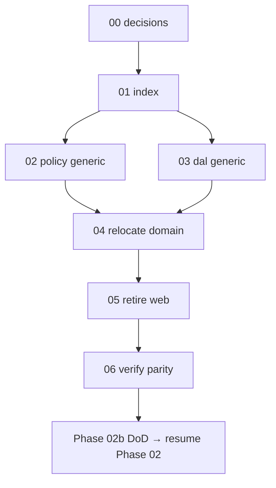

# 01 — Task index (read once)

## Goal

Orient the Phase 02b platform-extraction chain. **Do not implement code in this file.**

## Prerequisites

- [`00-decisions.md`](./00-decisions.md) complete (Verify gate passed).
- Skim the [phase README](../README.md) and [`../decisions.md`](../decisions.md).

## Execution order

```
00-decisions (docs)
  → 02-policy-generic  ─┐  (additive: build generic engines; keep pilot green)
  → 03-dal-generic     ─┘
  → 04-relocate-domain     (move schema/seed/store/metadata/migrations → apps/crm; repoint codegen/db-migrate/tests/build; remove pilot code from packages)
  → 05-retire-web          (delete apps/web; doc sweep)
  → 06-verify-parity       (tests/build/codegen green; two-role jobs proof in crm)
```

## Dependency diagram



> **02 and 03 are additive-first:** build the generic policy loader and DAL kernel **alongside** the existing pilot code so the suite stays green. The pilot `surfaces/job-*.ts`, `jobs/*`, `schema.ts`, `seed.ts` are removed from `packages/` only in **04**, once `apps/crm` provides the replacements.

## Full table

| # | Task | Type | Delivers |
|---|------|------|----------|
| 00 | [00-decisions.md](./00-decisions.md) | Docs | Lock boundary, engine contracts, homes, retire-web |
| 01 | [01-task-index.md](./01-task-index.md) | Docs | This index |
| 02 | [02-policy-generic.md](./02-policy-generic.md) | Code | `@latch/policy` metadata→policy loader/registry; `resolve()` semantics unchanged |
| 03 | [03-dal-generic.md](./03-dal-generic.md) | Code | `@latch/dal` `createSurfaceDal` kernel + `Store` adapter + Surface descriptor types |
| 04 | [04-relocate-domain.md](./04-relocate-domain.md) | Code | Move jobs schema/seed/store/YAML/migrations → `apps/crm`; wire `createSurfaceDal`; repoint codegen/db-migrate/build/tests; delete pilot code from packages |
| 05 | [05-retire-web.md](./05-retire-web.md) | Code/Docs | Delete `apps/web`; sweep `packages.md`, `architecture-overview.md`, `crm-and-phases.md`, `DATABASE.md`, `scope.md` |
| 06 | [06-verify-parity.md](./06-verify-parity.md) | Code | Green test/build/codegen; manual two-role jobs proof; phase DoD |

## STATUS discipline

After each task's **Verify** passes: check its boxes, set [`../STATUS.md`](../STATUS.md) **Execute now** → next file, move the task to **Recently completed**. When `06` passes, repoint root [`../../../STATUS.md`](../../../STATUS.md) active phase back to **02 UI sync** and resume [`../../02-ui-sync/tasks/04-db-schema.md`](../../02-ui-sync/tasks/04-db-schema.md).

## Verify (stop gate)

- [ ] You know which file [`../STATUS.md`](../STATUS.md) names as **Execute now**
- [ ] You understand 02/03 are additive; removals land in 04

## Out of scope

`customer_detail` feature work, new capabilities, RLS, multi-company, separate-repo publishing.
