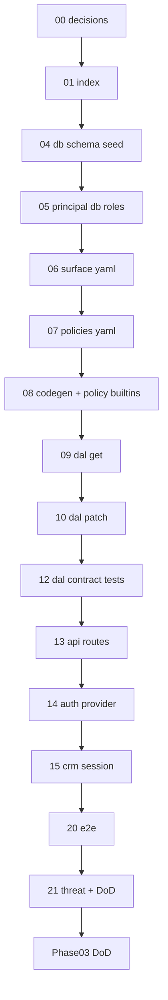

# 01 — Task index (read once)

> **Status:** Complete (2026-06-02). Next: [04-db-schema.md](./04-db-schema.md).

## Goal

Orient the Phase 03 Identity & IAM task chain. **Do not implement code in this file.**

## Prerequisites

- [00-decisions.md](./00-decisions.md) complete (Verify gate passed).
- Phase 02 complete ([`../../02-ui-sync/STATUS.md`](../../02-ui-sync/STATUS.md)).
- Skim the [phase README](../README.md) and [`../decisions.md`](../decisions.md).

## Execution order

```
00-decisions (docs)
  → 04-db-schema → 05-principal-db-roles
  → 06-surface-yaml → 07-policies-yaml → 08-codegen-policy-builtins
  → 09-dal-get → 10-dal-patch → 12-dal-contract-tests → 13-api-routes
  → 14-auth-provider → 15-crm-session-migration
  → 20-e2e-identity → 21-threat-t8-phase-dod
```

## Dependency diagram



## Full table

| # | Task | Type | Delivers |
|---|------|------|----------|
| 00 | [00-decisions.md](./00-decisions.md) | Docs | Lock catalog, data_master wildcard, storage, D2, IAM boundary, Surface sketch |
| 01 | [01-task-index.md](./01-task-index.md) | Docs | This index |
| 04 | [04-db-schema.md](./04-db-schema.md) | Code | `latch_user_roles` migration; seed assignments; memory store |
| 05 | [05-principal-db-roles.md](./05-principal-db-roles.md) | Code | `getPrincipal()` loads `roles[]` from DB/store; session user id only |
| 06 | [06-surface-yaml.md](./06-surface-yaml.md) | Metadata | `user_roles_detail.surface.yaml` |
| 07 | [07-policies-yaml.md](./07-policies-yaml.md) | Metadata | `user_roles_detail.policies.yaml`; built-in role policy notes |
| 08 | [08-codegen-policy-builtins.md](./08-codegen-policy-builtins.md) | Code | Codegen + registry; `@latch/policy` `data_master` wildcard |
| 09 | [09-dal-get.md](./09-dal-get.md) | Code | `dal.iam.getUserRoles` (read assignments) |
| 10 | [10-dal-patch.md](./10-dal-patch.md) | Code | Assign/revoke roles; strict write; audit |
| 12 | [12-dal-contract-tests.md](./12-dal-contract-tests.md) | Code | IAM DAL contract + multi-role union from DB |
| 13 | [13-api-routes.md](./13-api-routes.md) | Code | `GET`/`PATCH` IAM routes; T8 default deny |
| 14 | [14-auth-provider.md](./14-auth-provider.md) | Code | Auth.js wired; env matrix documented |
| 15 | [15-crm-session-migration.md](./15-crm-session-migration.md) | Code | CRM login via provider; cookie without embedded roles |
| 20 | [20-e2e-identity.md](./20-e2e-identity.md) | Code | E2E: DB roles → manifest diff |
| 21 | [21-threat-t8-phase-dod.md](./21-threat-t8-phase-dod.md) | Code | **T8** + data_master new-Surface test; phase DoD |

## Omitted / reuse (do not re-run)

| Artifact | Location |
|----------|----------|
| `PolicyService`, `union_grants`, `denyWins` | [`packages/policy`](../../../../packages/policy) |
| App policy registry pattern | [`apps/crm/src/lib/policy/registry.ts`](../../../../apps/crm/src/lib/policy/registry.ts) |
| `createSurfaceDal` / descriptor pattern | [`apps/crm/src/lib/customers/`](../../../../apps/crm/src/lib/customers/) |
| `latch_users` table + seed users | [`apps/crm/db/schema.ts`](../../../../apps/crm/db/schema.ts), [`seed.ts`](../../../../apps/crm/db/seed.ts) |
| Session layout guards | [`apps/crm/src/app/(app)/layout.tsx`](../../../../apps/crm/src/app/(app)/layout.tsx), [`requireSession.ts`](../../../../apps/crm/src/lib/auth/requireSession.ts) |
| Session cookie helpers (narrow roles out in **05**) | [`apps/crm/src/lib/auth/session.ts`](../../../../apps/crm/src/lib/auth/session.ts) |
| Dev login (replace in **15**, not duplicate) | [`login/actions.ts`](../../../../apps/crm/src/app/login/actions.ts) (`loginAction`), [`login/LoginForm.tsx`](../../../../apps/crm/src/app/login/LoginForm.tsx), [`actions/auth.ts`](../../../../apps/crm/src/app/actions/auth.ts) (`logoutAction`) |
| Dev user → role map (stops driving authz in **05**) | [`apps/crm/src/lib/auth/users.ts`](../../../../apps/crm/src/lib/auth/users.ts) |
| Threat harness | [`tests/threat.test.ts`](../../../../tests/threat.test.ts) |
| Business Surfaces (`job_*`, `customer_detail`) | Phase 01–02 — extend policies only if built-in roles need explicit denies |

## CRM proof mapping

CRM proves **login → principal → manifest** only ([`apps/crm/docs/AUTH.md`](../../../../apps/crm/docs/AUTH.md)). IAM role assignment is **API + tests**, not a CRM screen. Do not add `/admin/users` routes in this phase.

## STATUS discipline

After each task's **Verify** section passes:

1. Check off verify items in the task file.
2. Add **Status** line under the task title (`Complete (YYYY-MM-DD). Next: …`).
3. Update [`../STATUS.md`](../STATUS.md): **Execute now** → next task; **Recently completed** ← finished task.
4. Update root [`../../../../STATUS.md`](../../../../STATUS.md) only when Phase 03 definition of done is complete.

## Commands cheat sheet

| Command | When |
|---------|------|
| `npm run codegen` | After 06–07 YAML (task 08) |
| `npm run codegen:check` | After 08; required in CI |
| `npm run test` | After 05, 12, 20, 21 |
| `npm run build` | Task 21 / CI |

## Verify (stop gate)

- [x] You know which file [`../STATUS.md`](../STATUS.md) names as **Execute now**
- [x] You will update **STATUS** after each task's Verify section passes

## Out of scope

Implementation work — use tasks 04–21. IdP group sync, `@latch/iam` package, CRM IAM admin UI, break-glass audit, multi-company identity (Phase 07), RLS.
