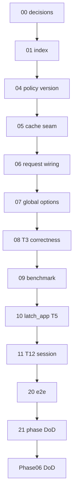

# 01 — Task index (read once)

> **Status:** Complete (2026-06-03). Phase 06 closed at [21-phase-dod.md](./21-phase-dod.md).

## Goal

Orient the Phase 06 Performance & safety task chain. **Do not implement code in this file.**

> **Phase 06 is the cache + connection-safety phase.** All RLS work (spikes, adoption, business-table audit triggers) is **deferred to Phase 07** — see [00-decisions.md](./00-decisions.md) §6. Phase 06 still lands the cheap, v1-required safety items: **T5** (`latch_app` non-superuser, a v1 CI minimum) and the **`SET LOCAL` actor-binding control** (T12) on the Postgres paths that exist today.

## Prerequisites

- [00-decisions.md](./00-decisions.md) complete (Verify gate passed).
- Phase 05 complete ([`../../05-verification/STATUS.md`](../../05-verification/STATUS.md)).
- Skim the [phase README](../README.md) and [`../decisions.md`](../decisions.md).

## Execution order

```
00-decisions (docs)
  → 04-policy-version
  → 05-manifest-cache-seam
  → 06-request-cache-wiring
  → 07-global-options
  → 08-cache-correctness-t3
  → 09-benchmark-cache
  → 10-latch-app-role-t5
  → 11-threat-t12-session
  → 20-e2e-performance-safety
  → 21-phase-dod
```

## Dependency diagram



## Full table

| # | Task | Type | Delivers |
|---|------|------|----------|
| 00 | [00-decisions.md](./00-decisions.md) | Docs | Cache modes, `policyVersion`, **RLS→Phase 07**, T3/T5/T12 scope |
| 01 | [01-task-index.md](./01-task-index.md) | Docs | This index |
| 04 | [04-policy-version.md](./04-policy-version.md) | Code | `latch_policy_version` + bump on IAM role change; `Principal.policyVersion` |
| 05 | [05-manifest-cache-seam.md](./05-manifest-cache-seam.md) | Code | `@latch/policy` cache wrapper; modes `none` / `request` / `ttl` |
| 06 | [06-request-cache-wiring.md](./06-request-cache-wiring.md) | Code | CRM request-scoped cache; writes bypass cache |
| 07 | [07-global-options.md](./07-global-options.md) | Docs/Code | `manifestCacheMode` in global-options + CRM config read |
| 08 | [08-cache-correctness-t3.md](./08-cache-correctness-t3.md) | Code | Revocation + stale-cache tests; extend threat **T3** |
| 09 | [09-benchmark-cache.md](./09-benchmark-cache.md) | Code | Benchmark / counter test: cache hit skips re-resolve |
| 10 | [10-latch-app-role-t5.md](./10-latch-app-role-t5.md) | Code | `latch_app` connection + grants top-up; threat **T5** (v1 minimum) |
| 11 | [11-threat-t12-session.md](./11-threat-t12-session.md) | Code | `SET LOCAL` on audit/pending/IAM PG paths; threat **T12** |
| 20 | [20-e2e-performance-safety.md](./20-e2e-performance-safety.md) | Code | E2E: cache + revoke → write denied |
| 21 | [21-phase-dod.md](./21-phase-dod.md) | Docs/Code | Phase README DoD; repoint root STATUS → Phase 07 |

## Omitted / reuse (do not re-run)

| Artifact | Location |
|----------|----------|
| `PolicyService.resolve` | [`packages/policy/src/policy-service.ts`](../../../../packages/policy/src/policy-service.ts) |
| `stalePolicyOnWrite: recheck` | [`docs/foundations/global-options.md`](../../../foundations/global-options.md) |
| `PermissionContext` | [`packages/contracts`](../../../../packages/contracts/src/index.ts) |
| `latch_user_roles` IAM | [`../../03-identity-iam/`](../../03-identity-iam/) |
| `latch_audit` immutability (T6) | [`../../04-audit-lifecycle/`](../../04-audit-lifecycle/) |
| Pending store | [`../../05-verification/`](../../05-verification/) |
| Partial T3 on accept | [`tests/threat.test.ts`](../../../../tests/threat.test.ts) |
| `latch_app` role (exists) | [`apps/crm/migrations/005_latch_app_role.sql`](../../../../apps/crm/migrations/005_latch_app_role.sql) |
| DB-gated test harness (`LATCH_APP_DATABASE_URL` + `it.runIf` + `pg` Pool) | [`tests/threat.test.ts`](../../../../tests/threat.test.ts) T6 block (~line 439) |
| `resolveContext` seam (where cache wraps) | [`apps/crm/src/lib/latch.ts`](../../../../apps/crm/src/lib/latch.ts) |

## Deferred to Phase 07 (recorded, not built here)

| Item | Why deferred |
|------|--------------|
| RLS spikes A/C/D + pilot adoption | Pilot job data is in-memory; RLS only meaningful with a Postgres job store + multi-company (T9) |
| Business-table audit triggers | Same direct-SQL-bypass story as RLS; do once, together |
| Postgres-backed job store | Prerequisite that makes RLS worthwhile; Phase 07 |

See [00-decisions.md](./00-decisions.md) §6 and [`../decisions.md`](../decisions.md) for the dated decision.

## STATUS discipline

After each task's **Verify** section passes:

1. Check off verify items in the task file.
2. Add **Status** line under the task title (`Complete (YYYY-MM-DD). Next: …`).
3. Update [`../STATUS.md`](../STATUS.md): **Execute now** → next task; **Recently completed** ← finished task.
4. Update root [`../../../../STATUS.md`](../../../../STATUS.md) only when Phase 06 definition of done is complete (task **21**).

## Commands cheat sheet

| Command | When |
|---------|------|
| `npm run db:migrate` | After **04** (and **10** if a grants top-up migration is added) |
| `npm run test` | After **05**, **08**, **09**, **10**, **11**, **20**, **21** |
| `npm run build` | Task **21** |

## Verify (stop gate)

- [x] You know which file [`../STATUS.md`](../STATUS.md) names as **Execute now**
- [x] You will update **STATUS** after each task's Verify section passes

## Out of scope

Implementation work — use tasks **04–21**. RLS (Phase 07), multi-company routing, Redis cache, `session` mode, per-Field RLS, business-table audit triggers.
