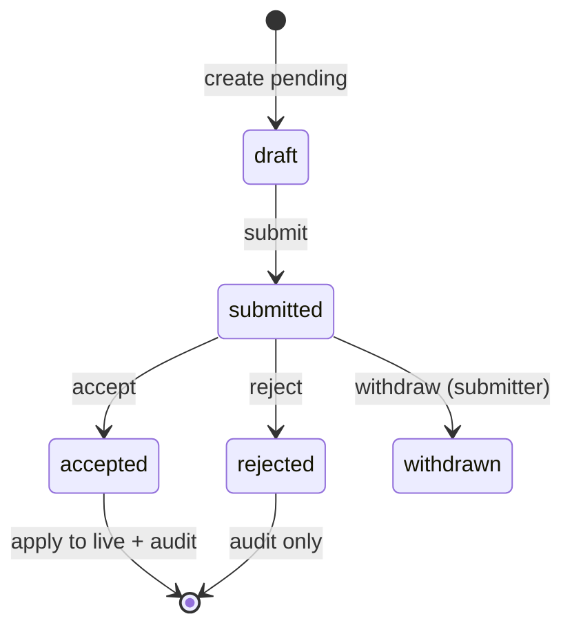

# Approval trails (accept / reject)

Workflow for changes that must be reviewed before they affect live data.

## When to use

Configured per **Module**, and optionally narrowed to:

- Specific **Fields** (e.g. `financial_terms` requires approval)
- Specific **tables** (child rows only)
- Specific **rows** (e.g. status = `published`)

Not every Module needs approval; default is direct write with audit only.

## Concepts

| Concept | Description |
|---------|-------------|
| **Pending change** | Proposed new values for one entity + Field set |
| **Submitter** | Principal who proposed |
| **Reviewer** | Principal with `approve` on affected Fields |
| **Trail** | Ordered history: submitted ? accepted/rejected (+ comments) |

## State machine (draft)

## Storage options

### A — Shadow columns / JSONB on entity

`pending_patch JSONB` on main row. Simple; messy for multi-table Modules.

### B — `latch_pending_changes` table (preferred sketch)

| Column | Purpose |
|--------|---------|
| `id` | UUID |
| `module_id` | Module |
| `entity_id` | Target row |
| `field_ids` | Fields in scope |
| `patch` | Proposed values |
| `status` | submitted / accepted / rejected |
| `submitted_by`, `submitted_at` | |
| `decided_by`, `decided_at`, `comment` | |

On **accept**: apply `patch` in transaction, write audit, mark pending row accepted.

### C — Duplicate “staging” tables

Full copy of Module tables for pending version. Heavy but clear for complex graphs.

**Decision**: TBD after first pilot Module.

## Partial approval

### Decision: all-or-nothing for v1 (2026-05-27)

**Choice:** **Option 1** — one pending record per submission; accept or reject applies to the **entire** proposed bundle. After reject, submitter may **resubmit** as a **new** pending record (trail links versions).

**Deferred:** Per-Field accept/reject (Option 2) and richer workflow (parallel approvers, SLAs) may become a separate package later.

- **Option 1**: All-or-nothing per pending record — **v1**
- **Option 2**: Split pending per Field group — later

## Reviewer scope

### Decision: internal reviewers only in v1 (2026-05-27)

**Choice:** Reviewers in v1 are **internal Latch principals** (same company, role-gated via `approve` on the affected Fields). External reviewers (customer sign-off via tokenized link, etc.) are deferred.

**Rationale:** External reviewers require a parallel identity surface (tokens, expiry, email delivery, anonymous sessions) that doubles the auth scope. Service-trades pilot can ship without it.

## Bulk + approval interaction

Bulk update on Fields that are approval-gated creates **per-row pending records** linked by a batch id. v1 reviewers accept/reject per row. See [`bulk-operations.md`](./bulk-operations.md).

## Notifications

Out of scope for Phase 0; trail is queryable via API/admin UI later.

## API sketch (future)

- `POST /api/modules/:module/entities/:id/pending` — propose change
- `POST /api/pending/:id/accept`
- `POST /api/pending/:id/reject`
- `GET /api/pending?module=&status=submitted`

## Audit linkage

Each decision appends to **approval trail** table and references main **audit** on accept when live data changes.
