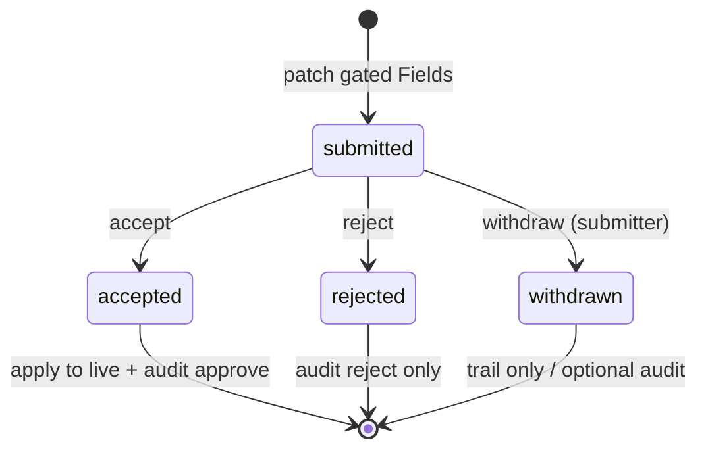

# Approval trails (accept / reject)

Workflow for changes that must be reviewed before they affect live data. Product term: **verification**; v1 implementation is accept/reject with a pending store.

## When to use

Configured per **Surface**, at **Field** granularity:

- Mark Fields with **`requires_verification: true`** in `*.surface.yaml` (structural eligibility).
- At runtime, principals with **`submit`** and without **`write`** on those Fields route patches to **pending**; principals with **`write`** may apply live (hybrid gating — see Phase 05 decisions).

Not every Surface needs verification; default is direct write with audit only.

**Deferred:** Surface-wide “all fields pending”, row-level rules (e.g. status = `published`), external reviewers.

## Concepts

| Concept | Description |
|---------|-------------|
| **Pending change** | Proposed new values for one entity + Field set (all-or-nothing per record in v1) |
| **Submitter** | Principal who proposed (`submit` on affected Fields) |
| **Reviewer** | Principal with `approve` on affected Fields |
| **Trail** | Ordered history: submitted → accepted / rejected / withdrawn (+ optional comments) |

## State machine (v1)

After **reject** or **withdraw**, submitter may create a **new** pending record (`supersedes_id` links versions). Only **one** `submitted` row per `(surface_id, entity_id)` at a time; duplicate submit → **409**.

## Storage

### Decision: `latch_pending_changes` table (2026-06-02)

**Choice:** **Option B** — dedicated table (not shadow JSONB on entity rows).

| Column | Purpose |
|--------|---------|
| `id` | UUID; equals `latch_audit.approval_id` on accept |
| `surface_id` | Surface id (e.g. `job_detail`) |
| `entity_id` | Target row |
| `field_ids` | Fields in scope (all-or-nothing bundle) |
| `patch` | Proposed values (JSONB) |
| `status` | `submitted` / `accepted` / `rejected` / `withdrawn` |
| `submitted_by`, `submitted_at` | |
| `decided_by`, `decided_at`, `comment` | Reviewer or withdraw; comment optional on reject |
| `batch_id` | Links bulk-created pendings |
| `supersedes_id` | Prior pending after resubmit |

On **accept** (v1 pilot): ordered steps — re-check `approve`, `resolve(accepted)`, apply live patch, `writeAudit(approve)` last. **Not** one DB transaction while the business store is in-memory and audit is a separate writer; see **Accept ordering** below.

**Immutability (T7):** Terminal rows are not updated via public API; enforced in DAL (v1). Optional DB trigger deferred.

**Canonical detail:** [`../phases/05-verification/decisions.md`](../phases/05-verification/decisions.md).

### Rejected options (historical)

- **Shadow JSONB on entity** — simple but messy for multi-table Surfaces.
- **Duplicate staging tables** — heavy; deferred.

## Partial approval

### Decision: all-or-nothing for v1 (2026-05-27)

**Choice:** One pending record per submission; accept or reject applies to the **entire** proposed bundle. After reject, submitter may **resubmit** as a **new** pending record (trail links versions via `supersedes_id`).

**Deferred:** Per-Field accept/reject and parallel approvers.

## Reviewer scope

### Decision: internal reviewers only in v1 (2026-05-27)

**Choice:** Reviewers are **internal Latch principals** (role-gated via `approve` on affected Fields). External sign-off deferred.

## Visibility

### Decision: role-split pending visibility (2026-06-02)

**Choice:**

- **Submitter** (`submit`, not `write`): sees own proposed values on readable rows.
- **Reviewer** (`approve`): sees open pending for accept/reject.
- **Others**: live data only; DAL must not expose pending patches.

UI is not a security boundary; DAL projection enforces omission.

## Bulk + approval interaction

Bulk update on verification-gated Fields creates **per-row pending records** linked by **`batch_id`**. v1 reviewers accept/reject **per row**. See [`bulk-operations.md`](./bulk-operations.md).

## Notifications

Out of scope for v1; trail is queryable via API. Minimal **`job_detail`** CRM strip for accept/reject (Phase 05).

## API (v1 sketch)

- `GET /api/pending?surface=&status=submitted&entity_id=`
- `POST /api/pending/:id/accept`
- `POST /api/pending/:id/reject` — optional body `{ "comment": "..." }`
- `POST /api/pending/:id/withdraw` — submitter only

Proposals are created via normal Surface **PATCH** (or bulk) when gating applies — no separate “create pending” route required in v1.

## Accept ordering (v1)

### Decision: non-transactional accept on memory pilot (2026-06-03)

**Choice:** `createSurfaceDal` runs accept as: (1) re-check `approve` on all `field_ids`, (2) `resolve(accepted)`, (3) apply live patch, (4) `writeAudit({ action: 'approve' })` **last**. Steps are **not** rolled back if a later step throws (separate stores).

**Rationale:** `MemoryJobStore` and the global audit writer cannot share a real transaction. Audit-after-live-write avoids “approved in audit but row unchanged” when audit fails. True `BEGIN/COMMIT` across pending + business + audit is **deferred** until both stores are Postgres-backed.

## Audit linkage

| Event | `latch_audit.action` | Live data |
|-------|----------------------|-----------|
| Accept | `approve` | Updated; `approval_id` = pending `id` |
| Reject | `reject` | Unchanged (always audited) |
| Withdraw | — | Unchanged; pending row `withdrawn` is the trail |
| Submit | — | Unchanged (pending row is the trail) |

See [`audit-and-lifecycle.md`](./audit-and-lifecycle.md).

## Submitter edit and expiry

**v1:** No edit of pending rows — **withdraw** or wait for decision. **No** auto-expiry in Phase 05 (deferred).
