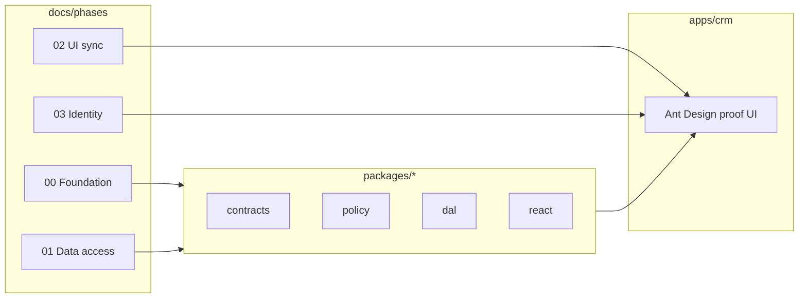

# CRM app and package phases — developing side by side

How **`apps/crm`** (integration harness) relates to **`docs/phases/`** (package delivery plan).

## Two planning tracks, one repo

| Track | Where it lives | Owns |
|-------|----------------|------|
| **Packages** | `docs/phases/<NN>-*/` + `packages/*` | APIs, DAL behavior, policy, tests, invariants |
| **CRM harness** | `apps/crm/docs/` | Minimal UI that *consumes* those APIs |

Phases are the **source of truth** for platform work. CRM has **no parallel phase numbering** — only a short checklist tied to phase outcomes (see [`../../apps/crm/docs/PLAN.md`](../../apps/crm/docs/PLAN.md)).

## Golden rule

> **Never build a CRM screen for a capability that does not exist in `packages/*` yet.**

If the UI needs it, the phase task + package API come first (or in the same PR, package first).

## Timing rule (when a CRM slice may be built)

A CRM slice may be implemented **only against package phases in `done` / `mostly done` state.**

| Phase state | CRM allowed to… |
|-------------|-----------------|
| `done` / `mostly done` | Build the slice fully against the shipped API |
| `active` | Build **only** against the API as already merged to `main` — never ahead of an in-flight task; prefer waiting until the task lands |
| `partial` | Build the parts whose API is merged; stub nothing that an unfinished task will change |
| `not started` / `deferred` | **Do not build** — no stubs, no placeholder screens |

**Consequence today** (Phase 02 active, `customer_detail` in progress): build CRM customer UI only after `dal.customers.get` (+ `patch`) is merged (Phase 02 tasks 09–13). Jobs harness (Steps A + B) is complete against the generic kernel.

Rationale: building ahead of a merged API means coding against an imagined contract and reworking when the real one lands — the exact cost this harness exists to avoid.

## Who leads what

| Situation | Lead | Follow |
|-----------|------|--------|
| New DAL method (`list`, `bulkDelete`) | Phase task in `docs/phases/01-data-access/tasks/` | CRM adds table column or button |
| New manifest field / Surface | Phase 00/01 YAML + codegen | CRM adds `FieldControl` section |
| Login UX polish | Phase 03 | CRM swaps stub cookie for provider |
| Split list/detail layout | **CRM** | Packages unchanged |
| Approval banner | Phase 05 | CRM pending panel (optional) |

CRM **never** leads schema or permission semantics — it only reflects them.

## Side-by-side workflow (solo dev)

Recommended loop:

1. Read root [`STATUS.md`](../../STATUS.md) — active **phase**.
2. Complete the phase **task** (package + tests).
3. If the task maps to a CRM proof row (below), add the **smallest** UI in `apps/crm`.
4. Click-test as two seed users.
5. Update phase `STATUS.md`; do not add CRM-only scope.

**Parallel work allowed when:**

- Phase task does not change DAL contract CRM uses, **or**
- CRM works against memory store while Postgres adapter is in progress.

**Stop CRM work when:**

- The proof row for that package is checked off in CRM done criteria.
- Further UI would not increase confidence in Latch.

## Phase → CRM proof mapping

| Phase | Package capability | CRM proof (minimal) |
|-------|-------------------|---------------------|
| 00 | `resolve`, `get`, `patch`, `delete` | Jobs detail pane: read + save + delete |
| 01 | `list`, projection, bulk | Jobs list pane + optional bulk button |
| 02 | `@latch/react`, second Surface | Customers split view; cross-link |
| 03 | Real auth | Replace stub login; remove dev role env |
| 04 | Restore-from-audit tool | **Optional** admin page — only if tool exists |
| 05 | Pending accept/reject | Pending banner on detail pane — **defer** until asked |
| 06+ | Cache, RLS | No CRM requirement unless debugging |

## Change orders

When root `STATUS.md` switches active phase (e.g. 01 → 03):

- **Packages:** follow new phase `tasks/`.
- **CRM:** pause feature slices that depend on skipped phase; do not invent interim auth in CRM beyond [`AUTH.md`](../../apps/crm/docs/AUTH.md) stub.

Inserting a new phase folder does not require CRM doc rewrites — update the table above if a new proof row is needed.

## The app

`apps/crm` is the **only** app — the canonical visual harness (Ant Design, split views) and sole consumer of `@latch/*`. It owns its schema, migrations, seed, and Surface descriptors. (The former `apps/web` pilot was retired in [Phase 02b](../phases/02b-platform-extraction/STATUS.md).)

## CI

| Layer | Runs on |
|-------|---------|
| Package tests | Every PR — `packages/*`, `tests/threat` |
| CRM E2E | Only when `apps/crm` exists — thin Playwright: login, list/detail, role diff |

CRM E2E is **not** a substitute for DAL contract tests.

## Related

- [`packages.md`](./packages.md) — import boundaries
- [`../../apps/crm/docs/PLAN.md`](../../apps/crm/docs/PLAN.md)
- [`../phases/README.md`](../phases/README.md)
