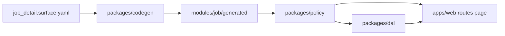

# Step 3 — Pilot Surface `job_detail`

> **Execution:** Work one file at a time under [`tasks/job_detail/`](../../../docs/archive/tasks/job_detail). After each task passes its **Verify** gate, update [`STATUS.md`](../../../STATUS.md) to the next task.

## Goal

Prove the Latch **library stack** (`@latch/*`) on one real Surface — not ship a CRM product. A thin Next.js host in `apps/web` wires routes and RSC; it does not own business logic or raw DB access.

## What we are / are not building

| In scope | Out of scope (Step 3) |
|----------|------------------------|
| `@latch/contracts`, `policy`, `dal`, `audit`, `approval`, `react`, `codegen` | Polished trades-CRM UX |
| `job_detail` Surface YAML + policies + codegen | `job_list`, `customer_detail` |
| DAL read/write/soft-delete + contract tests | RLS, multi-company, bulk ops |
| GET/PATCH API + one Server Action + `/jobs/[id]` page | Real auth provider (D2) — stub only |
| Audit + minimal approval on `financial_terms` | CI hardening beyond plan |

## Naming

| Term | Meaning |
|------|---------|
| **Latch** | Platform (`@latch/*`) |
| **Trades CRM** | Sample app in `apps/web` |
| **`job_detail`** | Surface id (one screen), not the app name |

Metadata lives in `apps/web/modules/job/` (YAML + `generated/` only — no task markdown there).

## Architecture slice

## What Step 3 must prove

1. Manifest is server-only truth; UI mirrors it.
2. All business data via DAL + `PermissionContext`.
3. Forbidden Fields **omitted** from DTOs (S1).
4. Writable Zod **`.strict()`** (T1).
5. Mutations re-resolve policy (T3).
6. Row scope — tech cannot read another tech's job (S4 → 404).
7. Append-only audit.
8. Soft delete on `jobs`.
9. Minimal approval on `financial_terms` (S3).
10. `npm run codegen --check` (T11).

Proof artifacts: policy matrix tests, DAL contract tests, one E2E through `job_detail`, threat tests T1, T2, T3, T6, T11, T13.

## Task order

| # | Task | Type |
|---|------|------|
| [00](./tasks/job_detail/00-decisions.md) | Lock D2–D5 defaults | Docs only |
| [01](./tasks/job_detail/01-task-index.md) | Index (read once) | Docs only |
| [02](./tasks/job_detail/02-contracts.md) | `@latch/contracts` | Code |
| [03](./tasks/job_detail/03-policy.md) | `@latch/policy` | Code |
| [04](./tasks/job_detail/04-db-schema.md) | Schema + seed | Code |
| [05](./tasks/job_detail/05-audit-skeleton.md) | `@latch/audit` | Code |
| [06](./tasks/job_detail/06-surface-yaml.md) | Surface YAML | Metadata |
| [07](./tasks/job_detail/07-policies-yaml.md) | Policies YAML | Metadata |
| [08](./tasks/job_detail/08-codegen.md) | Codegen CLI | Code |
| [09](./tasks/job_detail/09-dal-read.md) | DAL read | Code |
| [10](./tasks/job_detail/10-dal-write.md) | DAL patch | Code |
| [11](./tasks/job_detail/11-dal-soft-delete.md) | Soft delete | Code |
| [12](./tasks/job_detail/12-dal-contract-tests.md) | DAL tests | Code |
| [13](./tasks/job_detail/13-api-route.md) | REST routes | Code |
| [14](./tasks/job_detail/14-server-action.md) | Server Action | Code |
| [15](./tasks/job_detail/15-stub-principal.md) | Stub auth | Code |
| [16](./tasks/job_detail/16-job-detail-page.md) | RSC page | Code |
| [17](./tasks/job_detail/17-audit-triggers.md) | DB triggers | Code/SQL |
| [18](./tasks/job_detail/18-approval-minimal.md) | Approval | Code |
| [19](./tasks/job_detail/19-react-gates.md) | `@latch/react` | Code |
| [20](./tasks/job_detail/20-e2e-job-detail.md) | E2E test | Code |
| [21](./tasks/job_detail/21-threat-tests.md) | Threat + CI | Code |

## Definition of done

- [x] Tasks 00–21 verify gates pass
- [x] `field_tech` API JSON omits `financial_terms`; `office_admin` includes it
- [x] Cross-tech GET returns 404
- [x] Approval path + audit linkage on financial Field
- [x] `npm run codegen:check` and `npm run test` green (threat tests T1, T2, T3, T6, T11, T13)
- [x] STATUS updated to Step 4 (`job_list`)

## References

- [`scope.md`](../foundations/scope.md) · [`use-cases.md`](../foundations/use-cases.md) · [`architecture/packages.md`](../reference/packages.md)
- [`.cursor/rules/10-invariants.mdc`](../../../.cursor/rules/10-invariants.mdc)
