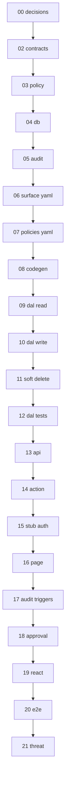

# 01 — Task index (read once)

## Goal

Orient the Step 3 task chain. **Do not implement code in this file.**

## Prerequisites

Skim [`../../step-3-pilot-surface.md`](../../step-3-pilot-surface.md).

## Execution order

```
00-decisions (docs)
  → 02-contracts → 03-policy → 04-db-schema → 05-audit-skeleton
  → 06-surface-yaml → 07-policies-yaml → 08-codegen
  → 09-dal-read → 10-dal-write → 11-dal-soft-delete → 12-dal-contract-tests
  → 13-api-route → 14-server-action → 15-stub-principal → 16-job-detail-page
  → 17-audit-triggers → 18-approval-minimal → 19-react-gates
  → 20-e2e-job-detail → 21-threat-tests
```

## Dependency diagram



## Full table

See [`../../step-3-pilot-surface.md`](../../step-3-pilot-surface.md#task-order).

## Verify (stop gate)

- [ ] You know which file [`STATUS.md`](../../../../../STATUS.md) points to as **Execute now**
- [ ] You will update **STATUS** after each task's Verify section passes

## Out of scope

Implementation work — use tasks 02–21.
