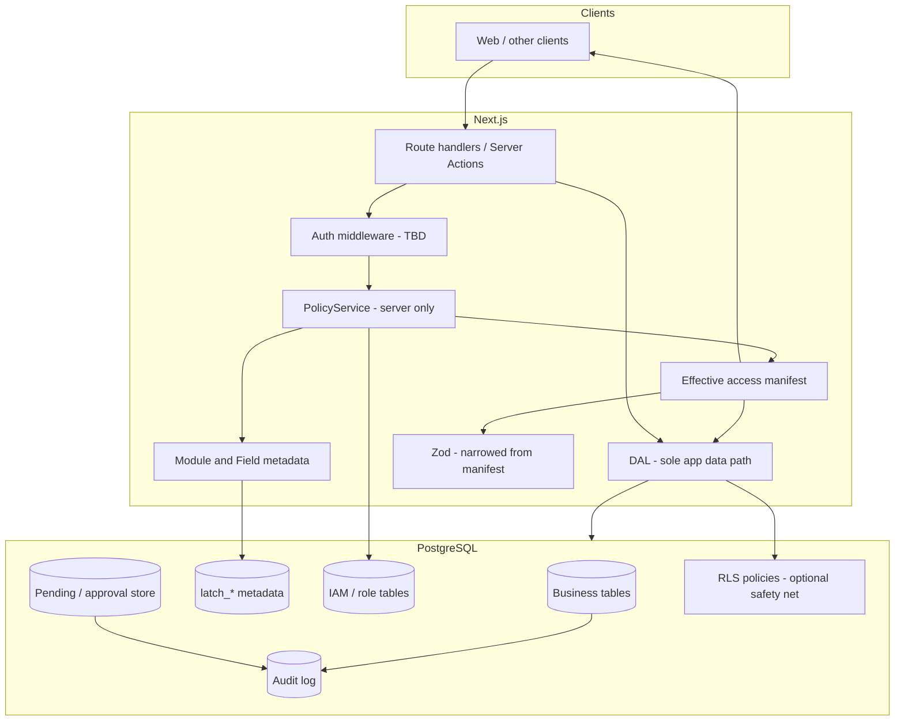

# Architecture overview

High-level shape for Latch. **Proposal** for Postgres RLS details ? see discovery doc. **Decided** for DAL, manifest, and UI sync ? see [permissions-and-ui-sync.md](../reference/permissions-and-ui-sync.md).

## Layered model

## Responsibilities

| Layer | Owns |
|-------|------|
| **Identity (authn)** | Who is the user (JWT, session, SSO) ? likely external or thin wrapper |
| **Authorization (authz)** | What they can do on Modules/Fields/rows ? `PolicyService` + manifest |
| **Manifest** | Server-computed permissions for page + nav; UI render hints (read-only vs hidden) |
| **DAL** | All business reads/writes; narrows SQL/DTO from manifest; no raw DB from handlers |
| **Zod** | Validates only allowed shape; writable schemas **reject** extra keys |
| **Metadata** | Module definitions, Field?column mappings, approval config; codegen ? types/schemas |
| **Data** | Business schema + optional RLS for tenant/row |
| **Roles** | Built-in platform roles + app roles; user?role assignment |
| **Audit** | Immutable change log |
| **Approval** | Staging pending values until accept/reject |

## Request flow (read)

1. Authenticate ? `principal_id`, roles, tenant (if multi-tenant).
2. `PolicyService.resolve(scope)` ? **manifest** for page (and separately for nav if needed).
3. Gate: Module/Field `read` for requested resources; **403** if client asks for forbidden Fields.
4. **DAL** query with `PermissionContext` ? SELECT only columns for allowed Fields.
5. Parse response with **readable** Zod schema (manifest-narrowed).
6. Return DTO + manifest subset to UI; UI does not render controls for Fields without `read`.

## Request flow (write)

1. Authenticate ? **re-resolve** permissions (do not trust UI manifest alone).
2. Gate `write` on target Fields; **403** if forbidden.
3. Parse body with **writable** Zod schema ? **reject unknown keys**.
4. If Module requires approval for those Fields ? **pending** store, not live columns.
5. Else **DAL** apply; **audit** (trigger and/or app).
6. **Delete** removes the live row; audit records `before` snapshot (`action = delete`). Recovery = restore-from-audit (Phase 04 tool).

## Metadata vs business data

We expect `latch_*` (name TBD) tables for:

- `modules`, `module_tables`, `module_views`
- `fields`, `field_columns`
- `roles`, `user_roles`, built-in role seeds
- `policies` or role?Field bindings
- `approval_config`

Module **structure** is also declared in repo (YAML/JSON) and drives **codegen** ? see [metadata-and-codegen.md](../../codegen/docs/reference/metadata-and-codegen.md).

Business tables remain normal Postgres tables with standard columns (`created_at`, `updated_at`) — **no** `deleted_at` in v1.

## Global options (platform config)

Central defaults (database-per-company, RBAC union, Drizzle, audit retention, manifest via RSC, etc.): [global-options.md](./global-options.md).

Additional knobs (exact schema TBD):

- Nav manifest: minimal routes vs include disabled stubs
- Stale policy handling: 403-only vs require `policyVersion` ? 409
- Sensitive Fields: 403 vs 404 on explicit forbidden request

## Packaging (future)

| Package | Role |
|---------|------|
| `@latch/contracts` | Generated + shared Zod, Field IDs (client-safe) |
| `@latch/core` | PolicyService, manifest types, audit helpers |
| `@latch/dal` | DB access, migrations, RLS templates |
| `apps/crm` | The single Next.js app + Latch proof harness; owns its schema, migrations, and Surface descriptors |

Phase 0?2 may use `src/modules/*/generated/` instead of packages.

## Related docs

- [global-options.md](./global-options.md)
- [permissions-and-ui-sync.md](../reference/permissions-and-ui-sync.md)
- [metadata-and-codegen.md](../../codegen/docs/reference/metadata-and-codegen.md)
- [access-control.md](../../policy/docs/access-control.md)
- [audit-and-lifecycle.md](../../audit/docs/audit-and-lifecycle.md)
- [approval-trails.md](../../approval/docs/approval-trails.md)
